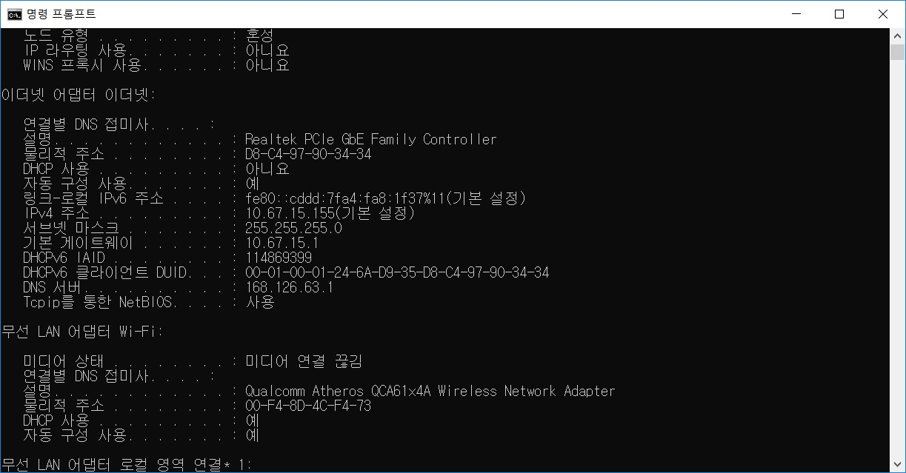
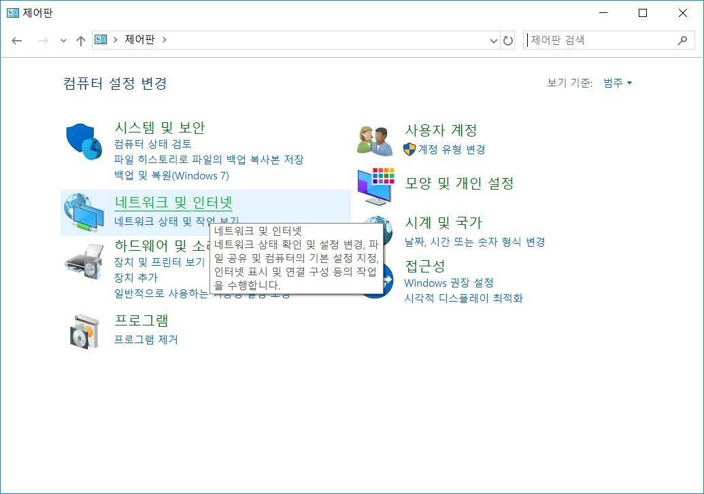
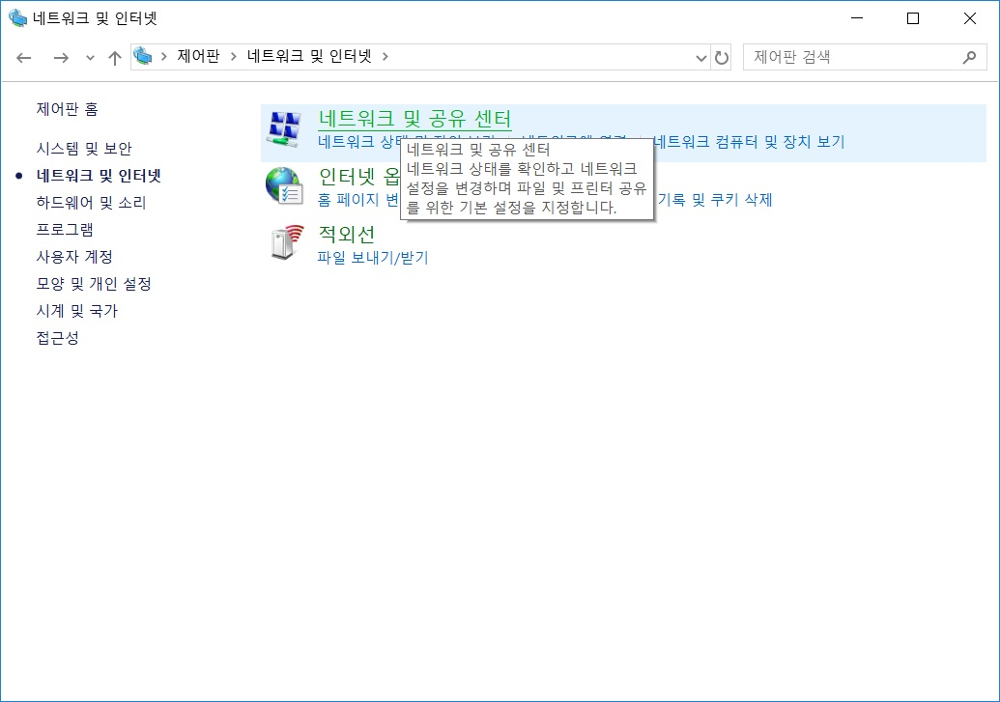
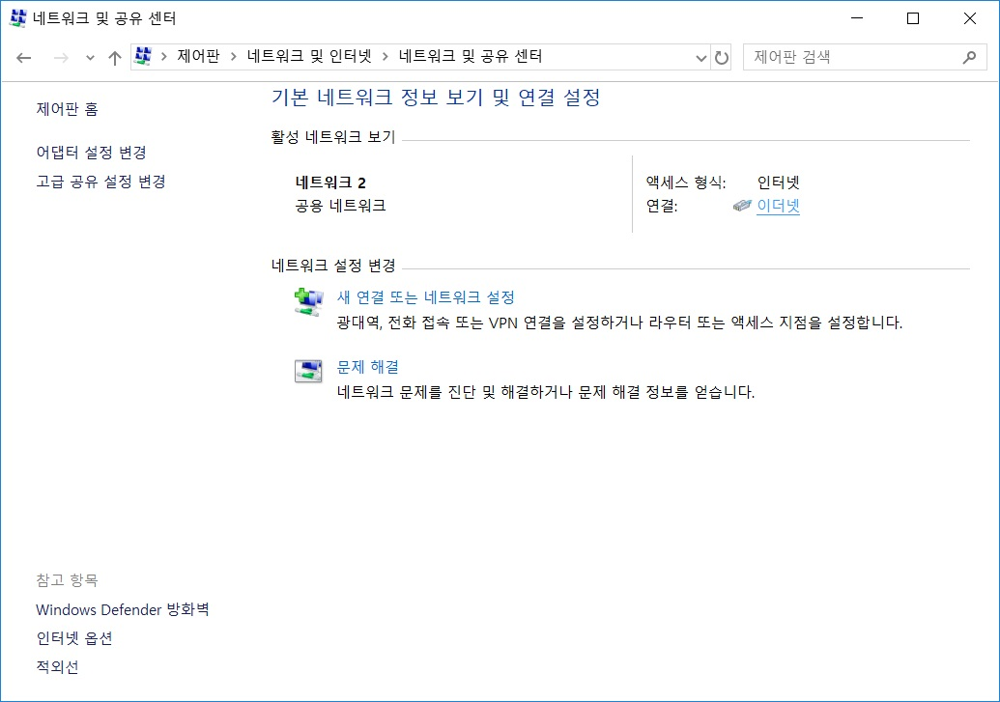
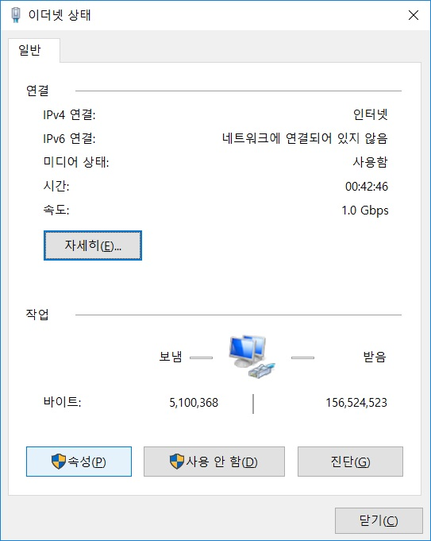
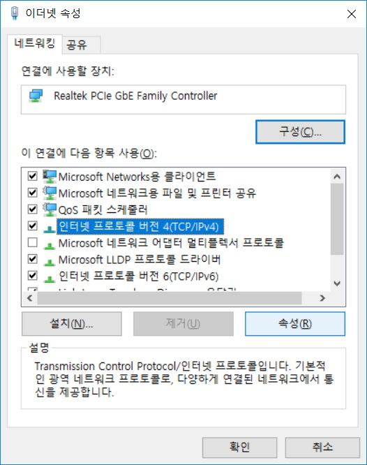
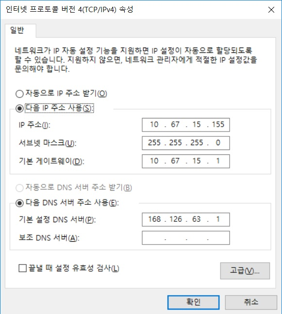

# hunel 개발자를 위한 자료 저장소 [](http://www.e-hcg.com/)

<br>

<div align=center>

## <a href="개발정리.md">★ hunel 컨설턴트 개발 참고 자료 바로가기 ★</a>

</div>

<br>

## 목차 수정 중(2020. 01. 04)
- PDF 변환을 위한 메뉴얼 변경 중 *(개발정리.md 파일)*
    ```
    1. 기본 정보
     - 프로그램 설치

    2. 기본 코드(포맷) 소개
     - IBSheet
     - hunel
        = View
          > css
          > js
          > HTML Tag
        = Server
          > Java
          > Xml(Database)
    - ReportDesigner

    3. 상세 정보 모음
    - 기타 커스텀 함수들
    ```

- GitRepository 메뉴 구성 변경 중
  ```
  1. 업무
     1. Human-Resource 모듈별 업무(Not Only hunel)
        1. 조직/인사
        2. 근태
        3. 급여
        4. 평가
        5. 복리후생
        6. 시스템/공통
  2. 개발
     1. 환경 세팅
        1. IDE
        2. Package
        3. Database Tool
     2. 에러
        1. hunel 에러
        2. 기타
  ```

<hr>
<br>

# 로컬 PC 에 개인환경 설정 시
## 네트워크 설정 *(IP 설정)*
- 네트워크 정보 확인 *(인터넷 연결이 자유로울 때)*
    > `시작 - cmd - ipconfig /all`
    <div align=center>
    
    </div>
- 네트워크 환경 설정 *(IP할당을 받아 수동으로 연결해야 할 때)*
    > `내 PC - 제어판 - 네트워크 및 인터넷`
    
    <div align=center>
    
    
    
    </div>
    
    > `네트워크 및 공유 센터 클릭`
    
    <div align=center>
    
    
    
    </div>
    
    > `좌측 탭) 어댑터 설정 변경 클릭`
    
    <div align=center>
    
    
    
    </div>
    
    > `좌측 하단) 속성 클릭`
    
    <div align=center>
    
    
    
    </div>
    
    > `인터넷 프로토콜 버전4(TCP/IPv4) 클릭 - 속성 클릭`
    
    <div align=center>
    
    
    
    </div>
    
    > `cmd 에서 확인한 정보를 인터넷 프로토콜 버전4(TCP/IPv4) 속성 창에서 아래와 같이 입력`
    
    <div align=center>
    
    
    
    </div>

<hr>
<br>

## 코드 에디터 설치 및 설정 *(선택)*

<hr>
<br>

## 프린터 기기 설정 *(선택)*

<hr>
<br>
