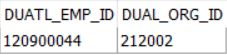
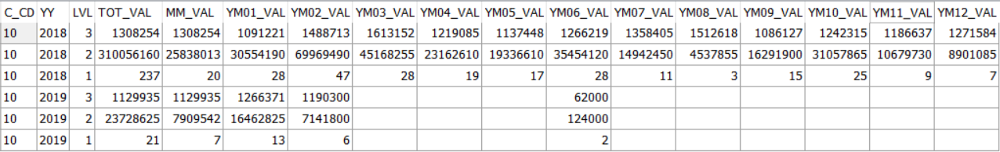

> **Ctrl + F 로 원하는 내용 찾아요!**

# RD Server 설정 관련
- Report Server : HTML5 사용

<br>

- Data Server : ActiveX 사용

<br>

# 데이터베이스 포팅(DB Porting)
- 프로젝트 시작 시, 개발 중 서버 변경 시 설정해야하는 것들

<hr>

## Tomcat
- server.xml 수정
  - 호스트 접속 정보 수정(IP + SID), USER / PASSWORD 수정

<hr>

## DataBase(DB Client)
- 호스트 접속 정보 수정(IP + SID), USER / PASSWORD 수정

<hr>

## Eclipse
- server.xml
  - 평균 접속 정보

<br>

- system.properties
  - 보통 **DEFAULT_JNDINAME=이름**이 변경된다.

<br>

# 코딩 용어 정의

|용어|정의|
|----|----|
|`Annotation`|자바 소스 코드에 추가하여 사용할 수 있는 메타데이터의 일종|
|`API`|Application Programming Interface, 응용 프로그램에서 사용할 수 있도록, 운영 체제나 프로그래밍 언어가 제공하는 기능을 제어할 수 있게 만든 인터페이스|
|`Architecture`|시스템의 구조나 구조들로 각 요소들과 외부에 보이는 특성들 및 요소간의 관계|
|`Class`|객체를 정의 하기 위한 상태(멤버변수)와 메서드(멤버변수)로 구성되는 틀|
|`CSS`|Cascading Style Sheet, 문서의 콘텐츠와 레이아웃, 글꼴 및 시각적 요소들로 표현되는 문서의 외관(디자인)을 분리하기 위한 목적으로 사용하는 언어|
|`Cursor`|테이블에서 여러 개의 행을 쿼리한 후에, 쿼리의 결과인 행 집합을 한 행씩 처리하기 위해 사용하는 데이터베이스 객체|
|`DCL`|Double checked locking, 멀티 스레드 환경에 안전한 Singleton 패턴을 구현하기 위한 기법. 이미 인스턴스가 생성된 경우에 동기화 블록에 들어가지 않도록 하기위해 두 번의 검사를 하도록 하는 프로그래밍 기법|
|`Encapsulation`|객체의 속성(data fields)과 행위(메서드, methods)를 하나로 묶고, 실제 구현 내용 일부를 외부에 감추어 은닉하고자 하는 프로그래밍 속성|
|`Factory`|어떤 클래스의 인스턴스를 만들지를 서브클래스에서 결정하게 하는 객체 생성 디자인패턴|
|`GC`|Garbage Collector, 힙 메모리에 남아있는 데이터를 효율적으로 관리(삭제)하는 역할을 하는 도구|
|`Glue`|Code 코드간 단단하게 결합되어 동작의 수정 및 테스트가 어려운 코드|
|`Index`|데이터들의 ROWID 정보를 별도의 세그먼트에 관리하는 데이터의 위치정보를 가진 데이터베이스 객체|
|`Inheritance`|한 클래스가 다른 클래스에서 정의된 속성(데이터, 함수)를 이어받아 그대로 사용하는 객체지향 속성|
|`Instance`|추상화 개념 또는 클래스 객체, 컴퓨터 프로세스 등과 같은 템플릿이 실제 구현된 것|
|`JDK`|Java Development Kit, 자바 SE, 자바 EE, 또는 자바 ME 플랫폼 중 하나를 구현한 것으로 솔라리스, 리눅스, 맥 OS X, 또는 윈도 자바 개발자를 대상으로 오라클에 의해 바이너리 제품으로 제공되는 개발 도구|
|`JNI`|Java Native Interface, 자바 가상 머신(JVM)에 실행되고 있는 자바코드를 네이티브 응용 프로그램(특히 하드웨어와 운영 체제 플랫폼)과 C, C++ 그리고 어샘블리 같은 다른 언어들로 구현된 라이브러리에 의해 호출되거나 호출할 수 있는 프로그래밍 프레임워크|
|`JS`|넷스케이프에서 만든 인터프리터형 프로그래밍 또는 스크립트 언어
|`JSP`|HTML 내에 자바 코드를 삽입하여 웹 서버에서 동적으로 웹 페이지를 생성하여 웹 브라우저에 돌려주는 언어
|`JVM`|Java Virtual Machine, 자바의 소스 코드를 컴파일 하게 되면 바이트 코드로 변환되는데 JVM 은 이러한 바이트 코드를 읽어서 실행할 수 있도록 해주는 도구
|`Log`|프로그램 개발이나 운영 시 발생하는 문제점을 추적하거나 운영 상태를 모니터링하기 위한 텍스트
|`Modularity`|비슷한 기능을 갖는 코드들은 같은 단위 프로그램 코드 내에 함께 포함시켜야 하며, 다른 기능들은 별도의 독립적인 단위 코드로 개발됨으로써, 유지보수와 타 프로그램들에서 쉽게 이 코드들을 재사용할 수 있도록 개발해야 한다는 프로그래밍 개념|
|`OOP`|Object-Oriented Promgramming, 컴퓨터 프로그램을 명령어의 목록으로 보는 시각에서 벗어나 여러 개의 독립된 단위, 즉 "객체"들의 모임으로 파악하고자 하는 프로그래밍 패러다임
|`Optimizer`|사용자가 질의한 SQL 문을 처리 가능한 실행계획을 탐색하고 각 실행계획에 대한 비용을 추정하여 최적의 실행계획을 수립하는 DBMS 의 핵심엔진
|`OS`|Operating System, 시스템 하드웨어를 관리할 뿐 아니라 응용 소프트웨어를 실행하기 위하여 하드웨어 추상화 플랫폼과 공통 시스템 서비스를 제공하는 시스템 소프트웨어
|`Overloding`|같은 함수 이름을 가지고 있으나 매개변수, 리턴타입 등의 특징은 다른 여러개의 서브프로그램 생성을 가능하게 하는 프로그래밍 기법
|`Overriding`|객체 지향 프로그래밍에서 서브클래스 또는 자식 클래스가 자신의 슈퍼클래스들 또는 부모 클래스들 중 하나에 의해 이미 제공된 메소드를 특정한 형태로 구현하는 것을 제공하는 프로그래밍 기법
|`Package`|클래스 또는 인터페이스를 포함 시킬 수 있으며, 서로 관련된 클래스들끼리 그룹 단위로 나누어 놓아 클래스 관리를 용이하게 하는 클래스의 묶음
|`Platform`|소프트웨어가 구동 가능한 하드웨어 아키텍처나 소프트웨어 프레임워크. 일반적으로 컴퓨터의 아키텍처, 운영 체제(OS), 프로그램 언어, 그리고 관련 런타임 라이브러리 또는 GUI 를 포함하는 개념 
|`Polymorphism`|하나의 객체를 여러 개의 타입으로, 하나의 타입으로 여러 종류의 객체를 여러 가지 모습으로 해설할 수 있는 프로그래밍 속성|
|`Procedure`|일련의 쿼리를 마치 하나의 함수처럼 실행하기 위한 쿼리의 집합|
|`Prototype`|생성할 객체들의 타입이 프로토타입인 인스턴스로부터 결정되도록 하며, 인스턴스가 새 객체를 만들기 위해 자신을 복제(clone)하는 디자인패턴|
|`Serialization`|데이터 구조나 오브젝트 상태를 동일하거나 다른 컴퓨터 환경에 저장하고 나중에 재구성할 수 있는 포맷으로 변환하는 과정|
|`Servlet`|자바를 사용하여 웹페이지를 동적으로 생성하는 서버측 프로그램 혹은 그 사양|
|`Singleton`|생성자가 여러 차례 호출되더라도 실제로 생성되는 객체는 하나이고 최초 생성 이후에 호출된 생성자는 최초의 생성자가 생성한 객체를 리턴하는 디자인패턴|
|`Spring Framework`|동적인 웹 사이트를 개발하기 위한 여러 가지 서비스를 제공하는 자바 플랫폼을 위한 오픈소스 애플리케이션 프레임워크|
|`SQL`|Structured Query Language, 관계형 데이터베이스 관리 시스템(RDBMS)의 데이터를 관리하기 위해 설계된 특수 목적의 프로그래밍 언어|
|`Synonym`|오라클 객체(테이블, 뷰, 시퀀스, 프로시저)에 대한 대체이름(Alias)를 말하며, 실질적으로 그 자체가 객체가 아니라 객체에 대한 직접적인 참조|
|`Thread-Safe`|멀티 스레드 프로그래밍에서 일반적으로 어떤 함수나 변수, 혹은 객체가 여러 스레드로부터 동시에 접근이 이루어져도 프로그램의 실행에 문제가 없어야 한다는 원칙|
|`Transaction`|데이터베이스 등의 시스템에서 사용되는 쪼갤 수 없는 업무처리의 단위|
|`Trigger`|테이블에 대한 이벤트에 반응해 자동으로 실행되는 작업|
|`XML`|Extensible Markup Language, 다른 특수한 목적을 갖는 마크업 언어를 만드는데 사용하도록 권장하는 다목적 마크업 언어|

<br>

# hunel에서 자주 사용하는 CSS 속성들
## css 정의

|소스명|설명|
|------|----|
|ui-lightness.css|`jQuery 의 UI 에서 사용`|
|Common.css|`hunel 전체 페이지에서 공통으로 사용`|
|Login.css|`Login.jsp 에서 사용`|

<hr>
<br>

## common.css 세부 설명
- box 컨트롤
  ```css
  .wbox {width:100%;height:100%;overflow:hidden;padding:0px;margin:0px;position:absolute;left:0px;top:0px;border:0px;}
  .vbox {height:100%;padding:0px;margin:0px;border:0px;float:left;position:absolute; overflow:hidden;}
  .hbox {width:100%;padding:0px;margin:0px;border:0px;position:absolute; overflow:hidden;}
  .vslider {height:100%;width:2px;padding:0px;margin:0px;border:0px;overflow:hidden;float:left;position:absolute;text-align:center;}
  .hslider {height:2px;width:100%;padding:0px;margin:0px;border:0px;overflow:hidden;position:absolute;text-align:center;}
  .sliderghost {overflow:hidden;position:absolute;text-align:center;padding:0px;margin:0px;border:0px;}
  ```

<br>

- 화면에서 출력하지 않기(display:none)
  ```css
  .hiddenZone {display:none;}
  ```

<br>

- float 정렬
  ```css
  .clearFix:after {content:""; display:block; height:0; clear:both; visibility:hidden;}
  .clearFix {zoom:1;}
  .floatL {float:left !important;}
  .floatR {float:right !important;}
  .clear  {clear:both !important;}
  ```

<br>

- 정렬
  ```css
  .alignL {text-align:left !important;}
  .alignC {text-align:center !important;}
  .alignR {text-align:right !important;}
  .valignT {vertical-align:top !important;}
  .valignM {vertical-align:middle !important;}
  ```

<br>

- view 에 따라 달라지는 가로길이
  ```css
  .wp3 {width:3% !important;}
  .wp10 {width:10% !important;}
  .wp12 {width:12% !important;}
  .wp20 {width:20% !important;}
  .wp30 {width:30% !important;}
  .wp40 {width:40% !important;}
  .wp50 {width:50% !important;}
  .wp55 {width:55% !important;}
  .wp60 {width:60% !important;}
  .wp65 {width:65% !important;}
  .wp70 {width:70% !important;}
  .wp75 {width:75% !important;}
  .wp80 {width:80% !important;}
  .wp90 {width:90% !important;}
  .wp100 {width:100% !important;}
  ```

<br>

- 고정적인 가로길이
  ```css
  /* Pixel width Size */
  .wx50 {width:50px !important;}
  .wx60 {width:60px !important;}
  .wx70 {width:70px !important;}
  .wx80 {width:80px !important;}
  .wx90 {width:90px !important;}
  .wx100 {width:100px !important;}
  .wx130 {width:130px !important;}
  .wx180 {width:180px !important;}
  .wx190 {width:190px !important;}
  ```

<br>

- 여백 margin, padding
  ```css
  /* 여백 마진 */
  .mt0  {margin-top:0 !important;}
  .mt-1 {margin-top:-1px !important;}
  .mt3  {margin-top:3px !important;}
  .mt5  {margin-top:5px !important;}
  .mt7  {margin-top:7px !important;}
  .mt8  {margin-top:8px !important;}
  .mt10  {margin-top:10px !important;}
  .mt15  {margin-top:15px !important;}
  .mt12  {margin-top:12px !important;}
  .mr0  {margin-right:0 !important;}
  .mr-7  {margin-right:-7px !important;}
  .mr5  {margin-right:5px !important;}
  .mr10  {margin-right:10px !important;}
  .mr20  {margin-right:20px !important;}
  .mb5  {margin-bottom:5px !important;}
  .mb10  {margin-bottom:10px !important;}
  .ml10  {margin-left:10px !important;}
  .mb12  {margin-bottom:12px !important;}
  .mb25 {margin-bottom:25px !important;}
  .mb30  {margin-bottom:30px !important;}
  .mb40  {margin-bottom:40px !important;}
  .ml5  {margin-left:5px !important;}
  .ml12  {margin-left:12px !important;}
  .m10 {margin:0 10px !important;}

  /* 여백 패딩 */
  .pt5 {padding-top:5px !important;}
  .pt10 {padding-top:10px !important;}
  .pt12 {padding-top:12px !important;}
  .pt15 {padding-top:15px !important;}
  .pt35 {padding-top:35px !important;}
  .pr5 {padding-right:5px !important;}
  .pr10 {padding-right:10px !important;}
  .pr15 {padding-right:15px !important;}
  .pr20 {padding-right:20px !important;}
  .pb5 {padding-bottom:5px !important;}
  .pb10 {padding-bottom:10px !important;}
  .pb15 {padding-bottom:15px !important;}
  .pb20 {padding-bottom:20px !important;}
  .pl5 {padding-left:5px !important;}
  .pl10 {padding-left:10px !important;}
  .pl15 {padding-left:15px !important;}
  .pl20 {padding-left:20px !important;}
  .pl32 {padding-left:32px !important;}
  .pall5 {padding:5px !important;}
  ```

<br>

- 스크롤 보이기/숨기기
  ```css
  /* 기본은 숨겨져있음 */
  .noscroll {overflow:hidden;}
  .autoscroll {overflow:auto;}
  .xscroll {overflow-x:auto;overflow-y:hidden;}
  .yscroll {overflow-y:auto;overflow-x:hidden;}
  ```

<br>

- 마우스 포커싱 시 커서 모양 변경
  ```css
  .curpointer {cursor:pointer;}
  ```

<br>

# JSP 문법 용어
> JSP는 HTML문서 사이에 JSP문이 삽입된 형태로 작성된다.

<br>

## 문법

|코드|내용|
|----|----|
|`<%...%>`|Screptlet, 내부에 자바 코드 기술|
|`<%=...%>`|Expression, 자바식 출력|
|`<%@...%>`|지시자, 웹컨테이너가 jsp 페이지를 처리할 때 필요한 정보를 기술|
|`<%!...%>`|선언부, 변수선언이나 메서드를 선언|
|`&{...}`|EL(Expression Language), 자바코드를 사용하지 않고 간편한 출력을 지원하는 도구|
|`<jsp:.../>` 또는 `<c:.../>`|JSTL, 액션 태그|

<br>

# JavaScript
## 배열처리객체(filter, map, reduce)
- 코드
  ```js
  // 결과값 확인
  console.log(sis_test());

  // 테스트 함수 정의, return 주석 풀고 확인
  function array_test(){
    // 배열처리객체 - filter 함수
    // 배열에 조건을 주어 조건에 만족하지 못하는 원소들을 걸러낸다.
    function isTen(value){ return value > 10; }
    var filtered = [11, 3, 9, 130, 44].filter(isTen);
    // return filtered;
    
    // 배열처리객체 - map 함수
    // 어떠한 배열에 특정 규칙을 적용시켜 새로운 배열을 만든다.
    var array = [1.1, 2.1, 3.1, 4.1, 5.1, 6.1, 7.1, 8.1, 9.1, 10.1, 11.1];
    var array10 = array.map(function (elements){ return elements * 10; });
    var arrayMath = array10;
    // return arrayMath;

    // 배열처리객체 - reduce 함수
    // 배열의 값을 한 개로 감소시켜 반환
    var testArray = [];
    for(var i = 1 ; i < 101; i++) { testArray.push(i); }
    var reduceValue = testArray.reduce(function(previousValue, currentValue, currentIndex, array){
      // previousValue : 마지막 콜백에서 반환된 값 또는 initalValue
      // currentValue : 현재 배열 내 처리되고 있는 요소
      // currentIndex : 현재 배열 내 처리되고 있는 요소의 인덱스
      // array : reduce 호출에 사용되는 원 배열
      return previousValue + currentValue;
    });
    // return reduceValue;
  }
  ```

<br>

- 참고 사이트
  - [reduce를 활용한 9가지 패턴](https://medium.com/@hongkevin/js-3-%EC%9E%90%EB%B0%94%EC%8A%A4%ED%81%AC%EB%A6%BD%ED%8A%B8-%EB%B0%B0%EC%97%B4-%EB%A9%94%EC%84%9C%EB%93%9C-reduce-100-%ED%99%9C%EC%9A%A9%EB%B2%95-feat-egghead-io-97c679857ece)

<hr>
<br>

## JS 역할

|소스명|설명|
|------|----|
|common.js|`권한체크, xsheet 등 hunel의 모든 페이지에서 공통으로 사용되는 함수 정의`|
|sys_appl.js|`popup, modal, iframe loading 시 progress bar 출력`|
|layout.js|`Layout : wbox, hbox, vbox, hslider, vslider 등 페이지 구성에 사용되는 method 정의`|

<hr>
<br>

### JS 세부 설명
- common.js 에 정의된 자주 사용하는 함수 집합
  - popup 관련
    ```js
    // 페이지의 팝업여부 값을 담는 전역변수 정의
    var isPopup = _isPopup;

    // 가로길이, 세로길이, 팝업타이틀, 페이지타이틀 정의
    sizeDialog(w, h, popTitle, pageTitle);
    ```

  <br>

  - form 관련
    ```js
    // element 에 포맷에 맞게 값을 세팅
    inputSetValueAuto("form ID", "입력 값");

    // F_ format element 를 자동으로 원래값이 들어간 S_ hidden element 생성
    inputAutoUnformat(form, f, s);

    // form element, image, button element 를 활성화 또는 비활성화
    enableInput("form ID", true/false);

    // 모든 버튼을 enable or disable
    enableInputButtonAll(true/false);
    
    // form의 input tag를 Json 형식으로 반환
    serializeForm();
    
    // element에 select 포커스 할당
    input_selectfocus(input);
    
    // form 의 element 들 validation check
    checkForm(f, bJustCheck);
    
    // input 들의 validation check
    checkInput(input, bJustCheck);
    
    // element not null 강제 체크
    checkInputNN(input, bJustCheck);
    ```

  <br>

  - sheet 관련
    ```js
    // 시트 컬럼을 돌면서 함수 실행
    sheetEachCol(ibsheet 객체(`object`), 실행함수(`function`), 정순/역순(`boolean`), 시작컬럼 인덱스(`number`));

    // 시트 로우를 돌면서 함수 실행
    sheetEachRow(ibsheet 객체(`object`), 실행함수(`function`), 정순/역순(`boolean`), 시작로우 인덱스(`number`), 종료로우 인덱스(`number`));
    ```

  <br>

  - sheet_getData 로 return 받는 grid 관련
    ```js
    // grid(sheet_getData 로 만들어진 데이터 객체(Json형식))에서 cell data 추출
    grid_GetCellValue(grid, row, col);
    
    // grid 컬럼 명칭을 리턴
    grid_GetColName(grid, col);
    
    // grid cell 에 값 세팅
    grid_SetCellValue(grid, row, col, val);
    
    // grid 로우를 돌면서 함수실행
    grid_eachRow(grid 객체(`object`), 실행함수(`function`), 정순/역순(`boolean`), 시작로우 인덱스(`number`), 종료로우 인덱스(`number`));
    ```

  <br>

  - 브라우저 관련
    ```js
    // 브라우저에 따라서 RD Viewer 또는 HTML5 Viewer로 RD를 보여줄지 체크하는 메소드("N":RD Viewer/"Y":HTML5 Viewer)
    isHtml5("Y/N");
    
    // 브라우저가 IE인지 여부를 리턴
    isIE();
    
    // 브라우저가 Edge인지 여부를 리턴해주는 펑션
    isEdge();
    
    // 현재 사용중인 브라우저가 Canvas를 지원하는지 여부 리턴
    isCanvasSupported();
    ```

  <br>

  - 비교
    ```js
    // 값이 from to 사이에 포함되는지 여부를 리턴(true/false)
    between("비교할 값", "~부터", "~까지");
    
    // null 체크
    isNull(값);
    
    // 스트링 배열(arr)의 각 요소(arr[n])를 시작첨자(s), 마지막첨자(e)를 붙인후 구분자(delim)로 연결하여 리턴
    joinStr(arr, delim, s, e);
    
    // 시작값(inputFrom)이 종료값(inputTo)보다 작은지 여부를 반환
    checkFromTo(inputFrom, inputTo);
    ```

  <br>

  - Date 관련
    ```js
    // 년월일(ymd) 에 년, 월, 주, 일(gbn) 단위로 증가수(inc) 만큼 증가 또는 감소시켜서 반환
    addYmd("년월일"(`string`), "Y:년/M:월/W:주/D:일"(`string`), 증가수(`number`));

    // date 를 format_string 포맷으로 변환
    date2format(date, format_string);
    
    // ymd 형식의 문자열을 date 로 변경
    ymd2date(ymd);

    // ymdFr, ymdTo 사이의 일수 계산
    getTermDayCnt(ymdFr, ymdTo);

    // ymdFr, hmFr, ymdTo, hmTo 사이의 시간수 계산
    getTermTimeCnt(ymdFr, hmFr, ymdTo, hmTo);
    
    // 월의 마지막 일 YMD 리턴
    lastDay(ym);

    // YMD 문자열을 date 로 변환
    makeYmdToDate(ymd);
    ```

<hr>
<br>

## JSP 공통 페이지 역할

|소스명|설명|
|------|----|
|blank.jsp|`iframe 등 blank 를 표시할 때 사용`|
|combo.jsp|`DomUtil.setCombo 에서 S_DSCLASS, S_DSMETHOD 를 받아 데이터 생성`|
|commonResource.jsp|`해당 페이지의 권한 설정과 필요한 css, js 파일을 링크`|
|commonResource_multi.jsp|`필요한 css, js 파일을 링크(download.jsp 에서 사용) `|
|download.jsp|`file 다운로드 받는 페이지`|
|fileDownList.jsp|`첨부파일이 있는 경우 레이어로 첨부파일 리스트를 출력`|
|header.jsp|`해당 페이지의 로그인 여부와 권한을 체크하고 doctype을 설정`|
|header_include.jsp|`include 파일의 권한을 체크`|
|header_nologin.jsp|`taglib prefix, character encoding, header 설정 및 현재 날짜 포맷 지정`|
|ibsheetResultXML.jsp|`ibsheet 조회용 xml 생성`|
|modal.jsp|`modal 창 띄울 때 보안상 실제 file path 를 hidden 시키기 위해 사용`|
|popup_wait.jsp|`popup, modal, iframe loading 시 progress bar 출력`|

<hr>
<br>

### JSP 공통 페이지 세부 설명
- header.jsp : 프로파일, 버튼권한 등 관련된 파일들을 include하고, 변수에 저장한다.

<br>

- header_nologin.jsp
  - `<%=TO_YMD%>` : 오늘 날짜의 YYYYMMDD

  - `<%=TO_YY%>` : 오늘 날짜의 YYYY

  - `<%=TO_YM%>` : 오늘 날짜의 YYYYMM

  - `<%=TO_MM%>` : 오늘 날짜의 MM

  - `<%=hmPreparedData.get("키 값")%>` : 화면을 로드하기 전 미리 준비할 데이터(HashMap)

<br>

- commonResource.jsp : 패키지의 공통 js, css 파일들을 include
  - Page 변수에 각종 페이지 정보를 담는다. (C_CD, PROFILE_ID, …)
  
  - 이미지, 가이드문서 등 서버에서 사용하는 파일의 경로는 `<%=SKIN_PATH%>`로 사용한다.

<hr>
<br>

## IBsheet
### Column
- 표준 컬럼
  ```js
  // 공통, 채번
  arrC[col++] = {Header:"No", Type:"Seq", SaveName:"CSEQ", Width:35, Align:"Right"};
  
  // 공통, 선택
  arrC[col++] = {Header:"<com:label key='choice' def='선택' />", Type:"CheckBox", SaveName:"CCHK", Width:45, Align:"Center"};

  // 사원 기본정보
  arrC[col++] = {Header:"<com:label key='emp_id' def='사번' />", Type:"Text", SaveName:"EMP_ID", Width:80, Align:"Center", InsertEdit:0, UpdateEdit:0};
  arrC[col++] = {Header:"<com:label key='emp_nm' def='성명' />", Type:"Popup", SaveName:"EMP_NM", Width:70, Align:"Left", UpdateEdit:0, KeyField:1};
    arrC[col++] = {Header:"<com:label key='org_nm_001' def='소속' />", Type:"Text", SaveName:"ORG_NM", Width:130, Align:"Left", InsertEdit:0, UpdateEdit:0};
  arrC[col++] = {Header:"<com:label key='org_nm_001' def='소속' />", Type:"Combo", SaveName:"ORG_ID", Width:130, Align:"Left", InsertEdit:0, UpdateEdit:0};
  // 함수를 사용하여 직급명 가져올 때
  arrC[col++] = {Header:"<com:label key='emp_grade' def='직급' />", Type:"Text", SaveName:"EMP_GRADE_NM", Width:70, Align:"Left", InsertEdit:0, UpdateEdit:0};
  // 함수를 사용지 않고 직급코드 가져올 때
  arrC[col++] = {Header:"<com:label key='emp_grade' def='직급' />", Type:"Combo", SaveName:"EMP_GRADE_CD", Width:70, Align:"Left", InsertEdit:0, UpdateEdit:0};
  // 함수를 사용하여 직위명 가져올 때
  arrC[col++] = {Header:"<com:label key='post_nm' def='직위' />", Type:"Text", SaveName:"POST_NM", Width:70, Align:"Left", InsertEdit:0, UpdateEdit:0};
  // 함수를 사용지 않고 직위코드 가져올 때
  arrC[col++] = {Header:"<com:label key='post_nm' def='직위' />", Type:"Combo", SaveName:"POST_CD", Width:70, Align:"Left", InsertEdit:0, UpdateEdit:0};
  // 함수를 사용하여 직책명 가져올 때
  arrC[col++] = {Header:"<com:label key='duty_nm' def='직책' />", Type:"Text", SaveName:"DUTY_NM", Width:70, Align:"Left", InsertEdit:0, UpdateEdit:0};
  // 함수를 사용지 않고 직책코드 가져올 때
  arrC[col++] = {Header:"<com:label key='duty_nm' def='직책' />", Type:"Combo", SaveName:"DUTY_CD", Width:70, Align:"Left", InsertEdit:0, UpdateEdit:0};
  arrC[col++] = {Header:"<com:label key='enter_ymd' def='입사일' />", Type:"Date", SaveName:"ENTER_YMD", Width:90, Align:"Center", Format:"Ymd", InsertEdit:0, UpdateEdit:0};
  arrC[col++] = {Header:"<com:label key='retire_ymd' def='퇴사일' />", Type:"Date", SaveName:"RETIRE_YMD", Width:90, Align:"Center", Format:"Ymd", InsertEdit:0, UpdateEdit:0};
  arrC[col++] = {Header:"<com:label key='stat_cd_001' def='재직상태' />", Type:"Text", SaveName:"STAT_NM", Width:60, Align:"Center"};
  arrC[col++] = {Header:"<com:label key='csal' def='호봉' />", Type:"Text", SaveName:"SAL_STEP_NM", Width:100, Align:"Left", InsertEdit:0, UpdateEdit:0};
  arrC[col++] = {Header:"<com:label key='conti_y_cnt' def='근속년수' />", Type:"Text", SaveName:"SNRT_Y_CNT", Width:90, Align:"Center", InsertEdit:0, UpdateEdit:0};
  arrC[col++] = {Header:"<com:label key='marry_yn' def='기혼여부' />", Type:"Combo", SaveName:"MARRY_YN", Width:70, Align:"Center", InsertEdit:0, UpdateEdit:0};
  arrC[col++] = {Header:"<com:label key='appnt_ymd' def='발령일' />", Type:"Date", SaveName:"APPNT_YMD", Width:90, Align:"Center", Format:"Ymd", UpdateEdit:0};
  arrC[col++] = {Header:"<com:label key='addr_002' def='주소' />", Type:"Text", SaveName:"ADDR", Width:200, Align:"Left"};
  arrC[col++] = {Header:"<com:label key='tel_no' def='전화번호' />", Type:"Text", SaveName:"TEL_NO", Width:100, Align:"Center", UpdateEdit:0};
  arrC[col++] = {Header:"<com:label key='per_no' def='주민번호' />", Type:"Text", SaveName:"PER_NO", Width:110, Align:"Center", InsertEdit:0, UpdateEdit:0, Format:"######-#******"};

  // 계좌
  arrC[col++] = {Header:"<com:label key='bank' def='은행' />", Type:"Combo", SaveName:"BANK_CD", Width:80, Align:"Center", KeyField:1};
  arrC[col++] = {Header:"<com:label key='account_no' def='계좌번호' />", Type:"Text", SaveName:"ACC_NO", Width:80, Align:"Center", KeyField:1};
  arrC[col++] = {Header:"<com:label key='depo_nm' def='예금주' />", Type:"Text", SaveName:"DEPO_NM", Width:60, Align:"Left", KeyField:1};
  
  // 신청서
  arrC[col++] = {Header:"<com:label key='enter_class' def='입력구분' />", Type:"Combo", SaveName:"IN_TYPE", Width:70, Align:"Left", InsertEdit:0, UpdateEdit:0};
  arrC[col++] = {Header:"<com:label key='appl_ymd' def='신청일' />", Type:"Date", SaveName:"APPL_YMD", Width:90, Align:"Center", Format:"Ymd", UpdateEdit:0};
  arrC[col++] = {Header:"<com:label key='appl_stat1' def='신청서상태' />", Type:"Combo", SaveName:"APPL_STAT_CD", Width:80, Align:"Left", UpdateEdit:0};
  arrC[col++] = {Header:"<com:label key='appl_gubun' def='신청구분' />", Type:"Combo", SaveName:"APPL_TYPE_CD",  Width:90, Align:"Left", KeyField:1};
  arrC[col++] = {Header:"<com:label key='appl_mon_002' def='신청금액' />", Type:"Int", SaveName:"APPL_MON", Width:80, Align:"Right", Format:"Integer"};
  arrC[col++] = {Header:"<com:label key='appl_rsn' def='신청사유' />", Type:"Text", SaveName:"APPL_RSN_TXT", Width:100, Align:"Left", KeyField:1};
  arrC[col++] = {Header:"<com:label key='pay_expt_ymd' def='지급예정일' />", Type:"Date", SaveName:"PAY_DUE_YMD", Width:90, Align:"Center", Format:"Ymd"};
  arrC[col++] = {Header:"<com:label key='pay_yn_001' def='지급여부' />", Type:"CheckBox", SaveName:"PAY_YN", Width:70, Align:"Center"};
  arrC[col++] = {Header:"APPL_ID", Type:"Text", SaveName:"APPL_ID", Hidden:1};
  arrC[col++] = {Header:"DATA_ID", Type:"Text", SaveName:"DATA_ID", Hidden:1};
  arrC[col++] = {Header:"SEQ_NO", Type:"Text", SaveName:"SEQ_NO", Hidden:1};

  // 시작일, 종료일
  arrC[col++] = {Header:"<com:label key='sta_ymd' def='시작일' />", Type:"Date", SaveName:"STA_YMD", Width:90, Align:"Center", Format:"Ymd"};
  arrC[col++] = {Header:"<com:label key='end_ymd' def='종료일' />", Type:"Date", SaveName:"END_YMD", Width:90, Align:"Center", Format:"Ymd"};

  // 공통, 파일 관련
  arrC[col++] = {Header:"<com:label key='upload' def='파일\n업로드' />", Type:"Image", SaveName:"FILEUPLOAD", Width:60, Align:"Center", InsertEdit:0, UpdateEdit:0};
  arrC[col++] = {Header:"<com:label key='download' def='다운로드' />", Type:"Image", SaveName:"FILEDOWNLOAD", Width:60, Align:"Center", InsertEdit:0, UpdateEdit:0};
  arrC[col++] = {Header:"<com:label key='file_cnt' def='파일갯수' />"};
  arrC[col++] = {Header:"FILE_NO", Type:"Text", SaveName:"FILE_NO", Hidden:1};

  // 비고
  arrC[col++] = {Header:"<com:label key='note' def='비고' />", Type:"Text", SaveName:"NOTE", Width:200, Align:"Left"};

  // 공통, 삭제 및 상태
  arrC[col++] = {Header:"<com:label key='delete' def='삭제' />", Type:"DelCheck", SaveName:"CDELETE", Width:45, Align:"Center"};
  arrC[col++] = {Header:"<com:label key='stat_cd' def='상태' />", Type:"Status", SaveName:"CSTATUS", Width:35};

  // 직급 공통코드, Java PreparedData 메소드에 설정해야한다.
  setCombo("<%=hmPreparedDate.get('/SY03')%>", arrC, 'EMP_GRADE_CD', null, 'S');
  // 직위 공통코드, Java PreparedData 메소드에 설정해야한다.
  setCombo("<%=hmPreparedDate.get('/SY04')%>", arrC, 'POST_CD', null, 'S');
  // 직책 공통코드, Java PreparedData 메소드에 설정해야한다.
  setCombo("<%=hmPreparedDate.get('/SY05')%>", arrC, 'DUTY_CD', null, 'S');

  // 파일 업/다운로드의 경우 클릭 함수를 추가해야 창이 열리고
  // Xml(Query)도 Select 부분에 '0' FILEUPLOAD, '1' FILEDOWNLOAD 를 추가한다.
  // 또한 아래 sheet1 함수를 추가하면 기능을 확장시킬 수 있다.
  sheet1.SetDataLinkMouse("FILEUPLOAD", 1);
  sheet1.SetDataLinkMouse("FILEDOWNLOAD", 1);
  sheet1.SetImageList(0, "/common/Sheet/Main/btn_upLoad.gif");
  sheet1.SetImageList(1, "/common/Sheet/Main/btn_downLoad.gif");
  ```

<hr>
<br>

#### Number 타입과 포맷
- arrC 배열 초기화 시킬 때 속성 값 추가
  - "Type": "Int", "Format": "#,##0 명"

  - "Type": "Float", "Format": "$ #,##0.00"

  - "Type": "AutoSum", "Format": "#,##0.##\\%"

<hr>
<br>

#### Date 타입과 포맷
- 예시 참고
  ```js
  arrC[col++] = {"Header": "년월일|Ymd", "Type": "Date", "Width": 120, "SaveName": "sDate_Ymd", "Format": "Ymd"};
  arrC[col++] = {"Header": "년월일|Ym", "Type": "Date", "Width": 85, "SaveName": "sDate_Ym", "Format": "Ym"};
  arrC[col++] = {"Header": "년월일|Md", "Type": "Date", "Width": 85, "SaveName": "sDate_Md", "Format": "Md"};
  arrC[col++] = {"Header": "시분초|Hms", "Type": "Date", "Width": 85, "SaveName": "sDate_Hms", "Format": "Hms"};
  arrC[col++] = {"Header": "시분초|Hm", "Type": "Date", "Width": 85, "SaveName": "sDate_Hm", "Format": "Hm"};
  arrC[col++] = {"Header": "년월일시분초|YmdHms", "Type": "Date", "Width": 85, "SaveName": "sDate_YmdHms", "Format": "YmdHms"};
  arrC[col++] = {"Header": "년월일시분초|YmdHm", "Type": "Date", "Width": 85, "SaveName": "sDate_YmdHm", "Format": "YmdHm"};
  arrC[col++] = {"Header": "년월일(한국)|yyyy.MM.dd", "Type": "Date", "Width": 120, "SaveName": "sDate_yyyyMMdd", "Format": "yyyy.MM.dd"};
  arrC[col++] = {"Header": "년월일(한국)|yyyy-MM", "Type": "Date", "Width": 120, "SaveName": "sDate_yyyyMM", "Format": "yyyy-MM"};
  arrC[col++] = {"Header": "월일년(미국)|MM/dd/yyyy", "Type": "Date", "Width": 120, "SaveName": "sDate_MMddyyyy", "Format": "MM/dd/yyyy"};
  arrC[col++] = {"Header": "일월년(유럽)|dd/MM/yyyy", "Type": "Date", "Width": 120, "SaveName": "sDate_ddMMyyyy", "Format": "dd/MM/yyyy"};
  ```

<hr>
<br>

### 자주 사용하는 메서드
#### 셀 스타일 설정
- Cell 수정가능 / 불가능(CellEditable)
  ```js
  sheet1.SetCellEditable(`Row`, `SaveName 또는 Index`, `true(1) 또는 false(0)`);
  ```
<br>

- Row 수정가능 / 불가능(RowEditable)
  ```js
  sheet1.SetRowEditable(`Row`, `true(1) 또는 false(0)`);
  ```

<br>

- Cell 의 컬러 변경(CellBackColor)
  ```js
  sheet1.SetCellBackColor(`Row`, `SaveName 또는 Index`, `"#D2D2FF" 또는 "blue" 형태`);
  ```

<br>

- Row 의 컬러 변경(RowBackColor)
  ```js
  sheet1.SetRowBackColor(`Row`, `"#D2D2FF" 또는 "blue" 형태`);
  ```

<br>

- Font 관련
  - 컬러 변경
    ```js
    sheet1.SetCellFontColor(`Row`, `SaveName 또는 Index`, `"#D2D2FF" 또는 "blue" 형태`);
    ```

  - 크기 변경
    ```js
    sheet1.SetCellFontSize(`Row`, `SaveName 또는 Index`, `Size`);
    ```

  - 글씨 변경
    ```js
    sheet1.SetCellFontName(`Row`, `SaveName 또는 Index`, `"굴림" 형태`);
    ```

  - 효과 변경
    ```js
    // 두껍게
    sheet1.SetCellFontBold(`Row`, `SaveName 또는 Index`, `true(1) 또는 false(0)`);
    // 기울기
    sheet1.SetCellFontItalic(`Row`, `SaveName 또는 Index`, `true(1) 또는 false(0)`);
    // 밑줄
    sheet1.SetCellFontUnderline(`Row`, `SaveName 또는 Index`, `true(1) 또는 false(0)`);
    // 취소선
    sheet1.SetCellFontStrike(`Row`, `SaveName 또는 Index`, `true(1) 또는 false(0)`);
    ```

<hr>
<br>

#### 데이터 읽기/쓰기
- 셀 데이터 읽기/쓰기
    ```js
    // 데이터 읽기(가져오기)
    sheet1.GetCellValue(Row, "SaveName");
    // 데이터 쓰기(삽입)
    sheet1.SetCellValue(Row, "SaveName", "입력값");
    // 포맷 형태로 데이터 읽기(가져오기)
    sheet1.GetCellText(Row, "SaveName");
    // 포맷 형태로 데이터 쓰기(삽입)
    sheet1.SetCellText(Row, "SaveName", "입력값");
    ```

<br>

- 행 데이터 읽기/쓰기
    ```js
    // 행의 데이터 읽기(가져오기)
    sheet1.GetRowData(Row);
    // 행에 데이터 쓰기(삽입)
    sheet1.SetRowData(Row, Data, Opt);
    ```

<hr>
<br>

#### 최초 조회된 값 확인/변경
- 행을 최초 조회값으로 변경
    ```js
    // 특정 행의 데이터를 조회 상태의 데이터로 변경
    sheet1.ReturnData(Row);
    ```

<br>

- 셀을 최초 조회값으로 변경
    ```js
    // 특정 셀의 데이터를 조회 상태의 데이터로 변경
    sheet1.ReturnCellData(Row,Col);
    ```

<br>

- 셀에 대한 조회 데이터 확인
    ```js
    // 특정 셀의 조회되었던 당시 값을 확인
    sheet1.CellSearchValue(Row, Col);
    ```

<hr>
<br>

#### 행/열 인덱스
- 마지막 행의 인덱스 가져오기
    ```js
    // 마지막 행의 인덱스 확인
    sheet1.LastRow();
    // 화면에 보여지는 마지막 행의 인덱스 확인
    sheet1.LastRow(1);
    ```

<br>

- 마지막 열의 인덱스 가져오기
    ```js
    // 마지막 컬럼의 인덱스 확인
    sheet1.LastCol();
    ```

<br>

- 첫번째 데이터 행의 인덱스 가져오기
    ```js
    // 헤더 행의 데이터 갯수 확인
    sheet1.HeaderRows();
    ```

<br>

- 조회한 데이터 행 수(상태가 R인 데이터 행 수) 가져오기
    ```js
    // 조회된 전체 행 갯수를 확인
    sheet1.SearchRows();
    ```

<br>

- 현재 선택(포커스) 된 행의 인덱스 가져오기/선택하기
    ```js
    // 현재 선택 된 셀의 행 인덱스 가져오기
    sheet1.GetSelectRow();
    // 특정 행을 선택하기
    sheet1.SetSelectRow(Row);
    ```

<br>

- 현재 선택(포커스) 된 열의 인덱스 읽기/쓰기
    ```js
    // 현재 선택 된 셀의 열 인덱스 가져오기
    sheet1.GetSelectCol();
    // 특정 열을 선택하기
    sheet1.SelectCol(Col);
    ```

<br>

- 특정 셀 선택(포커스)하기
    ```js
    // 특정 셀을 선택하기
    // 마지막 인자에 Eidt=1을 추가하면 셀이 선택되면서 편집모드가 됨
    // 필요하지 않다면 Row와 Col 값만 입력하여 호출
    sheet1.SelectCell(Row, Col)
    ```

<hr>
<br>

### 파일 업/다운로드 함수(*시스템 - 프로그램 관리에서 프로그램별 팝업관리에 파일업/다운로드를 추가해줘야 함*)
```js
function sheet1_OnClick(Row, Col, Value)
{
  switch ( sheet1.ColSaveName(Col) )
  {
    // 파일 업로드
    case "FILEUPLOAD":
    {
      FileUpDn.popUploadFile({S_FILE_NO: sheet1.GetCellValue(Row, "FILE_NO")||"",S_READONLY_YN:'N'}, null, function(rv)
      {
        if(rv != null)
        {
          sheet1.SetCellValue(Row, "FILE_NO", rv.S_FILE_NO);
          if ( sheet1.GetCellValue(Row, "CSTATUS") == 'I' )
          {
            doAction("<com:otp value='save01' />");
          }
        }
      });
    }
    break;
    // 파일 다운로드
    case "FILEDOWNLOAD":
    {
      FileUpDn.showDownFrame({fileNo:sheet1.GetCellValue(Row, "FILE_NO")||''}, event);
    }
    break;
  }
}
```

<hr>
<br>

### 변경시 이벤트 발생
```js
function sheet1_OnChange(Row,Col,Value,OldValue,flag)
{
  switch(sheet1.ColSaveName(Col))
  {
    case "컬럼 SaveName":
    {
      // SaveName이 "CCHK"인 셀의 값을 변경했을 경우 수행할 로직 추가
    }
    break;
  }
}
```

<hr>
<br>

#### 선택시 이벤트 발생 제어 함수
```js
// 1번
function sheet1_OnClick(Row,Col,Value)
{
  if(Row < sheet1.HeaderRows() ) return;
  switch ( sheet1.ColSaveName(Col) )
  {
  }
}

// 2번
function sheet1_OnSelectCell(OldRow, OldCol, NewRow, NewCol,isDelete)
{
  // 함수 기능 확인
  alert("셀("+ OldRow + "," + OldCol + ")을 선택하였다가 셀(" + NewRow + "," + NewCol +")을 선택하였습니다.");
  
  // 예시
  var EMP_ID = sheet1.GetCellValue(NewRow, "EMP_ID");
  var DATA_ID = sheet1.GetCellValue(NewRow, "DATA_ID");
  if(sheet1.GetCellValue(NewRow, "CSTATUS") == "I" || sheet1.GetCellValue(NewRow, "CSTATUS") == "U" || DATA_ID == null || DATA_ID == "")
  {
    return;
  }
  else
  {
    inputSetValueAuto("S_TEMP_EMP_ID", EMP_ID);
    inputSetValueAuto("S_TEMP_DATA_ID", DATA_ID);
    
    if(OldRow != NewRow)
      doAction("<com:otp value='tab01' />");
  }
}
```

<hr>
<br>

### 자주 사용하는 콤보(공통 코드)
- IBSheet 적용 콤보와 Freeform 적용 콤보는 인자값 위치만 수정해주면 된다.
  - IBSheet 적용 콤보코드 원형 : setCombo(**"값"**, **컬럼정의변수**, **"SaveName"**, **option** , **arrPair**);
    - 예제 : `setCombo("<%=hmPreparedData.get("/SY32")%>", arrC, "APPL_STAT_CD", "S");`
  
  - Freeform 적용 콤보코드 원형 : setCombo(**"값"**, **"ElementName"**, **null**, **option**, **arrPair**);
    - 예제 : `setCombo("<%=hmPreparedData.get("/SY32")%>", "S_APPL_STAT_CD", null, "A");`

<br>

- 콤보박스 기초값
  - "A" : 전체
  
  - "S" : 선택
  
  - "N" : 공백
  
  - "U" : 사용자정의(arrPair)

<br>

- 자주 사용하는 패키지 내 공통 코드들

  |코드|내용|
  |:--:|----|
  |SY110|`신청서 입력구분`|
  |/SY01|`직원구분`|
  |/SY02|`재직상태`|
  |/SY03|`직급`|
  |/SY04|`직위`|
  |/SY05|`직책`|
  |/SY33|`호칭`|
  |/SY32|`신청서 상태`|
  |/SY99|`여부(Y, N)`|

<br>

- 공통 코드 세팅
  ```js
  // 신청서 상태
  setCombo("<%=hmPreparedData.get("/SY32")%>", arrC, "APPL_STAT_CD","S");
  setCombo("<%=hmPreparedData.get("/SY32")%>", 'S_APPL_STAT_CD', null, "A");
  // 지급여부
  setCombo("<%=hmPreparedData.get("/SY99")%>", 'S_PAY_YN', null, "A");
  // 신청서 입력구분
  setCombo("<%=hmPreparedData.get("SY110")%>", arrC, "IN_TYPE","S");
  setCombo("<%=hmPreparedData.get("SY110")%>", 'S_IN_TYPE', null, "A");
  ```

<hr>
<br>

#### Column Type Popup 클릭 관련
- 자주 사용하는 함수
  ```js
  function sheet1_OnPopupClick(Row, Col)
  { 
    var colnm = sheet1.ColSaveName(Col);
    switch ( colnm )
    {
      // 사원 찾기
      case "EMP_NM":
      {
        ModalUtil.open({title:"<com:label key='search_emp' def='직원찾기' />", url: "/sys/sy_com/sy_com_150_p01.jsp"}, function(rv){
          if(rv != null)
          {
            var grid = rv;
            sheet1.SetCellValue(Row, "EMP_ID", grid_GetCellValue(grid, 0, "EMP_ID"));
            sheet1.SetCellValue(Row, "EMP_NM", grid_GetCellValue(grid, 0, "EMP_NM"));
            sheet1.SetCellValue(Row, "ORG_NM", grid_GetCellValue(grid, 0, "ORG_NM"));
            sheet1.SetCellValue(Row, "EMP_GRADE_NM", grid_GetCellValue(grid, 0, "EMP_GRADE_NM"));
            sheet1.SetCellValue(Row, "DUTY_CD", grid_GetCellValue(grid, 0, "DUTY_CD"));
            sheet1.SetCellValue(Row, "ENTER_YMD", grid_GetCellValue(grid, 0, "ENTER_YMD"));
            sheet1.SetCellValue(Row, "RETIRE_YMD", grid_GetCellValue(grid, 0, "RETIRE_YMD"));
          }
        });
      }
      break;
      //우편번호팝업
      case "ZIP_NO":
      {
        /* 우편번호 컬럼 세팅은 ibsheet1 초기화 부분에서 시행하는 것임. 아래는 참고 */
        arrC[col++] = {Header:"<com:label key='zip_code' def='우편번호' />", Type:"Popup", SaveName:"ZIP_NO", Width:80, Align:"Center", Format:"dfPostNo"};
        arrC[col++] = {Header:"<com:label key='addr_002' def='주소' />", Type:"Text", SaveName:"ADDR", Width:250, Align:"Left"};
        arrC[col++] = {Header:"<com:label key='dtl_addr' def='세부주소' />", Type:"Text", SaveName:"DTL_ADDR", Width:100, Align:"Left"};
        /* 컬럼 설정 방법 끝*/

        // 해당 프로그램 URL을 팝업으로 등록해줘야 함
        // var url = "/sys/sy_cd/sy_cd_140_p02.jsp"; //6자리우편번호
        var url = "/sys/sy_cd/sy_cd_140_p03.jsp"; //5자리우편번호

        ModalUtil.open({title:"<com:label key='search_zip_no' def='우편번호찾기' />", url: url}, function(rv)
        {
          if(rv != null)
          {
            var grid = rv;
            sheet1.SetCellValue(Row, "ZIP_NO", formatValue(grid_GetCellValue(grid, 0, "ZIP_NO"), "dfPostNo"));
            sheet1.SetCellValue(Row, "ADDR", grid_GetCellValue(grid, 0, "ADDR"));
          }
        });
      }
      break;
    }
  }
  ```

<br>

- ModalUtil 함수
  ```js
  ModalUtil.open({title:"<com:label key='다국어프로퍼티 라벨' def='디폴트값' />", url: url}, function(rv)
  {
    if(rv != null)
    {
      var grid = rv;
      // 반환 값 사용 방법
      sheet1.SetCellValue(Row, "ADDR", grid_GetCellValue(grid, 0, "ADDR"));
    }
  });
  ```

<hr>
<br>

#### search 후에 sheet 데이터를 컨트롤 하고 싶을 때
```js
function sheet1_OnSearchEnd(ErrCode, ErrMsg)
{
  if ( ! doCheckMsg(ErrMsg) ) return;
  if ( ErrCode )
  {
    alert(ajaxMsg("MSG_ALERT_SEARCH_FAIL") +(ErrMsg ? "\n\n"+ ErrMsg : ""));
  }
  else
  {
    // 지급 여부 Validation
    // 반복문을 사용하면서 각 컬럼의 값을 확인하고 컨트롤 하는 부분
    sheetEachRow(sheet1, function(r, x) // r, x는 콜백함수로 r은 sheet1의 Row, x는 시트객체를 가리킨다.
    {
      var applStateCd = x.GetCellValue(r, "APPL_STAT_CD") ;
      var inType = x.GetCellValue(r, "IN_TYPE");
      if(applStateCd == '900')
      {
        x.SetRowEditable(r, false);
        // 이 경우 신청서 상태를 체크하여 Cell의 Edit 여부를 컨트롤한다.
        x.SetCellEditable(r, "PAY_DUE_YMD", 1);
      }
      else if(inType == '10')
      {
        // 이 경우 신청서 상태를 체크하여 Row의 Edit 여부를 컨트롤한다.
        x.SetRowEditable(r, true);
      }
    });
  } 
}
```

<hr>
<br>

### 탭 만들기
- 참고용 파일 `te_course_010_m01`(옛날 코드이므로 참고만 할 것)
  ```js
  function LoadPage()
  {
    ...
      tab1 = $("#tabs").tab();
    ...
  }

  function doAction(sAction)
  {
    ...
        case "<com:otp value='tab01' />":
      {
        // if ( ! $("#S_DATA_ID").val() ) return;
        var url;
        switch ( tab1.attr("selectedTab") )
        {
          case "INFO01": url = "/bsi/be_ins/be_ins_130_f01.jsp"; break;  // 월별 지급내역
          case "INFO02": url = "/bsi/be_ins/be_ins_130_f02.jsp"; break;  // 대상자 지급이력
          default: return;
        }
        popOpen({url: url, name: "iframe01", param: {S_DATA_ID: $("#S_TEMP_DATA_ID").val(), S_EMP_ID:$("#S_TEMP_EMP_ID").val()}});
      }
      break;

      case "<com:otp value='refreshFrame01' />":
      {
        if ( tab1.attr("selectedTab")!=undefined )
        {
          tab1.reSelect();
        }
      }
      break;
    ...
  }

  function sheet1_OnSelectCell(OldRow, OldCol, NewRow, NewCol,isDelete)
  {
    var EMP_ID = sheet1.GetCellValue(NewRow, "EMP_ID");
    var DATA_ID = sheet1.GetCellValue(NewRow, "DATA_ID");
    if(sheet1.GetCellValue(NewRow, "CSTATUS") == "I" || sheet1.GetCellValue(NewRow, "CSTATUS") == "U" || DATA_ID == null || DATA_ID == "")
    {
      return;
    }
    else
    {
      inputSetValueAuto("S_TEMP_EMP_ID", EMP_ID);
      inputSetValueAuto("S_TEMP_DATA_ID", DATA_ID);
      
      doAction("<com:otp value='tab01' />");
    }
  }

  // 또는
  function sheet1_OnClick(Row, Col, Value)
  {
    switch ( sheet1.ColSaveName(Col) )
    {
      ...
    }

    doAction("<com:otp value='tab01' />");
  }

  <body>
  ...
    <input type="hidden" id="S_TEMP_EMP_ID" name="S_TEMP_EMP_ID" />
    <input type="hidden" id="S_TEMP_DATA_ID" name="S_TEMP_DATA_ID" />
  ...
  </body>
  ```

<hr>
<br>

### 신청서 모듈
#### 신청서 상태에 따른 동적 요소 컨트롤
- 컨트롤 항목은 신청서 공통 **doSearch()** 함수이다. 주석을 참고할 것
  ```js
  /**
   * 신청서 공통 조회 함수
  * @param applStatus - 신청서 현상태 코드
  * @param isReapply - 반려데이터 재신청 여부
  * @comment - 신청서 공통처리후 조회함수를 doSearch함수를 호출함.
  */
  function doSearch(applStatus, isReapply) {
    
      var isDisabled = (Apply.ApplMode == "APPL" && applStatus > Apply.TempSave) || (Apply.ApplMode != "APPL");
      ajaxSyncRequestXS($("#S_DSCLASS").val(), "<com:otp value='search01' />", {S_APPL_ID:$("#S_APPL_ID").val()}, function(xs){
        if ( isReapply )
        {
          $("#S_APPL_ID").val(""); // 반려 재신청의 경우 ID 초기화
        }
        
        if (xs.RowCount() != 0)
        {
          // input 태그에 entry 속성이 있는 항목들로 반복문을 실행한다.
          $("[entry]").each(function(idx, elem)
          {
            // 해당 테그의 type 속성이 버튼이 아니라면
            if($(elem).attr("type")!="button")
            {
              // 조회한 결과 값을 input 태그에 삽입한다. substr은 휴넬 패키지 함수이다. S_, F_를 제거한다.
              inputSetValueAuto(this.id, xs.GetCellValue(0, this.id.substr(2)));

              // 반복문을 돌면서 처리해야하는 로직이 들어가는 경우 기입한다.

            }
            // 결재 요청, 결재 완료 등 추가 입력이 불가능한 상태일 때 아래 조건문을 실행한다.
            if ( isDisabled )
            {
              enableInput(this.id, false);
            }
          });

          // 반복문이 종료된 후 전체의 값이 삽입되고 enable이 정해진 다음에 처리해야하는 로직이 들어가는 경우 기입한다.
          // 콤보를 구성하거나, 유효성을 체크하거나, readonly로 설정된 태그들의 값을 변경하거나 확인해야하는 경우 등
        }
        else
        {
          alert("신청 데이터가 존재하지 않습니다."); return;
        }
    });
      
    // 각 결재자가 결재단계에따라 입력할 수 있는 항목을 열어줌
    var isInputYn = ($("#S_APPL_ID").val() != null);
    if(isInputYn)
    {
      // 결재자가 결재/HR결재 단계일때
      if((Apply.ApplMode == "APPR" && Apply.ApprCd == "10") || (Apply.ApplMode == "APPR" && Apply.ApprCd == "20"))
      {
        $("[appr]").each(function(idx, elem){
          enableInput(this.id, true);
        });
      }
      // 승인자가 승인단계일때
      else if(Apply.ApplMode=="ADMIN" && Apply.ApprCd == "30")
      {
        $("[admin]").each(function(idx, elem){
          enableInput(this.id, true);
        });
      }
    }
  }
  ```

<hr>
<br>

#### 관리 페이지에서의 insert01 함수
- 담당자가 직접 입력하는 페이지라는 것을 인지
  - `IN_TYPE`(입력구분) : 직접입력
  - `APPL_STAT_CD`(신청서상태) : 최종완료
  - `APPL_YMD`(신청일) : 현재 일자
  - `FILEUPLOAD`(파일업로드) : Default 값 입력

<br>

```js
<com:auth btnAuth="WRITE">
//입력
case "<com:otp value='insert01' />":
{
  var Row = sheetDataInsert(sheet1);
  sheet1.SetCellValue(Row, "IN_TYPE", "10");
  sheet1.SetCellValue(Row, "APPL_STAT_CD", "900");
  sheet1.SetCellValue(Row, "FILEUPLOAD", "0");
  sheet1.SetCellValue(Row, "APPL_YMD", "<%=TO_YMD%>");
}
break;
</com:auth>
```

<hr>
<br>

## HTML tagLib
### 태그
- 데이터를 넘길 때 포맷이 있는 형식은 `F_이름`, 없으면 `S_이름`으로 지정한다.
  - 명명을 할 때 data_format을 지정하는 형식

    |Format|설명|
    |------|----|
    |dfDateYy|`년도 YYYY`|
    |dfDateMm|`월 MM`|
    |dfDateYmd|`년월일 YYYY.MM.DD`|
    |dfDateYm|`년월 YYYY.MM`|
    |dfDateMd|`월일 MM.DD`|
    |dfTimeHms|`년월일시분초 YYYY.MM.DD HH24:MI:SS`|
    |dfTimeHm|`시분 HH24:MI`|
    |dfTimeYmdhms|`년월일시분초 YY.MM.DD HH24:MI:SS`|
    |dfIdNo|`주민등록번호`|
    |dfSaupNo|`사업자번호`|
    |dfCardNo|`카드번호`|
    |dfPostNo|`우편번호`|
    |dfCorpNo|`사업자등록번호`|
    |dfNo|`숫자`|
    |dfInteger|`양의정수`|
    |dfInteger|`정수`|
    |dfFloat|`양의실수`|
    |dfFloat|`실수`|

<hr>
<br>

### hbox boxsize 표준

|상황|사이즈|
|----|------|
|Title 만 존재|`<div class="hbox" boxsize="35"></div>`|
|Title과 Search 조건이 1줄인 경우|`<div class="hbox" boxsize="80"></div>`|
|Title과 Search 조건이 2줄인 경우|`<div class="hbox" boxsize="104"></div>`|
|Title과 Search 조건이 3줄인 경우|`<div class="hbox" boxsize="130"></div>`|
|Title과 Search 조건이 4줄인 경우|`<div class="hbox" boxsize="156"></div>`|
|Search 조건만 존재|`<div class="hbox" boxsize="45"></div>`|
|Search 조건이 2줄인 경우|`<div class="hbox" boxsize="72"></div>`|
|Search 조건이 3줄인 경우|`<div class="hbox" boxsize="95"></div>`|
|Search 조건이 4줄인 경우|`<div class="hbox" boxsize="121"></div>`|
|Sub Title, Button 만 존재|`<div class="hbox" boxsize="35"></div>`|
|Tab|`<div class="hbox" boxsize="80"></div>`|

<hr>
<br>

### 검색 또는 조건 관련
#### `<jsp:include>` 로 묶이는 조회 조건(공통)
- 사번/성명
  ```html
  <span class="item_area"><com:label key='jsp_label_03119' def='사번/성명' />
    <span class="input_area">
      <jsp:include page="/sys/sy_com/sy_com_181_c01.jsp" flush="true" >
        <jsp:param name="S_MODE01" value="0060" /> <!-- 0010, 0020, 0030, 0040, 0050, 0060-->
        <jsp:param name="S_SIZE" value="8" /> <!-- 폼의 크기를 조절 -->
        <jsp:param name="S_REQUIRED" value="N" /> <!-- value를 Y로 주면 필수 조건 -->
        <jsp:param name="S_FUNCTION" value="OnEmpInfo01" /> <!-- value로 설정된 하단 Sciprt를 실행 -->
      </jsp:include>
      <script>
        function OnEmpInfo01()
        {
          if ( $("#S_EMP_ID").val() )
          {
            doAction("<com:otp value='search01' />");
          }
        }
      </script>
    </span>
  </span>
  ```

<br>

- 조직
  ```html
  <span class="item_area">
    <span class="input_area">
      <jsp:include page="/sys/sy_com/sy_com_182_c01.jsp" flush="true" >
        <jsp:param name="S_MODE01" value="0020" /> <!-- 0010, 0020, 0030, 0040, 0050, 0060 -->
        <jsp:param name="S_SIZE" value="10" /> <!-- 폼의 크기를 조절 -->
      </jsp:include>
    </span>
  </span>
  ```

<hr>
<br>

#### `<span>` 으로 묶이는 조회 조건
- 신청일자
  ```html
  <span class="item_area">
    <span class="point_req"><com:label key='appl_ymd_001' def='신청일자' /></span>
    <span class="input_area">
      <input type="text" id="F_APPL_YMD_FR" name="F_APPL_YMD_FR" key_field="Y" data_format="dfDateYmd" korname="<com:label key='appl_sta_ymd' def='신청일시작' />" class="intxt format" />
      ∼
      <input type="text" id="F_APPL_YMD_TO" name="F_APPL_YMD_TO" key_field="Y" data_format="dfDateYmd" korname="<com:label key='appl_end_ymd' def='신청일종료' />" class="intxt format" />
      <input type=button id="click_Ymd" onclick=setYmdPeriod($(this)); class="btn_period" value="<com:label key='period_sel' def='기간선택' />" >
    </span>
  </span>
  ```

  <br>

  ```js
  // 현재 년도
  inputSetValueAuto('F_APPL_YMD_FR', "<%=TO_YY%>");
  // 현재 년월
  inputSetValueAuto('F_APPL_YMD_FR', "<%=TO_YM%>");
  // 현재 년월일
  inputSetValueAuto('F_APPL_YMD_FR', "<%=TO_YMD%>");
  // 현재에서 1년을 더한 일자
  inputSetValueAuto('F_APPL_YMD_FR', addYmd("<%=TO_YMD%>", 'Y', +1));
  // 현재에서 3개월을 뺀 일자
  inputSetValueAuto('F_APPL_YMD_FR', addYmd("<%=TO_YMD%>", 'M', -3));
  // 현재에서 7일을 더한 일자
  inputSetValueAuto('F_APPL_YMD_FR', addYmd("<%=TO_YMD%>", 'D', +7));
  ```

<br>

- 신청상태
  ```html
  <span class="item_area">
    <span class="point_opt"><com:label key='appl_stat' def='신청상태' /></span>
    <span class="input_area">
      <select id="F_APPL_STAT" name="F_APPL_STAT" class="insert_select"></select>
    </span>
  </span>
  ```

<br>

- 입력구분
  ```html
  <span class="item_area">
    <span class="point_opt"><com:label key='enter_class' def='입력구분' /></span>
    <span class="input_area">
      <select id="F_IN_TYPE" name="F_IN_TYPE" class="insert_select"></select>
    </span>
  </span>
  ```

<hr>
<br>

#### `<table>` 로 묶이는 신청서 혹은 Freeform 들
```html
<table class="table_item" id="contentsTable">
  <colgroup>
    <!-- 테이블의 컬럼을 갯수로 나누는 것 -->
    <!-- 화면에 따라 유동적으로 변화하게 만든 것이므로 %를 사용 -->
    <!-- 기본적으로 th와 td는 1의 컬럼 길이이다. -->
    <col width="13%" />
    <col width="20%" />
    <col width="13%" />
    <col width="13%" />
    <col width="8%" />
    <col width="13%" />
    <col width="10%" />
    <col width="8%" />
  </colgroup>
  <tr>
    <th class="blt"><com:label key='jsp_label_03119' def='사번/성명' /></th>
    <td colspan="2">
      <jsp:include page="/sys/sy_com/sy_com_181_c01.jsp" flush="true" >
      <jsp:param name="S_MODE01" value="0060" />
      <jsp:param name="S_PREFIX" value="S_TARGET" />
      <jsp:param name="S_REQUIRED" value="N" />
      <jsp:param name="S_SIZE" value="8" />
      <jsp:param name="S_TITLE01" value="" />
      <!-- 폼이 그려지고 함수가 실행되게 하는 항목 -->
      <!-- 여기부터 -->
      <jsp:param name="S_FUNCTION" value="changeTRG" />
      </jsp:include>
      <script>
        function changeTRG()
        {
          doAction2("<com:otp value='changeTRG'/>");
        }
      </script>
      <!-- 여기까지 -->
    </td>
    <th><com:label key='org_nm_001' def='소속' />
    </th>
    <td colspan="5"><input type="text" class="intxt_bg90" id="S_ORG_NM" name="S_ORG_NM" readonly/></td>
  </tr>
  <tr>
    <th><com:label key='emp_grade' def='직급' /></th>
    <td><input type="text" class=" intxt_bg80 alignL" id="S_EMP_GRADE_NM" name="S_EMP_GRADE_NM" readonly /></td>
    <th><com:label key='duty_nm' def='직책' /></th>
    <td colspan="2"><input type="text" class=" intxt_bg80 alignL" id="S_DUTY_NM" name="S_DUTY_NM" readonly /></td>
    <th><com:label key='enter_ymd' def='입사일' /></th>
    <td colspan="3"><input type="text" class="intxt_bg80 alignL" id="S_ENTER_YMD" name="S_ENTER_YMD" data_format="dfDateYmd" readonly /></td>
  </tr>
  <tr>
    <th class="blt"><com:label key='appl_present' def='신청선물' /></th>
    <td><select class="insert_select" id="S_APPL_PRESENT" name="S_APPL_PRESENT" entry key_field="Y" korname="<com:label key='appl_present' def='신청선물' />"  onChange="doAction2('<com:otp value='preType' />');"></select></td>
    <th class="blt"><com:label key='tm_label_001' def='출산일' /></th>
    <td colspan="2"><input type="text" class="intxt_80" id="F_BIRTH_YMD" name="F_BIRTH_YMD" entry key_field="Y" korname="<com:label key='tm_label_001' def='출산일' />" data_format="dfDateYmd"  onblurchange="change_date()"/></td>
    <th class="blt"><com:label key='child_nm' def='자녀이름' /></th>
    <td colspan="3"><input type="text" class="intxt wp80 alignL" id="S_CHILD_NM" name="S_CHILD_NM" entry key_field="Y" /></td>
  </tr>
  <tr>
    <th class="blt" id="contact_txt"><com:label key='contact_txt_002' def='연락처' /></th>
    <td colspan="8"><input type="text" class="intxt" id="S_CONTACT_TXT" name="S_CONTACT_TXT" korname="<com:label key='contact_txt' def='연락처' />" entry key_field="Y" maxbl="300" style="width:20%"> </td>
  </tr>
  <tr>
    <th nowrap><com:label key='zip_code' def='우편번호' /></th>
    <td colspan="2">
      <input type="text"  class="intxt wp20" id="S_ZIP_CODE" name="S_ZIP_CODE"  entry />
      <input type="button" class="btn_search01"  align=absmiddle onClick="doAction2('<com:otp value='popZip01' />');" id="popZip01" entry />
    </td>
    <th><com:label key='addr_002' def='주소' /></th>
    <td colspan="5"><input type="text" class="intxt_bg90 alignL format" readonly id="S_ADDR" name="S_ADDR" entry /></td>
  </tr>
  <tr>
    <th><com:label key='dtl_addr' def='세부주소' /></th>
    <td colspan="8"><input type="text" class="intxt wp60 alignL" id="S_DTL_ADDR" name="S_DTL_ADDR" korname="<com:label key='dtl_addr' def='세부주소' />" entry /> </td>
  </tr>
  <tr>
    <th><com:label key='note' def='비고' /></th>
    <td colspan="8"><input type="text" class="intxt wp90 alignL" id="S_NOTE" name="S_NOTE" entry  /></td>
  </tr>
</table>
```

<hr>
<br>

#### btn 태그들 *doAction 메소드 내부에 위치*
> 버튼에 대한 동작은 **`<com:auth btnAuth="권한">`** 태그로 제어한다.
>> html 구문과 script 구문의 시작, 끝에 auth 태그를 기입하면 된다.

<br>

- 조회 버튼 *READ 권한*
  ```html
  <com:auth btnAuth="READ"><span class="btn_search"><input type="button" value="<com:label key='search' def='검색' />" onClick="doAction('<com:otp value='search01' />');" class="search" /></span></com:auth>
  ```

  - doAction 메소드
    ```js
    //조회
    case "<com:otp value='search01' />":
    {
      if ( ! checkForm("f1") ) return;
      $("#S_SAVENAME").val( concatSaveName(sheet1, "|", "CSEQ"));
      var paramSub = FormQueryStringEnc(document.f1);
      sheet1.DoSearch("/commonAction.do", paramSub);
    }
    break;
    ```

<br>

- Sheet 제어 버튼 *WRITE, PRINT 권한*
  ```html
  <div class="btn_areaR">
    <com:auth btnAuth="WRITE">
      <span class="btn"><input type="button" value="<com:label key='insert' def='추가' />" onClick="doAction('<com:otp value='insert01' />');" class="insert" /></span>
      <span class="btn"><input type="button" value="<com:label key='copy' def='복사' />" onclick="doAction('<com:otp value='copy01' />');" class="copy" /></span>
      <span class="btn"><input type="button" value="<com:label key='save' def='저장' />" onClick="doAction('<com:otp value='save01' />');" class="save" /></span>
    </com:auth>
    <com:auth btnAuth="PRINT">
      <span class="btn"><input type="button" value="DOWN" onclick="doAction('<com:otp value='down2excel01' />');" class="ex"/></span>
      <span class="btn"><input type="button" value="<com:label key='print' def='인쇄' />" onClick="doAction('<com:otp value='popReport'/>');" class="print" /></span>
    </com:auth>
    <com:auth btnAuth="WRITE">
      <span class="btn"><input type="button" value="UP" onclick="doAction('<com:otp value='load2excel01' />');" class="exup" /></span>
    </com:auth>
  </div>
  ```

  - doAction 메소드
    - WRITE 권한
      ```js
      <com:auth btnAuth="WRITE">
      //입력
      case "<com:otp value='insert01' />":
      {
        // sheet1.SetDataAutoTrim(0);
        var Row = sheetDataInsert(sheet1);
      }
      break;
      //복사
      case "<com:otp value='copy01' />":
      {
        var row = sheet1.DataCopy();
      }
      break;
      // 저장
      case "<com:otp value='save01' />":
      {
        if ( ! checkForm("f1") ) return;
        // 알림창 기능으로 제어할 때는 위 대신 아래 구문을 사용
        // if ( ! confirm(ajaxMsg("MSG_CONFIRM_SAVE")) ) return;
        var paramSub = FormQueryStringEnc(document.f1);
        sheet1.DoSave("/commonAction.do", paramSub);
      }
      break;
      // 업로드
      case "<com:otp value='load2excel01' />":
      {
        if ( ! checkForm("f1") ) return;
        sheet1.LoadExcel(1);
      }
      break;
      </com:auth>
      ```

    <br>

    - PRINT 권한
      ```js
      <com:auth btnAuth="PRINT">
      //엑셀다운로드
      case "<com:otp value='down2excel01' />":
      {
        //sheetSpeedDown2Excel(sheet1);
        export2excel(sheet1, "<com:otp value='search01' />", "급여대출상환내역", null);
      }
      break;
      //리포트 출력
      case "<com:otp value='popReport' />":
      {
        if ( ! checkForm("f1") ) return;
        
        var mrdName = "/mrd/be_loan_130_sl01.mrd";
        var resultText = "";
        
        //RD 파라메터 가져오기(스트림 방식)
        ajaxSyncRequestXS($("#S_DSCLASS").val(), "<com:otp value='getResultText' />",
        {
          S_PAYROLL_NO:$("#S_PAYROLL_NO").val(),
          S_PAYROLL_NM:getSelectedText("S_PAYROLL_NO"),
          S_EMP_ID:$("#S_EMP_ID").val(),
          S_ORG_ID:$("#S_ORG_ID").val(),
          S_REFUND_YN:$("#S_REFUND_YN").val(),
          S_YMD:$("#S_YMD").val(),
          S_LOAN_TYPE:$("#S_LOAN_TYPE").val()
        }, function(xs)
        {
          resultText = xs.GetEtcData("RESULT_TXT");
        });
        ModalUtil.open({title:"<com:label key='print' def='출력물' />", url: "/common/jsp/rdpop_stream.jsp", param: {S_MRD: mrdName, S_RDPARAM: resultText}});
      }
      break;
      </com:auth>
      ```

<hr>
<br>

### 화면에 주석 박스 추가하기
- 예시 화면
  
  

<br>

- 코드
  ```html
  <!--// 그리드 -->
  <div class="hbox">
    <script>writeIBSheet(Page.SKIN_PATH, "sheet1");</script>
  </div>
  <!-- 그리드 //-->
  <!--// 주석 박스-->
  <div class="hbox" boxsize="95">
    <dl class="infoCmt">
      <dt><com:label key='use_info' def='사용안내' /></dt>
      <dd>
          <ul>
            <!-- 주석 내용-->
            <li>▶ 연고지 : 미혼자 - 부모님 거주지 / 기혼자 - 배우자 거주지</li>
            <li>▶ 무연고 지원 대상자 : 결혼, 가족(배우자 혹은 부모님) 이주 등으로 연고지 변동이 있을 경우 총무담당 즉시 통보</li>
            <li>▶ 무연고 증빙 기간內 관련 서류 미증빙시 무연고 지원금 제한</li>
          </ul>
      </dd>
    </dl>
  </div>
  <!-- 주석 박스 //-->
  ```

<hr>
<br>

### 동적인 변화 요소들
- Freeform 태그 변화
  ```js
  // 필수 요소(빨간 *) 표시 : span 태그에 시각적인 요소로 사용
  $("#contact_txt").addClass('blt');
  // 필수 요소(빨간 *) 표시 제거
  $("#contact_txt").removeClass('blt');
  // 키 필드 값 추가하기 : input 태그에 실질적인 유효성 검사 요소로 사용
  $("#S_CONTACT_TXT").attr("key_field", "Y");
  // 키 필드 값 제거하기
  $("#S_CONTACT_TXT").attr("key_field", "N");
  // 태그의 값 지우기
  $("#S_CONTACT_TXT").val("");
  // 태그의 HTML 비우기, 콤보박스를 새로 구성할 때 사용한다.
  $("#S_CONTACT_TXT").empty();
  // 태그를 수정 가능하게 변환한다.
  enableInput("S_CONTACT_TXT", true);
  // 태그를 수정 불가능하게 변환한다.
  enableInput("S_CONTACT_TXT", false);
  ```

<hr>
<br>

## hunel 패키지 함수
### inputSetValueAuto 함수
- inputSetValueAuto(`input 태그 아이디`, `input 태그에 삽입할 값`);
  ```js
  // [S_TEST] 라는 이름의 input 태그에 [테스트값] 이라는 값을 삽입하는 것
  inputSetValueAuto("S_TEST", "테스트값");
  ```

<hr>
<br>

### inputAutoUnformat 함수
- data_format이 존재하는 input 태그(프리폼 데이터들)를 형변환한다.

<br>

- inputAutoUnformat() 또는 inputAutoUnformat("f1") 또는 inputAutoUnformat("명칭") 으로 사용한다.
  ```js
  // 지정하지 않으면 전체 데이터를 형변환한다.
  inputAutoUnformat();
  // form 아이디의 값이 f1이다.
  inputAutoUnformat("f1");
  // 보통 개발자가 작성한 임의의 함수를 시행할 때 하나의 값을 지정해서 형번환한다.
  inputAutoUnformat("S_TEST");
  ```

<br>

- 사용처
  - **형변환이 필요 없는 Text 데이터는 id와 name을 명명할 때 `S_이름`으로 한다.**
  - **형변환이 필요한 Date, Integer 등의 데이터는 id와 name을 명명할 때 `F_이름`으로 한다.**
    - 속성값에 **data_format=" "** 을 지정한다.
    - Integer는 1,000 단위로 구분자를 추가한다.
    - Date는 년, 월, 일 구분으로 구분자를 추가한다.

<br>

- F_TEST로 명명할 경우 JSP에는 F_TEST와 S_TEST 두 개의 값이 존재한다.
  - 이런 이유로 데이터포맷이 없는 데이터는 S_이름으로 불필요한 포맷팅을 최소화하자.
  - 날짜의 경우 201X.XX.XX 형식으로 들어가게 되는데 형변환을 거치면 201XXXXX로 변한다.
  - 숫자의 경우 1,000,000 형식으로 들어가게 되는데 형변환을 거치면 1000000로 변한다.

<br>

- Java에서는 S_이름으로 값을 받으면 된다.
  - 형변환을 거친 값으로 데이터베이스에 저장하거나 조회해야하므로 꼭 기억하자.
  ```java
  ...
  vstmt.setParameter("TEST", form.getValue("S_TEST"));
  ...
  ```

<hr>
<br>

### ajaxRequestXS 함수
- **ajax 비동기화** 함수로 동기식 제어가 필요 없을 때 사용한다.
  > 사용법 : ajaxRequestXS(**DSCLASS**, **DSMETHOD**, **파라미터객체**, **콜백함수**);

  ```js
  $("#S_DSMETHOD").val( sAction);
  // 파라미터 객체, serializeForm() 는 프리폼 데이터와 시트 데이터 전부를 전송한다.
  ajaxRequestXS($("#S_DSCLASS").val(), sAction, serializeForm(), function(xs)
  {
    alert(ajaxMsg("MSG_ALERT_SAVE_OK"));
    setTimeout(function()
    {
      doAction("<com:otp value='search02' />")
    }, 1);
  });
  ```

<hr>
<br>

### ajaxSyncRequestXS 함수
- **ajax 동기화** 함수로 화면설계서를 고려하여 사용한다.
  > 사용법 : ajaxSyncRequestXS(**DSCLASS**, **DSMETHOD**, **파라미터객체**, **콜백함수**);

  ```js
  // 파라미터 객체, 변수형태로 지정한 데이터만 전송한다.
  ajaxSyncRequestXS($("#S_DSCLASS").val(), "<com:otp value='search01' />", {S_APPL_ID:$("#S_APPL_ID").val()}, function(xs){
    // "<com:otp value='search01'/>" 는 Java 페이지의 함수 명
    // {S_APPL_ID:$("#S_APPL_ID").val()} 은 Parameter로 보낼 값
    // xs 는 Java 에서 리턴된 결과 값(콜백 함수)
    if ( isReapply )
    {
      $("#S_APPL_ID").val(""); //반려 재신청의 경우 ID 초기화
    }
    // RowCount() 는 리턴된 쿼리 결과의 Row 갯수를 세는 함수
    if (xs.RowCount() != 0)
    {
      $("[entry]").each(function(idx, elem){
        if($(elem).attr("type")!="button"){
          inputSetValueAuto(this.id, xs.GetCellValue(0, this.id.substr(2)));
        }
        if ( isDisabled ) {
          enableInput(this.id, false);
        }
      });
      
      if(!isDisabled)
      {
        doAction2("<com:otp value='traType' />");
      }            
    }
    else
    {
      alert("신청 데이터가 존재하지 않습니다."); return;
    }
  });
  ```

<hr>
<br>

### ajaxRequestXSProg 함수
- **ajax 비동기식** 함수이나 Progress Bar를 추가한 형태이다.
  > 사용법 : ajaxRequestXSProg(**DSCLASS**, **DSMETHOD**, **파라미터객체**, **콜백함수**);

  ```js
  // 보통 이미지 파일 등 ajax 통신 중인 상황을 사용자에게 보여줘야할 필요가 있을 때 사용한다.
  // 사진 출력, 인쇄 등의 작업 또는 프로시저, 배치(Batch)에 추가한다.
  // 파라미터 객체, $("form[name='f1']").serializeObject() 도 serializeForm()와 똑같이 동작한다.
  ajaxRequestXSProg($("#S_DSCLASS").val(), $("#S_DSMETHOD").val(), $("form[name='f1']").serializeObject(), function(xs)
  {
    alert(ajaxMsg("MSG_ALERT_BATCH_OK"));
    doAction("<com:otp value='search01' />");
  });
  ```

<hr>
<br>

### 계산 함수
- 금액 비교
    ```js
    // 금액 계산
    case "<com:otp value='calcul' />":
    {
      inputAutoUnformat("F_APPL_MON"); // 포맷 변환
      if ($("#F_APPL_MON").val() != "" )
      {
        var target_mon = $("#S_APPL_MON").val();
        var limit_mon = $("#S_MAX_MON").val();

        var calculs = limit_mon - Number(target_mon); // String 값과 Number 값을 계산하기 위해 Number() 함수 사용
        if ( calculs < 0 )
        {
          alert("대출한도보다 적은 금액을 입력해주세요.");
          $("#F_APPL_MON").focus(); // 커서 이동
          $("#F_APPL_MON").val(""); // 값 비우기
        }
      }
    }
    break;
    ```

<hr>
<br>

### 날짜 Validation
```js
function change_date()
{
  inputAutoUnformat("F_BIRTH_YMD");
  
  var BIRTH_YMD = $("#S_BIRTH_YMD").val();
  
  if(BIRTH_YMD != "")
  {
    var curTime = "<%=TO_YMD%>";

    if(curTime > BIRTH_YMD)
    {
      alert("생일은 신청일보다 작을 수 없습니다.");
      $("#F_BIRTH_YMD").val("");
      return;
    }
  }
}
```

<hr>
<br>

# Java
## PrepareData 세팅
- 코드 인덱스와 공통코드로 값을 추가한다.
  ```java
  @Override
  public HashMap<String, String> prepareData(hunelBaseForm form) throws SQLException
  {
    String S_C_CD = ehrbean.getCCD();
    String S_LANG_TYPE = ehrbean.get("LANG_TYPE");
    
    HashMap hmPreparedData = new HashMap();
    ComboDS comboDS = new ComboDS(conn, request, response);
    
    hmPreparedData.put(/*공통코드번호*/, comboDS.getCodeCombo(S_C_CD, /*공통코드번호*/, S_LANG_TYPE));
    
    return hmPreparedData;
  }
  ```

<hr>
<br>

### 커스텀 콤보
- jsp 사용법
  ```js
  setCombo("<%=hmPreparedData.get("CLUB_NM")%>", 'S_CLUB_NO', "A");
  ```

<br>

- java 설정 방법 : getStrCodeCombo ResultSet으로 콤보를 구성
  - 인자값 : getStrCodeCombo(MemResultSet, String, String)

  - MemResultSet : 쿼리 수행 결과 ResultSet 객체

  - String(codeColumnName) : 콤보의 코드가 될 컬럼명

  - String(nameColumnName) : 콤보의 명칭이 될 컬럼명

  ```java
  @Override
  public HashMap<String, String> prepareData(hunelBaseForm form) throws SQLException
  {
    String S_C_CD = ehrbean.getCCD();
    String S_LANG_TYPE = ehrbean.get("LANG_TYPE");
    
    HashMap hmPreparedData = new HashMap();
    ComboDS comboDS = new ComboDS(conn, request, response);
    
    // 커스텀 콤보 세팅
    hmPreparedData.put("CLUB_NM", comboDS.getStrCodeCombo(customCombo01(S_C_CD), "CLUB_NO", "CLUB_NM"));
    
    return hmPreparedData;
  }

  /**
  * 커스텀 콤보 함수
  *
  * @param form
  * @throws SQLException
  */
  private MemResultSet customCombo01(String S_C_CD) throws SQLException
  {
    String query = xmlQuery.getElement(this, "customCombo01", null);
    VarStatement vstmt = new VarStatement(conn, query, request, null);
    
    vstmt.setParameter("C_CD", S_C_CD);
    
    if(log.isDebugEnabled())
    {
      log.debug("\n=============================Query Start=============================\n" + vstmt.getQueryString() + "\n=============================Query Finish=============================");
    }
    
    MemResultSet mrs = SQLUtil.getResultSetWithClose(vstmt);
    
    return mrs;
  }
  ```

<br>

- Query 내용
  ```sql
  SELECT (CASE WHEN T1.CLUB_NO IS NULL THEN 0 ELSE T1.CLUB_NO END) CLUB_NO
      , (CASE WHEN T1.CLUB_NM IS NULL THEN '없음' ELSE T1.CLUB_NM END) CLUB_NM
    FROM BEE010 T1
  WHERE 1=1
  AND T1.C_CD = :C_CD
  ```

<hr>
<br>

### 동적 콤보
> 동적으로 콤보를 작성할 때 사용하는 방법
```js
// Freeform
setCombo(콜백함수 객체, "Freeform 아이디", null, "콤보 옵션 값");

// Ibsheet 첫번째 방법
setCombo(콜백함수 객체, 적용할 시트 객체, "sheet 컬럼명", "콤보 옵션 값", null, sheet의 행 값(row));

// Ibsheet 두번째 방법, 특정 셀의 콤보 항목 바꾸기
var info = {ComboCode:"사장|과장|대리",ComboText:"A|B|C"};
sheet1.CellComboItem(Row, Col, info);
```

<br>

- jsp 사용법
  ```js
  function LoadPage()
  {
    ...
    // Load Page 에서 정의한 PreparedData로 콤보 세팅
    setCombo("<%=hmPreparedData.get("BE106")%>", arrC, "CON_TYPE", "N");
    setCombo("<%=hmPreparedData.get("BE107")%>", arrC, "CON_SUPT_CD", "N");
    
    ...
  }

  case "<com:otp value='insert01' />":
  {
    var Row = sheetDataInsert(sheet1);
    sheet1.SetCellValue(Row, "IN_TYPE", "10");
    sheet1.SetCellValue(Row, "NOTE", "관리자 일괄 신청");
    // 동적 콤보 구성을 위해 LoadPage에서 구성한 콤보를 null로 처리하는 구문
    setCombo("□", sheet1, "CON_TYPE", null, null, Row);
    setCombo("□", sheet1, "CON_SUPT_CD", null, null, Row);
  }
  break;

  // 동적 콤보 선택 함수(FLAG가 1이면 Freeform, FLAG가 2이면 IBsheet)
  case "<com:otp value='setConYy'/>" :
  {
    // Freeform 의 조회년도 태그의 값을 변수로 저장
    var CON_YY = $("#S_CON_YY").val();
    
    // hidden 으로 숨겨놓은 input 태그의 값을 분기문으로 처리
    if($("#S_FLAG").val() == "1")
    {
      ajaxSyncRequestXS($("#S_DSCLASS").val(), $("#S_DSMETHOD").val(), {S_CON_YY : CON_YY}, function(xs) 
      {
        // 해당년도에 CON_TYPE 값이 존재하면 RowCount() 는 무조건 1 이상임
        if (xs.RowCount() != 0)
        {
          // 동적콤보를 만들어야하는 Freeform 의 input 태그를 활성화
          enableInput("S_CON_TYPE", true);
          // 세팅되어 있는 콤보를 지움(태그에 설정된 속성값을 지움)
          $("#S_CON_TYPE").empty();
          // 동적콤보를 콜백함수로 세팅함
          setCombo(xs, "S_CON_TYPE", null, "A");
        }
        else
        {
          // alert 띄우기, 다국어 Message "조회한 지급년도에 진행한 지급회차가 없습니다."
          alert(ajaxMsg("BE_CON_01"));
          // 동적콤보를 만들어야하는 Freeform 의 input 태그를 비활성화
          enableInput("S_CON_TYPE", false);
          // 동적콤보를 만들어야하는 Freeform 의 두번째 input 태그를 비활성화
          enableInput("S_CON_SUPT_CD", false);
          return;
        }
      });
    }
    else
    {
      // 선택된 Sheet 객체의 Row 값을 변수로 선언
      var row = sheet1.GetSelectRow();
      // sheet 객체의 선택년도를 변수로 저장
      var CON_YY = sheet1.GetCellValue(row, "CON_YY");
      // 동적콤보를 구성해야하는 컬럼을 비활성화
      enableInput(sheet1.GetCellValue(row, "CON_TYPE"), false);
      ajaxSyncRequestXS($("#S_DSCLASS").val(), $("#S_DSMETHOD").val(), {S_CON_YY : CON_YY, FLAG : $("#S_FLAG").val()}, function(xs) 
      {
        if (xs.RowCount() != 0)
        {
          // enableInput 과 SetCellEditable 두 개를 써서 비활성화, 활성화를 제어할 수 있다.
          sheet1.SetCellEditable(row, "CON_TYPE", 1);
          // 동적콤보를 콜백함수로 세팅함
          setCombo(xs, sheet1, "CON_TYPE", "S", null, row);
        }
        else
        {
          // alert 띄우기, 다국어 Message "해당 년도에 선택 가능한 지급회차가 없습니다."
          alert(ajaxMsg("BE_CON_02"));
          // 존재하지 않으므로 값을 비우고
          sheet1.SetCellValue(Row, "CON_TYPE", "");
          // 수정을 불가능하게 만듦
          sheet1.SetCellEditable(Row, "CON_TYPE", 0);
        }
      });
      $("#S_FLAG").val("1");
    }
  }
  break;

  // 또 다른 방식의 동적콤보 적용 예
  function sheet1_OnChange(Row, Col, Value) 
  {
    var colnm = sheet1.ColSaveName(Col);
    
    switch ( colnm )
    {
      case "CON_TYPE":
      {
        // Value 는 sheet1.GetCellValue(Row, "CON_TYPE"); 과 같음
        if(Value)
        {
          var CD_NM;
          var CD;
          var CD_NMS;
          var CDS;
          var arrCd = [];
          var arrNm = [];
          // 파라미터 변수
          var CON_TYPE = sheet1.GetCellValue(Row, "CON_TYPE");
          ajaxSyncRequestXS($("#S_DSCLASS").val(), "<com:otp value='selConSuptCd'/>", {S_CON_TYPE : CON_TYPE}, function(xs)
          {
            if(xs.RowCount() != 0){
              // 조회 결과의 행만큼 반복문 실행
              for (var r = 0, rcnt = xs.RowCount(); r < rcnt; r++)
              {
                // 콤보에 출력될 명칭을 변수에 저장
                CD_NM = xs.GetCellValue(r, "CD_NM");
                // 콤보 선택시 입력될 값을 변수에 저장
                CD = xs.GetCellValue(r, "CD");
                // 명칭 배열에 값 삽입
                arrNm.push(CD_NM);
                // 코드 배열에 값 삽입
                arrCd.push(CD);
              }
              // hunel 공통함수, 배열을 문자열 형태로 만들며 구분자는 '|(파이프)' 로 함
              CD_NMS = joinStr(arrNm, "|");
              CDS = joinStr(arrCd, "|");
            }
          });
          // CellComboItem 으로 넘길 인자 세팅
          // 코드와 코드 명에 문자열로 조합한 데이터를 파라미터로 선언함
          var info = {ComboCode : CDS, ComboText : CD_NMS};
          // 값을 비우고
          sheet1.SetCellValue(Row, "CON_SUPT_CD", "");
          // 설정한 값으로 콤보 세팅
          sheet1.CellComboItem(Row, "CON_SUPT_CD", info);  
        }
      }
      break;
    }
  }
  ```

<br>

- java 설정 방법 : 일반적인 `setResultSet` 또는 `addEtcData` 활용
  ```java
  /**
    * 동적 View를 구성하기 위한 첫 번째 방법
    *  : 조회하는 년도에 따라 지급회차 자동 세팅
    *
    * @param  form
    * @throws SQLException
    * @throws hunelBizException
    * @author 소인성
    */
  public void setConYy(hunelBaseForm form) throws SQLException
  {
    // FLAG로 Search와 Sheet를 구분하여 제어
    StringBuffer sb = new StringBuffer();
    
    // Sheet 의 제어
    if("2".equals(form.getValue("FLAG")))
        sb.append("\n   AND :CON_YY BETWEEN SUBSTR(T1.STA_YMD, 1, 4) AND SUBSTR(T1.END_YMD, 1, 4)");
    // Freeform 의 제어
    else
        sb.append("\n   AND T1.CON_YY = :CON_YY");
    
    String BLOCK = sb.toString();
    String query = xmlQuery.getElement(this, "setConYy", BLOCK, null);
    VarStatement vstmt = new VarStatement(conn, query, request);
    
    vstmt.setParameter("C_CD", ehrbean.getCCD());
    vstmt.setParameter("CON_YY", form.getValue("S_CON_YY"));
    
    log.debug("\n=============================Query Start=============================\n" + vstmt.getQueryString() + "\n=============================Query Finish=============================");

    setResultSet(SQLUtil.getResultSetWithClose(vstmt));
  }
  ```

  ```java
  /**
    * 동적 View를 구성하기 위한 두 번째 방법
    * 
    * @param form
    * @throws SQLException
    */
  public void selConSuptCd(hunelBaseForm form) throws SQLException
  {
    // 특별히 다른게 없음
    // 파라미터를 넘겨 DB를 조회하고 결과값을 반환하는 것
    String query = xmlQuery.getElement(this, "selConSuptCd", null);
    
    VarStatement vstmt = new VarStatement(conn, query, request);
    vstmt.setParameter("C_CD", StringUtil.nvl(form.getValue("S_C_CD"), ehrbean.getCCD()));
    vstmt.setParameter("LANG_TYPE", ehrbean.get("LANG_TYPE"));
    vstmt.setParameter("CON_TYPE", form.getValue("S_CON_TYPE"));
    
    log.debug("\n=============================Query Start=============================\n" + vstmt.getQueryString() + "\n=============================Query Finish=============================");
    
    setResultSet(SQLUtil.getResultSetWithClose(vstmt));
  }
  ```

<br>

- Query 내용
  ```sql
  SELECT T1.CON_TYPE
       , T1.CON_TYPE_NM
    FROM BEA020 T1
   WHERE T1.C_CD = :C_CD
         @BLOCK@
  ```

  ```sql
  SELECT T2.CD_NM
       , T2.CD
    FROM SY5020 T1
       , SY9820 T2
   WHERE T1.C_CD = T2.C_CD
     AND T1.IDX_CD = T2.IDX_CD
     AND T1.CD = T2.CD
     AND T1.C_CD = :C_CD
     AND T1.IDX_CD = 'BEA020'
     AND T1.COND_CD1 = :CON_TYPE
     AND T2.LANG_TYPE = :LANG_TYPE
   ORDER BY T1.DP_ORDER
  ```

<hr>
<br>

## CUDSQLManager(DAO 역할)의 addKey, addField, addKeyRaw, addFieldRaw
### addKey
- *UPDATE*, *DELETE* 시 WHERE 절의 **기준 컬럼**과 **JSP에서 폼 태그로 입력 받은 값**
  - 예제 코드(PRIMARY KEY 값 또는 기준 값)
    ```java
    cud.addKey("C_CD", ehrbean.getCCD());
    cud.addKey("EMP_ID", form.getValue("EMP_ID"));
    cud.addKey("APPL_ID", form.getValue("APPL_ID"));
    cud.addKey("DATA_ID", form.getValue("DATA_ID"));
    ```

<hr>
<br>

### addField
- *INSERT*, *UPDATE* 시 **입력 컬럼**과 **JSP에서 폼 태그로 입력 받은 값**
  - 예제 코드
    ```java
    cud.addField("EMP_ID", form.getValue("EMP_ID"));
    cud.addField("MOD_USER_ID", ehrbean.get("USER_ID"));
    ```

<hr>
<br>

### addKeyRaw
- *UPDATE*, *DELETE* 시 WHERE 절의 **기준 컬럼**과 **Java에서 직접 입력한 값**
  - 예제 코드
    ```java
    cud.addKeyRaw("SEQ_NO", "(SELECT NVL(MAX(SEQ_NO)+1, 1) FROM BET200 WHERE C_CD = :K0 AND EMP_ID = :K1)");
    ```

<hr>
<br>

### addFieldRaw
- *INSERT*, *UPDATE* 시 **입력 컬럼**과 **Java에서 직접 입력한 값**
  - 예제 코드
    ```java
    cud.addFieldRaw("MOD_YMDHMS", "SYSTIMESTAMP");
    cud.addFieldRaw("MOD_GYMDHMS", "CURRENT_TIMESTAMP");
    ```

<hr>
<br>

## 권한
> 사번 또는 조직을 조회하거나, 사번 또는 조직으로 쿼리를 실행하는 경우 권한 코드를 추가한다.

<br>

- 권한 검색
  ```java
  // 권한 검색 : Varstatement 사용 시
  HashMap<String, String> authMap = xmlQuery.chkAuthMenu(conn, request, ehrbean, form);
  authMap.put("COL_EMP", "EMP_ID");  // 검색 조건과 화면에 EMP_ID 가 있다면 EMP_ID 검색 권한 추가
  authMap.put("COL_ORG", "ORG_ID");  // 검색 조건과 화면에 ORG_ID 가 있다면 ORG_ID 검색 권한 추가
  
  /* authMap(KEY, VALUE)
   * KEY : EMP_ID 권한을 체크한다는 KEY
   * VALUE : SELECT QUERY 에서 권한을 체크 해야하는 COLUMN 명 또는 Alias 명 */

  String query = xmlQuery.getElement(this, "search01", null, authMap);
  VarStatement vstmt = new VarStatement(conn, query, request, authMap);
  ```

  <br>

  ```sql
  -- Java에서 처리하지 않고 서버에서 자동으로 처리해주는 권한 체크 쿼리를 원하는 곳에 넣고 싶다면
  @AUTH_EMP_BLOCK@ -- 사번 권한 검색
  @AUTH_ORG_BLOCK@ -- 조직 권한 검색
  -- 각 원하는 WHERE 절에 추가

  SELECT *
    FROM PA1010
   WHERE C_CD = '10'
   @AUTH_EMP_BLOCK@
  ```

<br>

- 권한 저장
  ```java
  // CUDSQLManager 사용 시
  HashMap<String, String> authMap = new HashMap<String, String>();
  authMap.put("EMP_ID", "EMP_ID");  // 검색 조건과 화면에 EMP_ID 가 있다면 EMP_ID 검색 권한 추가
  authMap.put("ORG_ID", "ORG_ID");  // 검색 조건과 화면에 ORG_ID 가 있다면 ORG_ID 검색 권한 추가
  xmlQuery.chkAuthTrans(conn, request, ehrbean, form, authMap);

  /* authMap(KEY, VALUE)
   * KEY : 권한 체크할 구분 KEY
   * VALUE : 체크해야하는 파라미터 */
  
  // 체크할 파라미터가 form인 경우
  xmlQuery.chkAuthTrans(conn, request, ehrbean, form, authMap, false);
  // 체크할 파라미터가 sheet인 경우
  xmlQuery.chkAuthTrans(conn, request, ehrbean, form, authMap, true);
  // 체크할 파라미터가 문자열일 경우
  xmlQuery.chkAuthTrans(conn, request, ehrbean, form, authMap, empId, orgId);
  // 체크할 파라미터가 문자열 배열일 경우
  xmlQuery.chkAuthTrans(conn, request, ehrbean, form, authMap, empIds, orgIds);
  ```

<hr>
<br>

## 동적 쿼리 작성하기
- 동적으로 추가해야할 WHERE 절이 하나일 때 : block을 String 타입으로 선언한다.
  ```java
  public void search01(hunelBaseForm form) throws SQLException
  {
    HashMap<String, String> authMap = xmlQuery.chkAuthMenu(conn, request, ehrbean, form);
    authMap.put("COL_EMP", "EMP_ID");
    
    String S_APPL_TYPE_CD = form.getValue("S_APPL_TYPE_CD");
    String S_APPL_STAT_CD = form.getValue("S_APPL_STAT_CD");
    String S_EMP_ID = form.getValue("S_EMP_ID");
    String S_ORG_ID = form.getValue("S_ORG_ID");
    
    StringBuffer sb = new StringBuffer();
    if (!"".equals(S_APPL_TYPE_CD.trim()))
        sb.append("AND T1.APPL_TYPE_CD = :APPL_TYPE_CD \n");
    if (!"".equals(S_APPL_STAT_CD.trim()))
        sb.append("AND T2.APPL_STAT_CD = :APPL_STAT_CD \n");
    if (!"".equals(S_EMP_ID.trim()))
        sb.append("AND T1.EMP_ID = :EMP_ID \n");
    if (!"".equals(S_ORG_ID.trim()))
        sb.append("AND T3.ORG_ID IN (").append(CommonSQL.getQuerySubOrgs(":ORG_ID", null)).append(") \n");
    
    String block = sb.toString();
    String query = xmlQuery.getElement(this, "search01", block, authMap);
    
    VarStatement vstmt = new VarStatement(conn, query, request, authMap);
    vstmt.setParameter("C_CD", ehrbean.getCCD());
    vstmt.setParameter("LANG_TYPE", ehrbean.get("LANG_TYPE"));
    vstmt.setParameter("APPL_YMD_FR", form.getValue("S_APPL_YMD_FR"));
    vstmt.setParameter("APPL_YMD_TO", form.getValue("S_APPL_YMD_TO"));
    
    if (!"".equals(S_APPL_TYPE_CD.trim()))
        vstmt.setParameter("APPL_TYPE_CD", S_APPL_TYPE_CD);
    if (!"".equals(S_APPL_STAT_CD.trim()))
        vstmt.setParameter("APPL_STAT_CD", S_APPL_STAT_CD);
    if (!"".equals(S_EMP_ID.trim()))
        vstmt.setParameter("EMP_ID", S_EMP_ID);
    if (!"".equals(S_ORG_ID.trim()))
        vstmt.setParameter("ORG_ID", S_ORG_ID);
    
    if(log.isDebugEnabled())
    {
      log.debug("\n=============================Query Start=============================\n" + vstmt.getQueryString() + "\n=============================Query Finish=============================");
    }
    
    setResultSet(SQLUtil.getResultSetWithClose(vstmt));
  }
  ```

  ```sql
    SELECT T4.EMP_ID
          ,T4.EMP_NM
          ,F_GET_GLOBAL_OBJNM(T1.C_CD, 'O', T3.ORG_ID, TO_CHAR(SYSDATE, 'YYYYMMDD'), :LANG_TYPE) ORG_NM
          ,F_GET_GLOBAL_CDNM(T1.C_CD, '/SY03', T3.EMP_GRADE_CD, :LANG_TYPE) EMP_GRADE_NM
          ,F_GET_GLOBAL_CDNM(T1.C_CD, '/SY05', T3.DUTY_CD, :LANG_TYPE) DUTY_NM
          ,T4.ENTER_YMD
          ,T4.RETIRE_YMD
          ,T2.APPL_YMD
          ,T2.APPL_STAT_CD
          ,T1.APPL_TYPE_CD
          ,T1.INS_COM_NM
          ,T1.INS_NM
          ,T1.INS_REG_YMD
          ,T1.BABY_DUE_YMD
          ,T1.BIRTH_YMD
          ,T1.CHILD_NM
          ,T1.APPL_MON
          ,T1.CONTACT_TXT
          ,T1.APPL_ID
          ,T1.NOTE
          ,'0' FILEUPLOAD
          ,(CASE WHEN T2.FILE_NO IS NULL THEN 'N' ELSE 'Y' END) FILEDOWNLOAD
          ,T2.FILE_NO
      FROM BEN210 T1
          ,SY7010 T2
          ,PA1020 T3
          ,VR_PA1010 T4
    WHERE T1.C_CD = :C_CD
      AND T2.C_CD = T1.C_CD
      AND T2.APPL_ID = T1.APPL_ID
      AND T2.APPL_YMD BETWEEN :APPL_YMD_FR AND :APPL_YMD_TO
      AND T2.TRG_EMP_ID = T1.EMP_ID
      AND T3.C_CD = T2.C_CD
      AND T3.EMP_ID = T1.EMP_ID
      AND T2.APPL_YMD BETWEEN T3.STA_YMD AND T3.END_YMD
      AND T3.LAST_YN = 'Y'
      AND T3.STAT_CD LIKE '1%'
      AND T4.C_CD = T1.C_CD
      AND T4.EMP_ID = T1.EMP_ID
      @BLOCK@
  ORDER BY T2.APPL_YMD DESC
  ```

- 동적으로 추가해야할 WHERE 절이 여러 개일 때 : block 을 HashMap 타입으로 묶는다.
  ```java
  public void search01(hunelBaseForm form) throws SQLException
  {
    HashMap<String, String> authMap = xmlQuery.chkAuthMenu(conn, request, ehrbean, form);
    authMap.put("COL_EMP", "EMP_ID");
    
    String S_APPL_TYPE_CD = form.getValue("S_APPL_TYPE_CD");
    String S_IN_TYPE = form.getValue("S_IN_TYPE");
    String S_EMP_ID = form.getValue("S_EMP_ID");
    String S_ORG_ID = form.getValue("S_ORG_ID");
    
    // 동적으로 작성해야할 WHERE절의 갯수만큼 StringBuffer 선언
    StringBuffer sb = new StringBuffer();
    StringBuffer sb2 = new StringBuffer();
    // 입력 받은 파라미터 값이 null이 아니라면 StringBuffer에 WHERE절 구문 추가
    if (!"".equals(S_APPL_TYPE_CD.trim()))
        sb.append("AND T1.APPL_TYPE_CD = :APPL_TYPE_CD \n");
    if (!"".equals(S_IN_TYPE.trim()))
        sb.append("AND T1.IN_TYPE = :IN_TYPE \n");
    if (!"".equals(S_EMP_ID.trim()))
        sb.append("AND T1.EMP_ID = :EMP_ID \n");
    if (!"".equals(S_ORG_ID.trim()))
        sb2.append("AND T4.ORG_ID IN (").append(CommonSQL.getQuerySubOrgs(":ORG_ID", null)).append(") \n");
    
    // 동적으로 작성한 BLOCK 구문을 HashMap으로 묶음
    HashMap blockMap = new HashMap();
    
    // 첫번째 WHERE절에 위치할 BLOCK문을 String으로 변환
    String block = sb.toString();
    // 두번째 WHERE절에 위치할 BLOCK문을 String으로 변환
    String block2 = sb2.toString();
    
    // Key 값으로 xml에 적은 BLOCK 문장을 삽입
    // Value 값으로 동적으로 작성한 String block 구문 삽입
    blockMap.put("@BLOCK@", block);
    blockMap.put("@BLOCK2@", block2);
    
    // HashMap으로 선언한 블록 맵을 기존 String 형태의 블록문 자리에 대체
    String query = xmlQuery.getElement(this, "search01", blockMap, authMap);
    
    VarStatement vstmt = new VarStatement(conn, query, request, authMap);
    vstmt.setParameter("C_CD", ehrbean.getCCD());
    vstmt.setParameter("LANG_TYPE", ehrbean.get("LANG_TYPE"));
    vstmt.setParameter("APPL_YMD_FR", form.getValue("S_APPL_YMD_FR"));
    vstmt.setParameter("APPL_YMD_TO", form.getValue("S_APPL_YMD_TO"));
    
    if (!"".equals(S_APPL_TYPE_CD.trim()))
        vstmt.setParameter("APPL_TYPE_CD", S_APPL_TYPE_CD);
    if (!"".equals(S_IN_TYPE.trim()))
        vstmt.setParameter("IN_TYPE", S_IN_TYPE);
    if (!"".equals(S_EMP_ID.trim()))
        vstmt.setParameter("EMP_ID", S_EMP_ID);
    if (!"".equals(S_ORG_ID.trim()))
        vstmt.setParameter("ORG_ID", S_ORG_ID);
    
    if(log.isDebugEnabled())
    {
      log.debug("\n=============================Query Start=============================\n" + vstmt.getQueryString() + "\n=============================Query Finish=============================");
    }
    
    setResultSet(SQLUtil.getResultSetWithClose(vstmt));
  }
  ```

  ```sql
  WITH MAP_M
      AS (SELECT T1.*
            FROM BEN220 T1
                ,SY7010 T2
            WHERE 1 = 1
              AND T1.C_CD = :C_CD
              AND T2.C_CD(+) = T1.C_CD
              AND T2.APPL_ID(+) = T1.APPL_ID
              AND 'Y' = (CASE WHEN T1.IN_TYPE = '10' THEN 'Y' --담당자 직접입력
                              WHEN T2.APPL_STAT_CD = '900' THEN 'Y' --신청서입력 이고 최종완료 일때
                                                              END)
              AND T1.APPL_YMD BETWEEN :APPL_YMD_FR AND :APPL_YMD_TO --조회조건(신청일자)
               -- 동적쿼리 블록문 첫번째
              @BLOCK@
          )
      ,MAP_N
      AS (  SELECT T1.C_CD
                  ,T1.DATA_ID
                  ,MAX(T2.PAY_YM) MAX_PAY_YM
                  ,COUNT(T2.PAY_YM) PAY_CNT
                  ,SUM(T2.PAY_MON) TOT_PAY_MON
                  ,MIN(CASE WHEN TO_CHAR(SYSDATE, 'YYYYMM') = T2.PAY_YM THEN T2.PAY_MON END) PAY_MON
                  ,NVL(MIN(CASE WHEN TO_CHAR(SYSDATE, 'YYYYMM') = T2.PAY_YM THEN T2.PAY_YN END), 'N') PAY_YN
              FROM MAP_M T1
                  ,BEN221 T2
              WHERE 1 = 1
                AND T2.C_CD = T1.C_CD
                AND T2.DATA_ID = T1.DATA_ID
          GROUP BY T1.C_CD
                  ,T1.DATA_ID)
    SELECT T1.C_CD --회사코드
          ,T1.DATA_ID
          ,T1.APPL_ID
          ,T1.EMP_ID --사번
          ,T3.EMP_NM --성명
          ,F_GET_GLOBAL_OBJNM(T4.C_CD, 'O', T4.ORG_ID, TO_CHAR(SYSDATE, 'YYYYMMDD'), :LANG_TYPE) ORG_NM --조직
          ,F_GET_GLOBAL_CDNM(T4.C_CD, '/SY03', T4.EMP_GRADE_CD, :LANG_TYPE) EMP_GRADE_NM --직급
          ,F_GET_GLOBAL_CDNM(T4.C_CD, '/SY05', T4.DUTY_CD, :LANG_TYPE) DUTY_NM --직책
          ,T3.ENTER_YMD --입사일
          ,T3.RETIRE_YMD --퇴사일
          ,T1.IN_TYPE --입력구분
          ,T1.APPL_YMD --신청일
          ,T1.APPL_TYPE_CD --신청구분
          ,T1.INS_COM_NM --보험사명
          ,T1.INS_NM --보험명
          ,T1.INS_REG_YMD --보험가입일
          ,T1.BABY_DUE_YMD --출산(예정)일
          ,T1.BIRTH_YMD --생년월일
          ,T1.CHILD_NM --자녀명
          ,T1.APPL_MON --신청금액
          ,T1.CONTACT_TXT --연락처
          , 0 FILEUPLOAD --파일업로드
          ,(CASE WHEN T1.FILE_NO IS NULL THEN 'N' ELSE 'Y' END) FILEDOWNLOAD --파일존재여부(다운로드 시 사용)
          ,T1.FILE_NO
          ,T2.MAX_PAY_YM --최종지급년월
          ,T2.PAY_CNT --지급횟수
          ,T2.TOT_PAY_MON --지급금액
          ,T2.PAY_MON --당월지급액
          ,T2.PAY_YN --지급여부
      FROM MAP_M T1
          ,MAP_N T2
          ,VR_PA1010 T3
          ,PA1020 T4
    WHERE 1 = 1
      AND T2.C_CD(+) = T1.C_CD
      AND T2.DATA_ID(+) = T1.DATA_ID
      AND T3.C_CD = T1.C_CD
      AND T3.EMP_ID = T1.EMP_ID
      AND T4.C_CD = T1.C_CD
      AND T4.EMP_ID = T1.EMP_ID
      AND TO_CHAR(SYSDATE, 'YYYYMMDD') BETWEEN T4.STA_YMD AND T4.END_YMD
      AND T4.LAST_YN = 'Y'
       -- 동적쿼리 블록문 두번째
      @BLOCK2@
  ORDER BY T1.APPL_YMD
          ,T1.EMP_ID
  ```

<hr>
<br>

## log.debug 사용시 주의
- 로깅 라이브러리는 개발 간 필요할 때 사용하고, 개발이 완료된 후에는 가급적 삭제할 것
  - 삭제하지 않는다면 아래와 같이 if문으로 예외처리를 추가할 것
    ```java
    if(log.isDebugEnabled())
    {
      log.debug("\n=============================Query Start=============================\n" + vstmt.getQueryString() + "\n=============================Query Finish=============================");
    }
    ```

<hr>
<br>

### 제약조건
- 공통 코드 관리시 제약기준(`COND_CD1 ~ 5`)을 이용한 제어
  ```java
  hmPreparedData.put("BE105", comboDS.getCodeCombo(S_C_CD, "BE105", S_LANG_TYPE));
  // 기존 코드에서 조건만 추가
  hmPreparedData.put("BE105", comboDS.getCodeCombo(S_C_CD, "BE105", S_LANG_TYPE, null, "AND COND_CD2 = 'Y'"));
  ```

<hr>
<br>

### 급여 관련 내용 가져올 때(대출 관련된 내용)
- 아래 코드를 PreaparedData 세팅 부분에 추가한다.
  ```java
  Sys_common sys_common = new Sys_common(conn, request, response);
  Be_loan_common be_loan_common = new Be_loan_common(conn, request, response);
  
  hmPreparedData.put("cbInterPayitem", comboDS.getStrCodeCombo(new Pcm_common(conn, request, response).selectPAYITEM(S_C_CD, S_LANG_TYPE), "PAYITEM", "PAYITEM_NM"));

  // new Pcm_common(conn, request, response).selectPAYITEM(S_C_CD, S_LANG_TYPE)
  // 급여 관련된 콤보 구성 코드이므로 기억하고 있으면 좋다.

  hmPreparedData.put("cbPayStan", comboDS.getStrCodeCombo(sys_common.comboSQL_ID(S_C_CD, "06", "008"), "SQL_ID", "SQL_NM"));
  ```

<hr>
<br>

## DATA_ID 혹은 SEQ_NO 자동 채번 코드
- DATA_ID
  ```java
  // 부분 필요코드
  ...
  Sys_common sys_common = new Sys_common(conn, request, response);
  ...
  String DATA_ID = sys_common.selectNEW_TABLE_ID(`회사코드`, `테이블이름`, `컬럼명`, "4");
  ...
  cud.addKey("DATA_ID", DATA_ID);
  ...

  // 예시
  ...

  CUDSQLManager cud = new CUDSQLManager(conn, request);
  Sys_common sys_common = new Sys_common(conn, request, response);
  int sz = form.getValues("CSTATUS").length;
  char IUD;
  for (int n = 0; n < sz; n++)
  {
    IUD = form.getValues("CSTATUS")[n].charAt(0);
    cud.addKey("C_CD", ehrbean.getCCD());
    
    cud.setTable("BED320");
    
    // 아래에서 CASE문으로 처리해도 된다.
    if (IUD == 'I')
    {
      String DATA_ID = sys_common.selectNEW_TABLE_ID(ehrbean.getCCD(), "BED320", "DATA_ID", "4");
      cud.addKey("DATA_ID", DATA_ID);
    }
    else
    {
      cud.addKey("DATA_ID", form.getValues("DATA_ID")[n]);
    }
  }
  ...

  ```

<br>

- SEQ_NO
  ```java
  // DATA_ID와 거의 유사하다.
  // 다른 점은 전용 함수 없이 addKeyRaw로 컨트롤한다는 것
  ...
  switch (IUD)
  {
    case 'I':
    {
      // K0, K1은 위에서 지정한 addKey의 인덱스(순서) 값이다. 즉 PK로 지정한 컬럼을 가리킨다.
      // 아래의 SELECT 문은 간단한 SEQ_NO 조회구문이니 테이블, 키값만 변경해서 사용하도록 한다.
      cud.addKeyRaw("SEQ_NO", "(SELECT NVL(MAX(SEQ_NO)+1, 1) FROM BET200 WHERE C_CD = :K0 AND EMP_ID = :K1)");
      cud.insert();
    }
    break;
    case 'U':
    {
      cud.addKey("SEQ_NO", form.getValues("SEQ_NO")[n]);
      cud.update();
    }
    break;
    case 'D':
    {
      cud.delete();
    }
        break;
    default:
    {
      log.info("Not found case!");
    }
  }
  ...

  ```

<hr>
<br>

## return 받는 Query 실행 결과 값을 컨트롤
- 유효성 검사에서 많이 사용한다.
  ```java
  MemResultSet mrs = SQLUtil.getResultSetWithClose(vstmt);
  
  // 반복문을 사용할 수도 있다.
  // 리턴받는 Row가 다수일 때 사용한다.
  while(mrs.next())
  {
    // 로직 작성부분  
  }

  // if문을 사용할 수도 있다.
  // 리턴받는 Row가 무조건 1개일 때 사용한다.
  if(mrs.next())
  {
    // 로직 작성부분

    // 리턴받은 쿼리 결과값의 제어 - 컬럼값 가져오기
    mrs.getString("컬럼명");

    // 리턴받은 쿼리 결과의 총 행을 카운트한다.
    mrs.getRowCount();
  }
  ```

<br>

- 위의 코드를 응용한 신청 여부 확인 로직
  ```java
  @Override
  protected void apply01_before(hunelBaseForm form) throws SQLException, hunelBizException
  {
    // 신청 전 이루어지는 로직
    String query = xmlQuery.getElement(this, "applyCheck", null);
    VarStatement vstmt = new VarStatement(conn, query, request);
    
    vstmt.setParameter("C_CD", ehrbean.getCCD());
    vstmt.setParameter("EMP_ID", form.getValue("S_TARGET_EMP_ID"));
    vstmt.setParameter("BIRTH_YMD", form.getValue("S_BIRTH_YMD"));
    vstmt.setParameter("CHILD_NM", form.getValue("S_CHILD_NM"));
    
    if(log.isDebugEnabled())
    {
      log.debug("\n=============================Query Start=============================\n" + vstmt.getQueryString() + "\n=============================Query Finish=============================");
    }
    
    MemResultSet mrs = SQLUtil.getResultSetWithClose(vstmt);
    
    if (mrs.next())
    {
      if ("Y".equals(mrs.getString("VAL")))
          throw new hunelBizException("이미 신청된 내용입니다.", ehrbean.getLocale());
    }   
  }
  ```

  ```sql
  --출산축하선물 VALIDATION
  --신청 버튼 클릭 시 아래를 체크한다. 
  --아래의 값이 'Y'이면 '이미 신청된 내용입니다'
  --'N'이면 PASS
  SELECT NVL(MIN(CASE WHEN T1.APPL_ID IS NOT NULL AND T2.APPL_STAT_CD NOT IN ('100','300') THEN 'Y'   --신청서가 존재하고 임시저장,반려가 아닌경우
                      WHEN T1.APPL_ID IS NULL AND T1.EMP_ID IS NOT NULL THEN 'Y'  --신청서가 없이 직접입력한 자료
                END),'N') VAL      
    FROM BEI220 T1
        ,SY7010 T2
  WHERE T1.C_CD         = :C_CD
    AND T1.EMP_ID       = :EMP_ID
    AND T1.BIRTH_YMD    = :BIRTH_YMD
    AND T1.CHILD_NM     = :CHILD_NM
    AND T2.C_CD(+)         = T1.C_CD
    AND T2.APPL_ID(+)      = T1.APPL_ID
    AND T2.APPL_STAT_CD NOT IN ('100','300','600','620')
  ```

<hr>
<br>

## 기능(체크박스)
- `반려내역조회안함`
  - *.jsp 설정
    ```html
    <span class="item_area">
      <input type="checkbox" id="S_NOAPPR_NODISP_YN" name="S_NOAPPR_NODISP_YN" value="Y" />
      <label for="S_NOAPPR_NODISP_YN"><com:label key='ret_dtl_sch_no' def='반려내역조회안함' /></label>
    </span>
    ```

    <br>

    ```java
    // ...(생략)...

    String S_NOAPPR_NODISP_YN = form.getValue("S_NOAPPR_NODISP_YN");
    
    StringBuffer sb = new StringBuffer();

    if("Y".equals(S_NOAPPR_NODISP_YN))  // @BLOCK@ 로 동적 쿼리를 만들 경우
      sb.append("AND T2.APPL_STAT_CD NOT IN ('300','600','620') \n");

    // 300, 600, 620
    // 결재반려, 담당자승인반려, HR결재반려의 코드임

    String block = sb.toString();
    String query = xmlQuery.getElement(this, "search01", block, authMap);
    // ...(생략)...
    ```

<hr>
<br>

## 신청 항목에 대한 일괄 승인 / 반려 처리
- html 태그 버튼(btn_AreaR로 지정된 div 안에 기입)
  ```html
  <span class="btn"><input type="button" value="<com:label key='confirm1' def='승인' />" onclick="doAction('<com:otp value='completeSelected' />');" title="<com:label key='admin_001' def='선택항목을 승인합니다.' />" /></span>
  <span class="btn"><input type="button" value="<com:label key='ret' def='반려' />" onClick="doAction('<com:otp value='completeSelected2' />');" title="<com:label key='reject_001' def='선택항목을 반려합니다.' />" /></span>
  ```

<br>

- onClick 연결 함수
  ```js
  // 선택승인
  case "<com:otp value='completeSelected' />":
  {
    if ( ! checkForm("f1") ) return;
    if ( sheet_getData(sheet1, "CCHK").RowCount == 0 ){
      alert(ajaxMsg("MSG_ERROR_DBMS_0159"));
      return;
    }
    if ( ! confirm(ajaxMsg("MSG_CONFIRM_TAM_0007")) ) return;
    var paramSub = FormQueryStringEnc(document.f1);
    sheet1.DoSave("/commonAction.do", paramSub, -1, 0);
  }
  break;
  // 선택반려
  case "<com:otp value='completeSelected2' />":
  {
    var rowCount = 0;
    for ( row=1; row <= sheet1.RowCount(); row++ )
    {
      if( sheet1.GetCellValue(row, "CCHK") == "Y" )
      {
        rowCount++;
      }
    }
    if( rowCount <= 0 )
    {
      alert(ajaxMsg("MSG_ALERT_COMMON_0001"));
      return;
    }
    if ( ! checkForm("f1") ) return;
    //if ( ! confirm(ajaxMsg("MSG_CONFIRM_SAVE")) ) return;
    var paramSub = FormQueryStringEnc(document.f1);
    sheet1.DoSave("/commonAction.do", paramSub);
  }
  break;
  ```

<br>

- 호출하는 DoSave 항목
  ```java
  /**
    * 선택승인
    * 
    * @param form
    * @throws SQLException
    * @throws hunelBizException
    */
  public void completeSelected(hunelBaseForm form) throws SQLException, hunelBizException
  {
    Sys_appl_common sy_appl_common = new Sys_appl_common(conn, request, response);
    CUDSQLManager cud = new CUDSQLManager(conn, request);
    int sz = form.getValues("CSTATUS").length;
    for (int n = 0; n < sz; n++)
    {
      if ("Y".equals(form.getValues("CCHK")[n]))
      {
        switch (form.getValues("CSTATUS")[n].charAt(0))
        {
          case 'U':
          {
            cud.setTable("BEA220");
            cud.addKey("C_CD", ehrbean.getCCD());
            cud.addKey("DATA_ID", form.getValues("DATA_ID")[n]);
            cud.addField("EMP_ID", form.getValues("EMP_ID")[n]);
            cud.addField("APPL_YMD", form.getValues("APPL_YMD")[n]);
            cud.addField("CON_TYPE", form.getValues("EMP_ID")[n]);
            cud.addField("CON_SUPT_CD", form.getValues("CON_SUPT_CD")[n]);
            cud.addField("FAM_NM", form.getValues("FAM_NM")[n]);
            cud.addField("BIRTH_YMD", form.getValues("BIRTH_YMD")[n]);
            cud.addField("CON_YMD", form.getValues("CON_YMD")[n]);
            cud.addField("COM_MON", form.getValues("COM_MON")[n]);
            cud.addField("TGIF_GIFT_CD", form.getValues("TGIF_GIFT_CD")[n]);
            cud.addField("FUNL_SUPT_TYPE_CD", form.getValues("FUNL_SUPT_TYPE_CD")[n]);
            cud.addField("FLOWER_YN", form.getValues("FLOWER_YN")[n]);
            cud.addField("REASON_TXT", form.getValues("REASON_TXT")[n]);
            cud.addField("PAY_DUE_YMD", form.getValues("PAY_DUE_YMD")[n]);
            cud.addField("PAY_YN", form.getValues("PAY_YN")[n]);
            cud.addField("IN_TYPE", form.getValues("IN_TYPE")[n]);
            cud.addField("APPL_ID", form.getValues("APPL_ID")[n]);
            cud.addField("FILE_NO", form.getValues("FILE_NO")[n]);
            
            cud.addField("MOD_USER_ID", ehrbean.get("USER_ID"));
            cud.addFieldRaw("MOD_YMDHMS", "SYSTIMESTAMP");
            cud.addFieldRaw("MOD_GYMDHMS", "CURRENT_TIMESTAMP");
            cud.update();
            // 강제승인
            sy_appl_common.updateStat(form, "ADMIN_OK", form.getValues("APPL_ID")[n]);
          }
          break;
          default:
          {
            log.info("Not found case!");
          }
        }
      }
    }
  }
  
  /**
    * 선택반려
    * 
    * @param form
    * @throws SQLException
    * @throws hunelBizException
    */
  public void completeSelected2(hunelBaseForm form) throws SQLException, hunelBizException
  {
    Sys_appl_common sy_appl_common = new Sys_appl_common(conn, request, response);
    int sz = form.getValues("CSTATUS").length;
    for (int n = 0; n < sz; n++)
    {
      if ("Y".equals(form.getValues("CCHK")[n]))
      {
        switch (form.getValues("CSTATUS")[n].charAt(0))
        {
          case 'U':
          {
            // 강제반려
            sy_appl_common.updateStat(form, "ADMIN_RTN", form.getValues("APPL_ID")[n]);
          }
          break;
          default:
          {
            log.info("Not found case!");
          }
        }
      }
    }
  }
  ```

<hr>
<br>

## Crownix Report Designer(RD) 작성 방법
### 유의사항
> 여러 건을 선택 후 출력할 때, 배열 형태로 파라미터를 넘기는데 어떤 식으로 split 하여 처리할까?
>> 답은 jsp 의 `var emp_ids = joinStr(array, ",");` 과 sql 쿼리의 `F_SPLIT_MAKE_TABLE('문자열')`이다.
>>> 다수의 건으로 split 되므로 sql 조건문에선 `= / <>` 연산이 아니라 `IN / NOT IN` 을 사용하여 한다.

- 예시
  ```js
  // 선택한 row의 사번 배열로 담기
  var array = [];
  sheetEachRow(sheet1, function(r, x)
  {
    if ( x.GetCellValue(r, "CHECK") == 'Y' )
    {
      array.push(x.GetCellValue(r, "EMP_ID"));
    }
  });
  // 확인
  console.log(array); // 세 개의 로우를 선택 후 출력 결과 : Array(3)

  var emp_ids = joinStr(array, ",");
  // 확인
  console.log(emp_ids); // 세 개의 로우를 선택 후 출력 결과 : 141800015,261903528,141600037

  ajaxSyncRequestXS("<com:otp value='biz.pas.pa_bas.Pa_bas_950_m01'/>", method, 
  {
    // 문자열로 반환한 사번데이터 파라미터로 전송
    EMP_ID:emp_ids, 
    }, function(xs)
    {
      resultText = xs.GetEtcData("RESULT_TXT");
  });

  ```

  ```java
  // 메인쿼리에 EMP_ID 파라미터 세팅
  String EMP_ID = form.getValue("EMP_ID");
  // 서브쿼리에 메인쿼리로 반환된 EMP_ID 파라미터 세팅
  String M_EMP_ID = mrs.getString("EMP_ID");
  ```

  ```sql
  -- 문자열 사번을 SPLIT하여 ROW로 구분
  SELECT COLUMN_VALUE AS EMP_ID FROM TABLE(CAST(F_SPLIT_MAKE_TABLE(:EMP_ID) AS TT_VC2));
  ```

<br>

> 주민등록번호, 계좌번호 등 민감한 개인정보를 다룰 때 복호화는 어떻게 하는가?
>> 다른 조회화면에서는 `PKG_CRYPTO.F_GET_DEC_DATA2(암호화코드)` 를 사용하여 쿼리로 복호화를 실시
>>> RD(Report Designer)를 사용할 때는 `biz.sys.Sys_common.getResultTxt()` 또는 `biz.sys.Sys_common.getResultTxtRow()` 로 시행

- 예시
  ```sql
  SELECT EMP_ID
        ,EMP_NM
        ,PER_NO
    FROM PA1010
  WHERE PER_NO IS NOT NULL;
  ```

  ```java
  ...
  MemResultSet mrs = SQLUtil.getResultSetWithClose(vstmt);
  
  while (mrs.next())
  {
    int row = mrs.getRow();
    String M_EMP_ID = mrs.getString("EMP_ID");
    sb.append(biz.sys.Sys_common.getResultTxtRow(mrs, "|", "N", PHOTO_PATH + "|" + IP_ADDRESS + "|" + LOGIN_EMP_NM, row, request));
  ...
  ```

  <br>

  - getResultTxt() 또는 getResultTxtRow() 함수 실행 시 각 MemResultSet에 담긴 결과값의 컬럼명을 비교하여 복호화를 한다.
    - 관련 클래스 및 메소드
      - `Sys_common.java` : *getResultTxt(파라미터)*, *getResultTxtRow(파라미터)*
        ```java
        ...
        ServerStartUtil serverStartUtil = new ServerStartUtil();

        //쿼리 결과 순서대로 append
        for(int i=1; i <= COL_CNT; i++)
        {
          if(!"WRAP_ORDER".equals(mrs.getColumnName(i))){
            String value = StringUtil.nvl(mrs.getString(row, i));
            if("Y".equals(S_PSN_INFO_AUTO_ENC_COLUMN_YN))
            {
              // 복호화 판단을 위한 비교값 1
              boolean existEncColumn = serverStartUtil.getExistEncColMap(mrs.getColumnName(i));
              // 복호화 판단을 위한 비교값 2
              boolean existExceEncColumn = serverStartUtil.getExistExceEncColMap(S_DSCLASS+"."+S_DSMETHOD+"."+mrs.getColumnName(i));
              // 컬럼 비교
              if(existEncColumn && !existExceEncColumn && !"".equals(value))
              {
                // 복호화 함수
                sb.append(hunelCryptoUtil.getDecrypt(value));
              }
              else
              {
                sb.append(value);
              }
            }
            else
            {
              sb.append(value);
            }
            sb.append(splitStr);
          }
        }
        ...
        ```

      - `ServerStartUtil.java` : *setEncColMap()*, *setExceEncColMap(파라미터)*
        ```java
        /**
          * 암호화할 컬럼들을 static map에 담는다.
          */
        private void setEncColMap()
        {
          if(log.isDebugEnabled()) log.debug("=============== setEncColMap() was start!!!");
          HashMap<String,String> encColMap = new HashMap();
          encColMap.put("PSPT_NO", "PSPT_NO");
          //encColMap.put("TAX_DEFER_ACC_NO", "TAX_DEFER_ACC_NO");
          encColMap.put("PER_NO", "PER_NO");
          encColMap.put("주민등록번호", "주민등록번호");
          //encColMap.put("ACC_NO", "ACC_NO");
          encColMap.put("GRNT_PER_NO", "GRNT_PER_NO");
          encColMap.put("DEC_PER_NO", "DEC_PER_NO");
          encColMap.put("M_PER_NO", "M_PER_NO");
          encColMap.put("RST_PER_NO", "RST_PER_NO");
          encColMap.put("M_주민번호", "M_주민번호");
          // encColMap.put("RET_PNS_ACC_NO", "RET_PNS_ACC_NO");

          hunelServlet.setStaticMap("ENC_COL_MAP", encColMap);
          for(String key : encColMap.keySet())
          {
            if(log.isDebugEnabled()) log.debug("ENC_COLUMN : "+key);
          }
          if(log.isDebugEnabled()) log.debug("=============== setEncColMap() was succeeded...");
        }

        /**
        * 암호화 예외컬럼들을 static map에 담는다.
        * @throws SQLException 
        */
        private void setExceEncColMap(Connection conn) throws SQLException
        {
          if(log.isDebugEnabled()) log.debug("=============== setExceEncColMap() was start!!!");

          String query = "SELECT DSCLASS||'.'||DSMETHOD||'.'||ENC_EXEC_COL AS MAP_KEY FROM SY9040";
          VarStatement vstmt = new VarStatement(conn, query);
          MemResultSet mrs = SQLUtil.getResultSetWithClose(vstmt);
          HashMap<String, String> exceEncColMap = new HashMap();
          while (mrs.next()) {
            exceEncColMap.put(mrs.getString("MAP_KEY"), "");
          }

          hunelServlet.setStaticMap("EXCE_ENC_COL_MAP", exceEncColMap);
          for( String key : exceEncColMap.keySet())
          {
            if(log.isDebugEnabled()) log.debug("EXCE_ENC_COLUMN : "+ key);
          }
          
          if(log.isDebugEnabled()) log.debug("=============== setExceEncColMap() was succeeded...");
        }

        /**
        * EXCE_ENC_COL_MAP에 입력받은 key값이 있는지 여부를 리턴.
        * @param key
        * @return
        */
        public boolean getExistExceEncColMap(String key){
          HashMap<String,String> exceEncColMap = hunelServlet.getStaticMap("EXCE_ENC_COL_MAP");
          if(exceEncColMap!=null)
          {
            if(exceEncColMap.get(key)==null)
            {
              return false;
            }
            else
            {
              return true;
            }
          }
          else
          {
            return false;
          }
        }
        ```

<hr>
<br>

### 사용법
- jsp
  ```js
  // 예시 : 인사기록출력(pa_bas_950_m01.jsp) 참고
  <com:auth btnAuth="PRINT">
  case "<com:otp value='popReport'/>":
  {
    // 체크된 row 반환
    var chk_rows = sheet1.CheckedRows("CHECK");
    // 체크된 row 가 존재하지 않는다면 알림창 출력 후 return;
    if(chk_rows == '0')
    {
      alert("선택된 항목이 없습니다.");
      return;
    }
    // 선택된 항목의 사번을 담을 배열 선언
    var array = [];
    // sheet 반복문 선언
    sheetEachRow(sheet1, function(r, x)
    {
      // 체크 컬럼(CHECK)이 체크가 되어있다면('Y' 라면)
      if ( x.GetCellValue(r, "CHECK") == 'Y' )
      {
        // 선언한 배열에 해당 시트 객체 로우의 사번을 저장
        array.push(x.GetCellValue(r, "EMP_ID"));
      }
    });
    // 배열에 하나라도 값이 존재하면
    if ( array.length )
    {
      // hunel 함수 joinStr
      // 선언된 배열의 사번들을 ","(콤마) 구분자로 붙여 연결
      var emp_ids = joinStr(array, ",");
      // 로그인한 사원의 이름
      var LOGIN_EMP_NM = $("#S_LOGIN_EMP_NM").val();
      // 접속 컴퓨터 아이피
      var IP_ADDRESS = "<%=ehrbean.ip_address%>"; 
      // 인사고과 출력여부
      var PEM_YN = "N";
      if($("#S_PEM_YN").is(":checked")){ 
        PEM_YN = "Y";
      }
      // mrd 파일 이름을 저장할 변수 선언
      var mrdName;
      // java 메소드명을 저장할 변수 선언
      var method;
      
      // 선택한 콤보박스의 항목에 따라 파일 이름과 메소드명을 컨트롤
      if($("#S_PRINT_CD").val() == "001")
      { 
        // 종합
        mrdName = "/mrd/emp_card_enc_full.mrd";  
        method = "<com:otp value='getResultText2'/>";
      }
      else if($("#S_PRINT_CD").val() == "004")
      { 
        // 요약
        mrdName = "/mrd/emp_card_enc.mrd"; 
        method = "<com:otp value='getResultText1'/>";
      }

      // 서버에서 처리한 데이터를 담을 변수 선언
      var resultText = "";
            
      // RD 파라미터 가져오기(스트림 방식)
      ajaxSyncRequestXS("<com:otp value='biz.pas.pa_bas.Pa_bas_950_m01'/>", method, 
        {
          // RD 파라미터로 담을 변수 및 값 선언
          C_CD:Page.C_CD,
          EMP_ID:emp_ids,
          YMD:"<%=TO_YMD%>",
          PEM_YN:PEM_YN,
          IP_ADDRESS:IP_ADDRESS,
          LOGIN_EMP_NM:LOGIN_EMP_NM,
          LANG_TYPE:"<%=ehrbean.get("LANG_TYPE")%>",
          PHOTO_PATH:location.protocol + "//" + location.host+"<%=SKIN_PATH%>" + "/images/emp/",
          LOGO_PATH:location.protocol +"//" + location.host
        }, function(xs)
      {
        // 선언한 변수에 서버에서 처리한 결과값을 저장
        resultText = xs.GetEtcData("RESULT_TXT");
      });
      
      // RD 인쇄 창 출력하기
      ModalUtil.open(
        args = {
          // 팝업창 제목
          title:"<com:label key='emp_card' def='인사기록카드' />",
          // 팝업 경로(고정)
          url: "/common/jsp/rdpop_stream.jsp",
          // 파라미터(고정)
          parameters: {S_MRD: mrdName, S_RDPARAM: resultText}
        }
      );
    }
  }
  break;
  </com:auth>
  ```

  ```html
  <com:auth btnAuth="WRITE">
    <span class="btn"><input type="button" value="<com:label key='print' def='인쇄' />" onClick="doAction('<com:otp value='popReport'/>');" class="print" /></span>
  </com:auth>
  ```

<br>

- java
  ```java
  /**
  * 인사기록카드(일반) RD 파라메터 생성
  * 
  * @param form
  * @throws Exception
  * @throws hunelBizException
  */
  public void getResultText1(hunelBaseForm form) throws Exception
  {
    // 권한 조회 구문
    HashMap<String, String> authMap = xmlQuery.chkAuthMenu(conn, request, ehrbean, form);
    authMap.put("COL_EMP", "EMP_ID");
    
    // 파라미터로 전송한 변수들을 문자열로 선언
    String C_CD = form.getValue("C_CD");
    String EMP_ID = form.getValue("EMP_ID");
    String YMD = form.getValue("YMD");
    String PEM_YN = form.getValue("PEM_YN");
    String IP_ADDRESS = form.getValue("IP_ADDRESS");
    String LOGIN_EMP_NM = form.getValue("LOGIN_EMP_NM");
    String LANG_TYPE = form.getValue("LANG_TYPE");
    String PHOTO_PATH = form.getValue("PHOTO_PATH");
    String LOGO_PATH = form.getValue("LOGO_PATH");
    
    // RD 파라미터로 보낼 StringBuffer 선언, 계속해서 값을 쌓음
    StringBuffer sb = new StringBuffer();
    
    // 메인쿼리(RD의 메인 페이지)
    String query = xmlQuery.getElement(this, "getMain", null, authMap);
    VarStatement vstmt = new VarStatement(conn, query, request, authMap);
    
    vstmt.setParameter("C_CD", C_CD);
    vstmt.setParameter("EMP_ID", EMP_ID);
    vstmt.setParameter("LANG_TYPE", LANG_TYPE);
    vstmt.setParameter("LOGO_PATH", LOGO_PATH);
    vstmt.setParameter("YMD", YMD);
    
    log.debug(vstmt.getQueryString());
    
    // while 문으로 쿼리 결과를 컨트롤하여 sb에 담아 RD로 보내기 위한 선언
    MemResultSet mrs = SQLUtil.getResultSetWithClose(vstmt);
    
    // MemResultSet에 데이터가 존재하면 아래 구문을 실행
    // 보통 View에서 여러 항목을 선택 후 인쇄버튼을 클릭했을 때의 분기를 제어할 때 사용
    // 단건 출력이지만 서브페이지가 있을 경우 while문만 제거하고 사용하면 된다.
    while (mrs.next())
    {
      //현재 Row를 정수 타입으로 저장
      int row = mrs.getRow();
      
      // 주쿼리에서 조회한 사번을 서브쿼리에 사용할 사번으로 선언
      // 소스 진단에서 걸린다. 객체를 while 실행시 생성하므로 해당 변수는 while문 바깥으로 선언하는게 좋다.
      String M_EMP_ID = mrs.getString("EMP_ID");
      
      //주쿼리의 항목으로, Row별 append를 하는 구분
      // getResultTxtRow와 getResultTxt의 차이점을 확실히 알아야 RD 연결이 쉬움
      sb.append(biz.sys.Sys_common.getResultTxtRow(mrs, "|", "N", PHOTO_PATH + "|" + IP_ADDRESS + "|" + LOGIN_EMP_NM, row, request));
      
      // 아래부터 RD의 서브페이지 갯수만큼 선언하여야 한다. 제일 중요함
      // ===========================여기서부터===========================
      String query2 = xmlQuery.getElement(this, "getSub2", null);
      VarStatement vstmt2 = new VarStatement(conn, query2, request);
      
      vstmt2.setParameter("C_CD", C_CD);
      vstmt2.setParameter("EMP_ID", M_EMP_ID);
      vstmt2.setParameter("LANG_TYPE", LANG_TYPE);
      
      log.debug(vstmt2.getQueryString());
      MemResultSet mrs2 = SQLUtil.getResultSetWithClose(vstmt2);
      
      sb.append(biz.sys.Sys_common.getResultTxt(mrs2, "|", "Y", "", request));
      // =============================여기까지============================
      
      // 서브페이지가 여러개라면 서브쿼리도 여러개여야 한다.
      // 아래엔 위와 같은 형식으로 구문을 추가하고 xml 파일에 해당 서브쿼리 제목으로 조회 쿼리를 세팅한다.
    }
    // 최종 StringBuffer를 암호화하여 RD 파라미터로 보낼 RESULT_TXT 를 키값으로 View 단에 데이터 전송
    addEtcData("RESULT_TXT", biz.sys.Sys_common.getResultTxtEnc(sb));
  }
  ```

<br>

- sql
  ```sql
  -- 메인쿼리(메인페이지용)
  -- RD의 데이터셋 연결 시 이름을 똑같이 세팅해주어야 한다.
  <query name='getMain'><![CDATA[
  SELECT T0.C_CD AS M_C_CD,
        T0.EMP_ID AS EMP_ID,
        (SELECT :LOGO_PATH || IMAGE_PATH FROM SY5120 WHERE C_CD = T0.C_CD AND IMG_TYPE = '20') AS M_로고,
        F_GET_GLOBAL_OBJNM(T1.C_CD, 'O', T1.ORG_ID, T1.STA_YMD , :LANG_TYPE) AS M_조직명,
        T0.EMP_NM AS M_성명,
        T0.CHA_EMP_NM AS M_한문성명,
        T8.FIRST_NM   || T8.MID_DLE_NM ||' ' || T8.LAST_NM  AS M_영문성명,
        F_GET_GLOBAL_CDNM(T0.C_CD, '03000', T0.RE_TYPE , :LANG_TYPE) AS 입사구분,
        T0.ENTER_YMD AS M_입사일,
        T0.RETIRE_YMD AS M_퇴사일,
        T0.GRP_YMD AS M_그룹입사일,
        T0.NEW_ASSIGN_YMD AS M_보임일,
        NVL(F_TM_GET_CONTI2(T0.GRP_YMD, DECODE(T0.STAT_CD, '30', T0.RETIRE_YMD, :YMD)) , '') AS M_그룹근속년월,
        F_TM_GET_CONTI2(T0.ENTER_YMD, DECODE(T0.STAT_CD, '30', T0.RETIRE_YMD, :YMD)) AS M_당사근속년월,
        T0.BIRTH_YMD AS M_생년월일,
        F_GET_GLOBAL_CDNM(T0.C_CD, '/SY97', T0.LNS_TYPE, :LANG_TYPE) AS M_생년음양구분,
        '(만'|| TRUNC(MONTHS_BETWEEN(TO_DATE(:YMD, 'YYYY-MM-DD HH24.MI.SS'),TO_DATE(T0.BIRTH_YMD,'YYYY-MM-DD HH24.MI.SS'))/12) || '세)' AS M_나이,
        T0.PER_NO AS PER_NO,     -- M_주민번호,
        T0.LAST_PROM_YMD  AS M_최종승진일,
        DECODE(T0.MARRY_YN, 'Y', '기혼', '미혼') AS M_결혼여부,
        F_GET_GLOBAL_CDNM(T0.C_CD, '00580', T0.HOUSEHOLD_CD, :LANG_TYPE) AS 주거형태,
        T0.TEL_NO AS M_연락처,
        T0.MOBILE_NO AS MOBILE_NO,   -- M_핸드폰,
        T0.MAIL_ADDR AS M_EMAIL,
        NVL(
          (SELECT ADDR||' '||DTL_ADDR FROM VR_PA2010 WHERE C_CD = T0.C_CD AND EMP_ID = T0.EMP_ID AND ADDR_CD = '003'),
          (SELECT ADDR||' '||DTL_ADDR FROM VR_PA2010 WHERE C_CD = T0.C_CD AND EMP_ID = T0.EMP_ID AND ADDR_CD = '005')) AS M_주소,
        (SELECT ADDR||' '||DTL_ADDR FROM VR_PA2010 WHERE C_CD = T0.C_CD AND EMP_ID = T0.EMP_ID AND ADDR_CD = '002') AS M_본적,
        F_GET_GLOBAL_CDNM(T0.C_CD, '/SY04', T1.POST_CD, :LANG_TYPE) AS M_직위,
        F_GET_GLOBAL_CDNM(T0.C_CD, '/SY03',T1.EMP_GRADE_CD, :LANG_TYPE) || '/' || T1.SAL_STEP_NM AS M_직급호봉,
        F_GET_GLOBAL_CDNM(T0.C_CD, '/SY05',T1.DUTY_CD, :LANG_TYPE)  AS M_직책,
        F_GET_GLOBAL_CDNM(T1.C_CD,'/SY01',T1.EMP_TYPE,:LANG_TYPE) AS M_직종,
        F_GET_GLOBAL_CDNM(T1.C_CD,'20140',T1.WORK_LOC_CD,:LANG_TYPE) AS M_근무지,       
        T5.ADJ_YMD AS 중간정산일,    
        T5.TOT_PAY_MON AS 중간정산금액,  
        NVL( T7.END_YMD_A, END_YMD_B ) AS 의무복무종료일,
        CASE
            WHEN NVL( T7.END_YMD_A, END_YMD_B ) >= :YMD THEN 'Y'
            ELSE 'N'
        END AS 의무복무여부YN
        ,TO_CHAR(SYSDATE, 'YYYY.MM.DD HH.MI AM', 'NLS_DATE_LANGUAGE=AMERICAN') AS TIME_STD
        ,T1.POST_CD
        ,F_TM_GET_CONTI2(NVL(T0.LAST_PROM_YMD,T0.ENTER_YMD), DECODE(T0.STAT_CD, '30', T0.RETIRE_YMD, :YMD)) AS M_직위체류기간
    FROM VR_PA1010 T0,
        PA1020 T1,
        VR_PA2130 T2,
        VR_PA2100 T3,
        VR_PA2070 T4,
      (SELECT T1.C_CD
            ,T1.EMP_ID
            ,T1.TOT_PAY_MON
            ,T1.ADJ_YMD
        FROM RT1010 T1
        WHERE 1 = 1
          AND T1.C_CD = :C_CD
          AND T1.ADJ_TYPE = '2'
          AND T1.ADJ_YMD = (SELECT MAX( ADJ_YMD )
        FROM RT1010
        WHERE C_CD = :C_CD
          AND EMP_ID = T1.EMP_ID
          AND ADJ_TYPE = '2')
          AND T1.PAYROLL_NO = (SELECT MAX( PAYROLL_NO )
        FROM RT1010
        WHERE C_CD = :C_CD
          AND EMP_ID = T1.EMP_ID
          AND ADJ_TYPE = '2')
              ) T5,
      ( SELECT T0.C_CD
              ,T0.EMP_ID
              ,MAX( T1.END_YMD ) END_YMD_A
              ,MAX( T2.DUTIE_SERV_END_YMD ) END_YMD_B
          FROM VR_PA1010 T0, PA2280 T1, TE2040 T2
          WHERE 1 = 1
          -- 산학의무복무기간
            AND T1.MGR_ITEM_TYPE(+) = '1020'
            AND T1.C_CD(+) = T0.C_CD
            AND T1.EMP_ID(+) = T0.EMP_ID
          -- 학술의무복무기간
            AND T2.C_CD(+) = T0.C_CD
            AND T2.EMP_ID(+) = T0.EMP_ID
      GROUP BY T0.C_CD, T0.EMP_ID) T7
      ,VR_PA1030 T8
      ,OM1010_V_1 T9
      ,SY5020 T10
      ,SY5020 T11
      ,SY5020 T12
  WHERE T0.C_CD = :C_CD
    AND T0.EMP_ID IN (SELECT COLUMN_VALUE AS EMP_ID
                      FROM TABLE(CAST (F_SPLIT_MAKE_TABLE(:EMP_ID) AS TT_VC2)))
    AND T1.C_CD = T0.C_CD
    AND T1.EMP_ID = T0.EMP_ID
    AND :YMD BETWEEN T1.STA_YMD AND T1.END_YMD
    AND T1.LAST_YN = 'Y'
    AND T0.C_CD = T2.C_CD(+)
    AND T0.EMP_ID = T2.EMP_ID(+)
    AND T0.C_CD = T3.C_CD(+)
    AND T0.EMP_ID = T3.EMP_ID(+)
    AND T0.C_CD = T4.C_CD(+)
    AND T0.EMP_ID = T4.EMP_ID(+)
  -- 중간정산
    AND T0.C_CD = T5.C_CD(+)
    AND T0.EMP_ID = T5.EMP_ID(+)
  -- 의무복무종료일 select.
    AND T7.C_CD(+) = T1.C_CD
    AND T7.EMP_ID(+) = T1.EMP_ID
  --여권명
    AND T8.C_CD(+)= T1.C_CD
    AND T8.EMP_ID(+)= T1.EMP_I
  -- FOR SORTING
    AND T9.C_CD(+) = T1.C_CD AND T9.ORG_ID(+) = T1.ORG_ID AND T9.LANG_TYPE(+)= :LANG_TYPE
    AND T10.C_CD(+) = T1.C_CD AND T10.IDX_CD(+) = '/SY05' AND T10.CD(+) = T1.DUTY_CD
    AND T11.C_CD(+) = T1.C_CD AND T11.IDX_CD(+) = '/SY04' AND T11.CD(+) = T1.POST_CD
    AND T12.C_CD(+) = T1.C_CD AND T12.IDX_CD(+) = '/SY03' AND T12.CD(+) = T1.EMP_GRADE_CD
  ORDER BY
        T9.DP_ORDER,
        T10.DP_ORDER, 
        T11.DP_ORDER,
        T12.DP_ORDER,
        T0.ENTER_YMD,
        T0.EMP_ID
  ]]></query>

  -- 서브쿼리(서브페이지용)
  <query name='getSub2'><![CDATA[
  SELECT T1.NUM
      , T1.입학일
      , T1.졸업일
      , T1.학교
      , T1.졸업구분
      , T1.학위
      , T1.전공계열
      , T1.전공
    FROM (SELECT  ROW_NUMBER() OVER (PARTITION BY T1.EMP_ID ORDER BY T1.STA_YMD DESC) NUM,
                              T1.STA_YMD AS 입학일,
                            T1.END_YMD AS 졸업일,
                            T1.SCHL_NM AS 학교,
                            F_GET_GLOBAL_CDNM(T1.C_CD, '00270', T1.GRADU_CD, :LANG_TYPE) AS 졸업구분,
                            F_GET_GLOBAL_CDNM(T1.C_CD, '00260', T1.DEGREE_CD, :LANG_TYPE) AS 학위,
                            F_GET_GLOBAL_CDNM(T1.C_CD, '03390', T1.MAJOR_GRP_CD, :LANG_TYPE) AS 전공계열,
                            T1.MAJOR_NM AS 전공
                        FROM PA2020 T1
                      WHERE T1.C_CD = :C_CD
                        AND T1.EMP_ID = :EMP_ID
                      ORDER BY
                            T1.STA_YMD DESC
        ) T1
        WHERE T1.NUM  <=5
  ]]></query>
  ```

<hr>
<br>

## 에러 관련 내용들
- `PSN_INFO_SEPA_STOR_YN`(개인정보 분리보관여부)
  - CUDSQLManager.class 에서 cud를 실행하는 테이블에 해당 컬럼이 있으면 임의적으로 WHERE 절을 작성한다.

<hr>
<br>

# Query(Xml)
## TODO/유용한 함수

<hr>
<br>

## 오라클 에러
### ORA-00001
<span style="color:red">**ORA-00001:** 무결성 제약 조건(HUNELWEBSTANDARD.PK_I_PA1010)에 위배됩니다.</span>
- *발생 사유*
  - PK로 설정된 컬럼에 중복된 값이 입력되면 발생하는 오류
- *해결 방법*
  - EMP_ID 가 Primary Key 로 설정되어 있을 때 같은 값을 입력할 경우 key 중복오류가 발생
  - 다수의 건을 적재 시 Primary Key 값이 동일한 row 가 여러건이 아닌지 확인 필요

<br>

### ORA-00904
<span style="color:red">**ORA-00904:** "EMP_ID": 부적합한 식별자</span>
- *발생 사유*
  - 테이블에 없는 컬럼을 조회하면 발생하는 오류
- *해결 방법*
  - 오탈자가 원인인 경우가 많음
  - 데이터베이스의 테이블 컬럼을 확인할 것

<br>

### ORA-00028
<span style="color:red">**ORA-00028:** 세션이 종료되었습니다.</span>
- *발생 사유*
  - 세션이 종료되어 발생하는 오류
- *해결 방법*
  - 해당 세션 또는 데이터베이스 서버를 재기동

<br>

### ORA-24801
<span style="color:red">**ORA-24801:** illegal parameter value in OCI lob function</span>
- *발생사유*
  - API 연동 또는 사용 간 BLOB/CLOB 타입에 발생하는 오류(거의 발생 안함)
- *해결 방법*
  - 입력한 파라미터 값을 확인하여 수정
  - ex) 사이즈 항목에 0보다 작거나 같은 값이 입력되는 경우 등

<br>

### ORA-01555
<span style="color:red">**ORA-01555:** 너무 이전 스냅샷 롤백 세그먼트 수에 이름으로 된 것이 너무 작습니다</span>
- *발생 사유*
  - 장시간 DB트렌젝션이 종료되지 않고 사용하여 데이터베이스가 메모리에서 내려졌을 때 발생
  - 배치(batch)에서 대용량 데이터를 처리하거나 오랫동안 트랜젝션을 잡고 있는 경우 발생
- *해결 방법*
  - SQL 튜닝 또는 해당 작업의 속도를 최적화 시키는 방법을 찾아야 함

<br>

### ORA-01438
<span style="color:red">**ORA-01438:** 지정한 정도를 초과한 값이 열에 지정되었습니다.</span>
- *발생 사유*
  - 테이블에 정의된 컬럼의 자리수 보다 큰 값이 INSERT / UPDATE 될 경우 발생
  - NUMBER 관련 변수는 자리수 제한을 할 수 없으므로 자주 발생
  - 변수 초기화를 하지 않고 사용하는 경우(쓰레기 값으로 인해 비정상적으로 큰 숫자 삽입)
  - 다른 로직 프로그램으로 인해 메모리가 깨진 경우(깨진 메모리 값으로 인해 비정상적으로 큰 숫자 삽입)
- *해결 방법*
  - 컬럼의 데이터 타입을 변경하거나 삽입되는 값의 무결성 확인과 예외처리를 시행

<br>

### ORA-01427
<span style="color:red">**ORA-01427:** 단일 행 하위 질의에 2개 이상의 행이 리턴되었습니다.</span>
- *발생 사유*
  - 서브쿼리에서 2개 이상의 데이타를 반환해서 발생
- *해결 방법*
  - 1개의 데이타가 반환되도록 쿼리를 수정
    - 연산자 변경(`=` 에서 `IN` 으로 변경)
    - 서브쿼리에서 레코드가 무조건 1건이 나올 수 있도록 조건절 추가 및 수정

<br>

### ORA-01403
<span style="color:red">**ORA-01403:** 데이터를 찾을 수 없습니다.</span>
- *발생 사유*
  - "데이타가 없다"는 오류이나 Array Fetch 처리시에는 "지정한 수만큼 데이타를 가져오지 못했다"도 포함하여 발생
  - ex1) 한 번 Fetch시 100건이 조회되도록 호출했으나 조회결과 100건이 안될 경우(1 ~ 99)에도 발생
  - ex2) 업무적으로 오류로 처리하거나 정상으로 처리할 수 있으므로 잘 판단할 것
- *해결 방법*
  - 서브 블록을 이용한 Exception 처리
    ```sql
      BEGIN
        SELECT EMP_ID
          FROM VR_PA1010
         WHERE EMP_NM = :EMP_NM; 
     EXCEPTION
          WHEN NO_DATA_FOUND THEN 
          Null;
      END;
    ```
  
  <br>
  
  - 그룹함수를 이용한 무조건 1행 반환 처리
    ```sql
    BEGIN 
      SELECT MAX(EMP_ID) FROM VR_PA1010 WHERE EMP_NM = :EMP_NM;
    END;
    ```

<br>

### ORA-01012
<span style="color:red">**ORA-01012:** 로그인 상태가 아닙니다.</span>
- *발생 사유*
  - 세션이 종료된 상태에서 쿼리가 실행될 때 발생
- 해결방법
  - 해당 세션 또는 데이터베이스 서버를 재기동

<br>

### ORA-03113
<span style="color:red">**ORA-03113:** 통신 채널에 eof 가 있습니다.</span>
- *발생 사유*
  - 서버의 Oracle 쉐도 프로세서가 예기지 않게 종료된 경우 발생
  - SQL.NET 드라이버 UNIX의 ORACLE 실행 파일과 연결되지 않아 발생
  - 서버 쪽의 기계 손상이나 네트워크 고장으로 인한 발생
  - 같은 네트워크에서 두 개의 서버가 같은 노드 이름을 가질 때 발생
  - INIT.ORA 매개변수 CONTEXT_AREA와 CONTEXT_INCR이 4096이라는 값으로 설정된 경우에도 발생
  - 토큰링 카드의 공유 RAM 크기가 16KB가 아니라 8KB로 설정 되었을 때 발생
- *해결 방법*
  - 해당 문제는 여러 번 접속을 시도하면서 디버깅을 해야 한다.
  - 데스크탑 문제(로컬이나 사용자의 문제)가 아니라면 서버 쪽 에러이므로 담당자에게 연락할 것

<hr>
<br>

## 주의사항
- View 는 가급적 쓰지 않는다. 소수 데이터는 크게 상관 없으나 데이터가 많아지면 속도에 부하가 걸린다.

<br>

- Trigger 는 보안상의 문제로 사용을 지양한다.

<br>

- Index 는 View 와 같은 이유로 사용을 지양한다.

<br>

- 쿼리로 직접 **~_NM(이름)** 컬럼들을 가져오지 않는다. 보안상의 문제로 **~_CD(코드)** 를 변환하여 사용하라
  - 함수 사용이 싫다면 공통코드를 사용하여 콤보를 구성하라

<br>

- PA1020은 인사발령 정보를 관리한다.
  - 반드시 조회조건(WHERE절)에 포함시켜야하는 부분은 아래와 같다.
    1. C_CD(회사코드)

    2. EMP_ID(사번)

    3. LAST_YN(최종 발령여부) : 똑같은 날짜에 발령 종료 / 보직 이동 / 현재 보직으로 3개의 명령이 난 경우 최종을 여부를 확인한다.

    4. STA_YMD(시작일) AND END_YMD(종료일) : 기준일을 선택하여 해당 정보를 가져온다.

  - STAT_CD(재직여부) : 재직여부는 화면 성격에 따라 추가 또는 제거한다. 필수는 아니다.

<br>

- WITH문(ORACLE 9버전 이상 지원)은 쿼리 내에서 임시테이블을 생성해 버퍼 캐쉬에 올리는 것으로 메모리 사용량이 올라갈 수 있으나 반복되는 서브쿼리의 효율을 높일 수 있다.
  > 장점 : WITH문은 버퍼에서 풀스캔을 하기에 쿼리문의 내용을 버퍼에서 계속 가져다 재사용 할 수 있다.
    - 일반적으론 같은 쿼리문을 여러번 서브쿼리로 사용할 시 각각의 실행 계획이 생성 되는데 이는 반복문을 여러번 시행하는 것과 같다.

  <br>

  > 단점 : 서브쿼리를 WITH문으로 사용하면 해당 쿼리를 버퍼에 올리는 과정에서 처리 범위를 줄이지 못할 수 있다.
    - 일반적으론 서브쿼리로 작성 시 쿼리 변환을 통해 옵티마이저가 더 좋은 실행 계획을 생성할 수 있다.


<hr>
<br>

## 코드로 각종 이름 가져오기
- 직급
  - F_GET_GLOBAL_CDNM(**T1.C_CD**, '/SY03', **T1.EMP_GRADE_CD**, **:LANG_TYPE**) EMP_GRADE_NM

<br>

- 직위(잘 쓰이지 않음)
  - F_GET_GLOBAL_CDNM(**T1.C_CD**, '/SY04', **T1.POST_CD**, **:LANG_TYPE**) POST_NM

<br>

- 직책
  - F_GET_GLOBAL_CDNM(**T1.C_CD**, '/SY05', **T1.DUTY_CD**, **:LANG_TYPE**) DUTY_NM

<hr>
<br>

## 코드로 근속연수 가져오기
- X년X월 형식
  - F_GET_YM_TERM_GLOBAL_NM(NULL, **T1.GRP_YMD**, LEAST(**TO_CHAR(SYSDATE, 'YYYYMMDD)**, NVL(**T1.RETIRE_YMD**, '99991231')), **:LANG_TYPE**) SNRT_Y_CNT

<br>

- 년 형식
  - F_CALC_TERM2(**'Y'**, **T1.GRP_YMD**, LEAST(**TO_CHAR(SYSDATE, 'YYYYMMDD')**, NVL(**T1.RETIRE_YMD**, '99991231'))) SNRT_Y_CNT

<br>

- 월 형식
  - F_CALC_TERM2(**'M'**, **T1.GRP_YMD**, LEAST(**TO_CHAR(SYSDATE, 'YYYYMMDD')**, NVL(**T1.RETIRE_YMD**, '99991231'))) SNRT_Y_CNT

<hr>
<br>

## 코드로 조직 이름 가져오기
- 조직은 객체로 관리하기 때문에 `F_GET_GLOBAL_CDNM`을 **쓰지 않는다.**
  - F_GET_GLOBAL_OBJNM(**T1.C_CD**, 'O', **T1.ORG_ID**, **TO_CHAR(SYSDATE, 'YYYYMMDD')**, **:LANG_TYPE**) ORG_NM

<hr>
<br>

## Decrypto 복호화 패키지 함수
- 프로젝트마다 암복호화가 다르므로 공통/시스템 담당 PL/PM의 지시를 따를 것, 패키지 함수는 동일하므로 아래를 사용한다.
  - 주민등록번호 복호화
    - PKG_CRYPTO.F_GET_DEC_DATA(**T1.PER_NO**) PER_NO
  
  - 계좌번호 복호화
    - PKG_CRYPTO.F_GET_DEC_DATA2(**T1.ACC_NO**) ACC_NO

<hr>
<br>

## 객체의 상위 객체 가져오기
- SY3020 테이블에 객체 정보가 존재하므로 Join을 해야 상위 객체를 가져올 수 있다.
  - F_GET_GLOBAL_UP_ORGID_NM (**T1.C_CD**, **T3.PAR_OBJ_ID**,'NM',TO_CHAR(SYSDATE,'YYYYMMDD'),**:LANG_TYPE**) UP_ORG_NM

<hr>
<br>

## "인자값1,인자값2,인자값3, ..." 의 문자열 자르기(split)
- ","로 구분된 문자열을 잘라서 반환
  - F_SPLIT_MAKE_TABLE(**:EMP_ID**) AS TT_VC2
    ```sql
    SELECT COLUMN_VALUE AS EMP_ID FROM TABLE(CAST(F_SPLIT_MAKE_TABLE('141800015,261903528') AS TT_VC2));
    ```

<hr>
<br>

## 파일 갯수 가져오기
```sql
SELECT COUNT(*)
      FROM SY9031 A,
          `사용하는 테이블` T1
      WHERE A.C_CD = T1.C_CD
        AND A.FILE_NO = T1.FILE_NO
```

<br>

## 조회된 레코드셋에 채번하기
### ROWNUM
- 조회된 결과에 순서대로 채번한다.
  - 정렬을 하면 순번이 뒤바뀌므로 ORDER BY 효과는 ROW_NUMBER 구문을 사용하거나 서브쿼리로 분리해야한다.
    ```sql
    SELECT ROWNUM NO
          ,EMP_ID
      FROM PA1020
    WHERE C_CD = '10'
      AND LAST_YN = 'Y'
      AND TO_CHAR(SYSDATE, 'YYYYMMDD') BETWEEN STA_YMD AND END_YMD;
    ```

<hr>
<br>

### ROW_NUMBER() OVER(ORDER BY 정렬컬럼1, ...)
- 컬럼을 정렬한 뒤에 채번한다.
  ```sql
  SELECT ROW_NUMBER() OVER(ORDER BY EMP_ID) NO
        ,EMP_ID
    FROM PA1020
  WHERE C_CD = '10'
    AND LAST_YN = 'Y'
    AND TO_CHAR(SYSDATE, 'YYYYMMDD') BETWEEN STA_YMD AND END_YMD;
  ```

<hr>
<br>

### ROW_NUMBER() OVER(PARTITION BY 나눌컬럼1, ... ORDER BY 정렬컬럼1, ...)
- 컬럼을 파티션별로 채번한다.
  ```sql
  SELECT ROW_NUMBER() OVER(PARTITION BY ENTER_YMD ORDER BY EMP_ID) NO
        ,EMP_ID
        ,ENTER_YMD
    FROM PA1010
  WHERE C_CD = '10'
  ```
<hr>
<br>

## DUAL 테이블
- 개념
  - SYS 사용자가 소유하는 오라클 표준 테이블

  - 오직 한 행(row)에 한 컬럼만 담고 있는 Dummy 테이블

  - 일시적인 산술 연산, 날짜 연산을 위해 주로 사용됨

<br>

- 기본 예시
  ```sql
  SELECT F_PCM_GET_MONTH_ORDI_MON2(:C_CD, :EMP_ID, :APPNT_YMD, '2') AS ORDI_MON
    FROM DUAL
  ```

- 응용 예시
  ```sql
  SELECT (SELECT T1.EMP_ID
            FROM PA1010 T1
          WHERE T1.C_CD = '10'
            AND T1.EMP_ID = '120900044') DUATL_EMP_ID
        ,(SELECT T1.ORG_ID
            FROM PA1020 T1
          WHERE T1.C_CD = '10'
            AND T1.EMP_ID = '120900044'
            AND T1.LAST_YN = 'Y'
            AND TO_CHAR(SYSDATE, 'YYYYMMDD') BETWEEN T1.STA_YMD AND T1.END_YMD) DUAL_ORG_ID
    FROM DUAL
  ```

  <br>

  - 결과

    

<hr>
<br>

## WITH문으로 계층 쿼리 작성하기
- 참고 사이트
  - [Oracle 계층형 쿼리](https://vaert.tistory.com/166)

  - START WITH문은 사용할 이유가 없으므로 아직 다루지 않음

<br>

- 기본 예시
  ```sql
  SELECT LEVEL LVL
    FROM DUAL
    -- LEVEL을 1, 2, 3까지 만듦
  CONNECT BY LEVEL < 4
  ```

<br>

- 응용 예시
  ```sql
  WITH MAP_M
      AS (  SELECT T1.C_CD
                  ,SUBSTR(T1.APPL_YMD, 1, 4) YY
                  ,SUM(CASE WHEN SUBSTR(T1.APPL_YMD, 5, 2) = '01' THEN 1 END) YM01_CNT --1월 인원
                  ,SUM(CASE WHEN SUBSTR(T1.APPL_YMD, 5, 2) = '02' THEN 1 END) YM02_CNT --2월 인원
                  ,SUM(CASE WHEN SUBSTR(T1.APPL_YMD, 5, 2) = '03' THEN 1 END) YM03_CNT --3월 인원
                  ,SUM(CASE WHEN SUBSTR(T1.APPL_YMD, 5, 2) = '04' THEN 1 END) YM04_CNT --4월 인원
                  ,SUM(CASE WHEN SUBSTR(T1.APPL_YMD, 5, 2) = '05' THEN 1 END) YM05_CNT --5월 인원
                  ,SUM(CASE WHEN SUBSTR(T1.APPL_YMD, 5, 2) = '06' THEN 1 END) YM06_CNT --6월 인원
                  ,SUM(CASE WHEN SUBSTR(T1.APPL_YMD, 5, 2) = '07' THEN 1 END) YM07_CNT --7월 인원
                  ,SUM(CASE WHEN SUBSTR(T1.APPL_YMD, 5, 2) = '08' THEN 1 END) YM08_CNT --8월 인원
                  ,SUM(CASE WHEN SUBSTR(T1.APPL_YMD, 5, 2) = '09' THEN 1 END) YM09_CNT --9월 인원
                  ,SUM(CASE WHEN SUBSTR(T1.APPL_YMD, 5, 2) = '10' THEN 1 END) YM10_CNT --10월 인원
                  ,SUM(CASE WHEN SUBSTR(T1.APPL_YMD, 5, 2) = '11' THEN 1 END) YM11_CNT --11월 인원
                  ,SUM(CASE WHEN SUBSTR(T1.APPL_YMD, 5, 2) = '12' THEN 1 END) YM12_CNT --12월 인원
                  ,COUNT(T1.APPL_YMD) TOT_CNT --전체인원
                  ,COUNT(DISTINCT SUBSTR(T1.APPL_YMD, 5, 2)) MM_CNT --월갯수
                  ,SUM(CASE WHEN SUBSTR(T1.APPL_YMD, 5, 2) = '01' THEN T1.TOT_TRV_MON END) YM01_MON --1월 금액
                  ,SUM(CASE WHEN SUBSTR(T1.APPL_YMD, 5, 2) = '02' THEN T1.TOT_TRV_MON END) YM02_MON --2월 금액
                  ,SUM(CASE WHEN SUBSTR(T1.APPL_YMD, 5, 2) = '03' THEN T1.TOT_TRV_MON END) YM03_MON --3월 금액
                  ,SUM(CASE WHEN SUBSTR(T1.APPL_YMD, 5, 2) = '04' THEN T1.TOT_TRV_MON END) YM04_MON --4월 금액
                  ,SUM(CASE WHEN SUBSTR(T1.APPL_YMD, 5, 2) = '05' THEN T1.TOT_TRV_MON END) YM05_MON --5월 금액
                  ,SUM(CASE WHEN SUBSTR(T1.APPL_YMD, 5, 2) = '06' THEN T1.TOT_TRV_MON END) YM06_MON --6월 금액
                  ,SUM(CASE WHEN SUBSTR(T1.APPL_YMD, 5, 2) = '07' THEN T1.TOT_TRV_MON END) YM07_MON --7월 금액
                  ,SUM(CASE WHEN SUBSTR(T1.APPL_YMD, 5, 2) = '08' THEN T1.TOT_TRV_MON END) YM08_MON --8월 금액
                  ,SUM(CASE WHEN SUBSTR(T1.APPL_YMD, 5, 2) = '09' THEN T1.TOT_TRV_MON END) YM09_MON --9월 금액
                  ,SUM(CASE WHEN SUBSTR(T1.APPL_YMD, 5, 2) = '10' THEN T1.TOT_TRV_MON END) YM10_MON --10월 금액
                  ,SUM(CASE WHEN SUBSTR(T1.APPL_YMD, 5, 2) = '11' THEN T1.TOT_TRV_MON END) YM11_MON --11월 금액
                  ,SUM(CASE WHEN SUBSTR(T1.APPL_YMD, 5, 2) = '12' THEN T1.TOT_TRV_MON END) YM12_MON --12월 금액
                  ,SUM(T1.TOT_TRV_MON) TOT_MON --전체금액
              FROM BET200 T1
              WHERE 1 = 1
                AND T1.APPL_YMD BETWEEN TO_CHAR(TO_NUMBER(:SCH_YY) - 1) || '0101' AND :SCH_YY || '1231' ---'2019'는 화면의 조회조건 값
          GROUP BY T1.C_CD
                  ,SUBSTR(T1.APPL_YMD, 1, 4))
  SELECT T1.C_CD
        ,T1.YY
        ,T3.LVL
        ,(CASE
              WHEN T3.LVL = 1 THEN
                  T2.TOT_CNT
              WHEN T3.LVL = 2 THEN
                  T2.TOT_MON
              WHEN T3.LVL = 3
              AND T2.TOT_CNT <> 0 THEN
                  T2.TOT_MON / T2.TOT_CNT
          END)
            TOT_VAL --총합
        ,(CASE
              WHEN T3.LVL = 1
              AND T2.MM_CNT <> 0 THEN
                  T2.TOT_CNT / T2.MM_CNT
              WHEN T3.LVL = 2
              AND T2.MM_CNT <> 0 THEN
                  T2.TOT_MON / T2.MM_CNT
              WHEN T3.LVL = 3
              AND T2.TOT_CNT <> 0 THEN
                  T2.TOT_MON / T2.TOT_CNT
          END)
            MM_VAL --월평균
        ,(CASE
              WHEN T3.LVL = 1 THEN
                  T2.YM01_CNT
              WHEN T3.LVL = 2 THEN
                  T2.YM01_MON
              WHEN T3.LVL = 3
              AND T2.YM01_CNT <> 0 THEN
                  T2.YM01_MON / T2.YM01_CNT
          END)
            YM01_VAL --1월
        ,(CASE
              WHEN T3.LVL = 1 THEN
                  T2.YM02_CNT
              WHEN T3.LVL = 2 THEN
                  T2.YM02_MON
              WHEN T3.LVL = 3
              AND T2.YM02_CNT <> 0 THEN
                  T2.YM02_MON / T2.YM02_CNT
          END)
            YM02_VAL --2월
        ,(CASE
              WHEN T3.LVL = 1 THEN
                  T2.YM03_CNT
              WHEN T3.LVL = 2 THEN
                  T2.YM03_MON
              WHEN T3.LVL = 3
              AND T2.YM03_CNT <> 0 THEN
                  T2.YM03_MON / T2.YM03_CNT
          END)
            YM03_VAL --3월
        ,(CASE
              WHEN T3.LVL = 1 THEN
                  T2.YM04_CNT
              WHEN T3.LVL = 2 THEN
                  T2.YM04_MON
              WHEN T3.LVL = 3
              AND T2.YM04_CNT <> 0 THEN
                  T2.YM04_MON / T2.YM04_CNT
          END)
            YM04_VAL --4월
        ,(CASE
              WHEN T3.LVL = 1 THEN
                  T2.YM05_CNT
              WHEN T3.LVL = 2 THEN
                  T2.YM05_MON
              WHEN T3.LVL = 3
              AND T2.YM05_CNT <> 0 THEN
                  T2.YM05_MON / T2.YM05_CNT
          END)
            YM05_VAL --5월
        ,(CASE
              WHEN T3.LVL = 1 THEN
                  T2.YM06_CNT
              WHEN T3.LVL = 2 THEN
                  T2.YM06_MON
              WHEN T3.LVL = 3
              AND T2.YM06_CNT <> 0 THEN
                  T2.YM06_MON / T2.YM06_CNT
          END)
            YM06_VAL --6월
        ,(CASE
              WHEN T3.LVL = 1 THEN
                  T2.YM07_CNT
              WHEN T3.LVL = 2 THEN
                  T2.YM07_MON
              WHEN T3.LVL = 3
              AND T2.YM07_CNT <> 0 THEN
                  T2.YM07_MON / T2.YM07_CNT
          END)
            YM07_VAL --7월
        ,(CASE
              WHEN T3.LVL = 1 THEN
                  T2.YM08_CNT
              WHEN T3.LVL = 2 THEN
                  T2.YM08_MON
              WHEN T3.LVL = 3
              AND T2.YM08_CNT <> 0 THEN
                  T2.YM08_MON / T2.YM08_CNT
          END)
            YM08_VAL --8월
        ,(CASE
              WHEN T3.LVL = 1 THEN
                  T2.YM09_CNT
              WHEN T3.LVL = 2 THEN
                  T2.YM09_MON
              WHEN T3.LVL = 3
              AND T2.YM09_CNT <> 0 THEN
                  T2.YM09_MON / T2.YM09_CNT
          END)
            YM09_VAL --9월
        ,(CASE
              WHEN T3.LVL = 1 THEN
                  T2.YM10_CNT
              WHEN T3.LVL = 2 THEN
                  T2.YM10_MON
              WHEN T3.LVL = 3
              AND T2.YM10_CNT <> 0 THEN
                  T2.YM10_MON / T2.YM10_CNT
          END)
            YM10_VAL --10월
        ,(CASE
              WHEN T3.LVL = 1 THEN
                  T2.YM11_CNT
              WHEN T3.LVL = 2 THEN
                  T2.YM11_MON
              WHEN T3.LVL = 3
              AND T2.YM11_CNT <> 0 THEN
                  T2.YM11_MON / T2.YM11_CNT
          END)
            YM11_VAL --11월
        ,(CASE
              WHEN T3.LVL = 1 THEN
                  T2.YM12_CNT
              WHEN T3.LVL = 2 THEN
                  T2.YM12_MON
              WHEN T3.LVL = 3
              AND T2.YM12_CNT <> 0 THEN
                  T2.YM12_MON / T2.YM12_CNT
          END)
            YM12_VAL --12월
    FROM (SELECT :C_CD C_CD
                ,TO_CHAR(TO_NUMBER(:SCH_YY) - 1) YY
            FROM DUAL
          UNION ALL
          SELECT :C_CD C_CD
                ,:SCH_YY YY
            FROM DUAL) T1
        ,MAP_M T2
        ,(    SELECT LEVEL LVL
                FROM DUAL
          CONNECT BY LEVEL < 4) T3
  WHERE 1 = 1
    AND T2.C_CD(+) = T1.C_CD
    AND T2.YY(+) = T1.YY
  ```

  <br>

  - 결과

    

<hr>
<br>

# 참고용
## save01 함수 실행 시
### 중복 구간 확인하기
```java
/**
  * 저장
  * 
  * @param form
  * @throws SQLException
  */
public void save01(hunelBaseForm form) throws SQLException, hunelBizException
{
  VarStatement vstmt = new VarStatement(conn, xmlQuery.getElement(this, "checkDuePeriod", null), request);
  HashMap<String, String> authMap = new HashMap<String, String>();
  authMap.put("EMP_ID", "EMP_ID");
  xmlQuery.chkAuthTrans(conn, request, ehrbean, form, authMap);
  
  CUDSQLManager cud = new CUDSQLManager(conn, request);
  Sys_common sys_common = new Sys_common(conn, request, response);
  int sz = form.getValues("CSTATUS").length;
  char IUD;
  for (int n = 0; n < sz; n++)
  {
    String NEW_DATA_ID = sys_common.selectNEW_TABLE_ID(ehrbean.getCCD(), "BEH200", "DATA_ID", "4");
    IUD = form.getValues("CSTATUS")[n].charAt(0);
    if(checkDuePeriod(vstmt, form, NEW_DATA_ID, n) && IUD != 'D')
    {
      vstmt.close();
      throw new hunelBizException("중복된 구간이 존재합니다.");
    }
    
    cud.setTable("BEH200");
    cud.addKey("C_CD", ehrbean.getCCD());
    if (IUD == 'I')
    {
      cud.addKey("DATA_ID", NEW_DATA_ID);
    }
    else
    {
      cud.addKey("DATA_ID", form.getValues("DATA_ID")[n]);
    }
    cud.addField("EMP_ID", form.getValues("EMP_ID")[n]);
    cud.addField("APPNT_YMD", form.getValues("APPNT_YMD")[n]);
    cud.addField("STA_YM", form.getValues("STA_YM")[n]);
    cud.addField("END_YM", form.getValues("END_YM")[n]);
    cud.addField("REL_PLACE_NM", form.getValues("REL_PLACE_NM")[n]);
    cud.addField("MARRY_YN", form.getValues("MARRY_YN")[n]);
    cud.addField("FILE_NO", form.getValues("FILE_NO")[n]);
    cud.addField("NOTE", form.getValues("NOTE")[n]);
    
    cud.addField("MOD_USER_ID", ehrbean.get("USER_ID"));
    cud.addFieldRaw("MOD_YMDHMS", "SYSTIMESTAMP");
    cud.addFieldRaw("MOD_GYMDHMS", "CURRENT_TIMESTAMP");
    switch (IUD)
    {
      case 'I':
      {
        cud.insert();
      }
      break;
      case 'U':
      {
        cud.update();
      }
      break;
      case 'D':
      {
        cud.delete();
      }
      break;
      default:
      {
        log.info("Not found case!");
      }
    }
  }
}

/**
  * 중복구간 조회
  * 
  * @param VarStatement, hunelBaseForm, String, int
  * @throws SQLException
  */
public boolean checkDuePeriod(VarStatement vstmt, hunelBaseForm form, String NEW_DATA_ID, int n) throws SQLException
{
  vstmt.setParameter("C_CD", ehrbean.getCCD());
  vstmt.setParameter("EMP_ID", form.getValue("EMP_ID"));
  vstmt.setParameter("STA_YM", form.getValue("STA_YM"));
  vstmt.setParameter("END_YM", form.getValue("END_YM"));
  vstmt.setParameter("APPNT_YMD", form.getValue("APPNT_YMD"));
  vstmt.setParameter("DATA_ID", NEW_DATA_ID);

  if(log.isDebugEnabled())
  {
    log.debug("\n=============================Query Start=============================\n" + vstmt.getQueryString() + "\n=============================Query Finish=============================");
  }
  
  MemResultSet mrs = MemResultSet.make(vstmt.executeQuery());
  
  if(mrs.next())
    return "Y".equals(mrs.getString("VAL"));
  
  return false; 
}
```

```sql
SELECT (CASE WHEN MIN(C_CD) IS NOT NULL THEN 'Y' ELSE 'N' END)  VAL
  FROM BEH200
WHERE 1=1
  AND C_CD    =  :C_CD
  AND STA_YM  <= :END_YM
  AND END_YM  >= :STA_YM
  AND EMP_ID  =  :EMP_ID
  AND APPNT_YMD = :APPNT_YMD
  AND 'Y' = (CASE WHEN :DATA_ID IS NOT NULL AND DATA_ID = :DATA_ID THEN 'N'
                  ELSE 'Y'
              END)
```

<hr>
<br>

## 선택한 행을 임의의 형태로 저장하고 싶을 때(전표처리 등)
- JSP 시트 초기화 부분
  ```js
  function LoadPage()
  {
    var cfg = {SearchMode:2,Page:50,FrozenCol:0};
    ...
    // 전표용
    // 엑셀 시트의 헤더(Row 0)로 쓰고 싶은 명칭을 arrC의 요소로 선언

    arrC = new Array;
    col = 0;
    arrC[col++] = {Header:"SLPDT",  Type:"Text",  SaveName:"SLPDT",   Width:70,    Align:"Right"};
    arrC[col++] = {Header:"EPIT",   Type:"Text",  SaveName:"EPIT",    Width:70,    Align:"Center"};
    arrC[col++] = {Header:"EMP_ID", Type:"Text",  SaveName:"EMP_ID",  Width:70,    Align:"Center"};
    arrC[col++] = {Header:"ORG_ID", Type:"Text",  SaveName:"ORG_ID",  Width:70,    Align:"Left"};
    arrC[col++] = {Header:"SLPSQ",  Type:"Int",   SaveName:"SLPSQ",   Width:70,    Align:"Left"};
    arrC[col++] = {Header:"SLPKEY", Type:"Text",  SaveName:"SLPKEY",  Width:70,    Align:"Left"};
    arrC[col++] = {Header:"SAKNR",  Type:"Text",  SaveName:"SAKNR",   Width:70,    Align:"Left"};
    arrC[col++] = {Header:"TTYPE",  Type:"Text",  SaveName:"TTYPE",   Width:70,    Align:"Left"};
    arrC[col++] = {Header:"TSAKNR", Type:"Text",  SaveName:"TSAKNR",  Width:70,    Align:"Center"};
    arrC[col++] = {Header:"CC_ID",  Type:"Text",  SaveName:"CC_ID",   Width:70,    Align:"Center"};
    arrC[col++] = {Header:"CC",     Type:"Text",  SaveName:"CC",      Width:70,    Align:"Right"};
    arrC[col++] = {Header:"TAXCD",  Type:"Text",  SaveName:"TAXCD",   Width:70,    Align:"Center"};
    arrC[col++] = {Header:"AMT",    Type:"Int",   SaveName:"AMT",     Width:70,    Align:"Left"};
    arrC[col++] = {Header:"VAT",    Type:"Int",   SaveName:"VAT",     Width:70,    Align:"Left"};
    arrC[col++] = {Header:"OMT",    Type:"Text",  SaveName:"OMT",     Width:70,    Align:"Center"};
    arrC[col++] = {Header:"REMK",   Type:"Text",  SaveName:"REMK",    Width:70,    Align:"Center"};
    arrC[col++] = {Header:"PAYDT",  Type:"Text",  SaveName:"PAYDT",   Width:70,    Align:"Right"};
    
    info = {Sort:1,ColMove:1,ColResize:1,HeaderCheck:1};
    
    initSheetColumn(sheet2, arrC, info, 1);
    
    sheet2.SetEditable(0);
    sheet2.SetVisible(0);
    
    // 끝
    
    doAction("<com:otp value='search01' />");
    ...
  }
  ```

  ```html
  ...
  <input type="hidden" id="S_EMP_IDS"  name="S_EMP_IDS" />
  <input type="hidden" id="S_SEQ_NOS"  name="S_SEQ_NOS" />
  ...
  <!-- common.css에 정의한 hiddenZone은 display 속성을 none으로 변경한다. -->
  <div class="hiddenZone">
    <script>writeIBSheet(Page.SKIN_PATH, "sheet2");</script>
  </div>
  ...
  ```

<br>

- JSP 함수(체크 항목을 기준으로 반복문을 돌려 Row의 임의 컬럼 값을 저장)
  ```js
  //전표처리
  case "<com:otp value='proc01'/>":
  {
    // '선택'의 체크 여부 확인
    var rowCount = sheet1.CheckedRows("CCHK");
    
    // 선택한 행이 없으면 return
    if( rowCount <= 0 )
    {
      alert(ajaxMsg("MSG_ALERT_COMMON_0001"));
      return;
    }

    // 값을 담을 배열 선언
    var empArray = [];
    var seqArray = [];
    // 시트 반복문
    sheetEachRow(sheet1, function(r, x)
    {
      // 체크가 되어 있다면
      if(x.GetCellValue(r, "CCHK") == 'Y')
      {
        // 각 배열에 해당 값을 담는다
        empArray.push(x.GetCellValue(r, "EMP_ID"));
        seqArray.push(x.GetCellValue(r, "SEQ_NO"));
      }
    });
    
    // 배열의 길이가 존재한다면
    if(empArray.length)
    {
      // input에 hidden으로 존재하는 값에 배열을 스트링으로 변환 후 저장한다.
      inputSetValueAuto("S_EMP_IDS", joinStr(empArray, ","));
      inputSetValueAuto("S_SEQ_NOS", joinStr(seqArray, ","));
    }

    // search02를 만들지 않는 이유는 보여줄 필요가 없는 시트이기 때문
    // 단순 자료다운을 위한 항목이므로 이와 같이 처리한다.

    /* 
      * $("#S_SAVENAME")은 JAVA-JSP간 컬럼 헤더를 지정하는 것이므로 반드시 넣어주어야 한다.
      * 프리폼에는 필요하지 않으나 그리드(IBSheet)가 들어가는 페이지에는 항상 확인할 것
      * 세번째 인자값은 "조회하지 않겠다"의 의미이므로 보통 CSEQ, CDELETE, CSTATUS를 넣는다.
      * */
    $("#S_SAVENAME").val( concatSaveName(sheet2, "|"));
    // f1은 하단 html 태그의 값들이다. 즉 프리폼 + 그리드 데이터를 한꺼번에 암호화 후 파라미터화하는 것
    var paramSub = FormQueryStringEnc(document.f1);
    // 파라미터를 설정한 후 sheet2를 검색한다.
    sheet2.DoSearch("/commonAction.do", paramSub);
  }
  break;
  ```

  ```js
  function sheet2_OnSearchEnd(ErrCode, ErrMsg)
  {
    if ( ! doCheckMsg(ErrMsg) ) return;
    if ( ErrCode )
    {
      alert(ajaxMsg("MSG_ALERT_SEARCH_FAIL") +(ErrMsg ? "\n\n"+ ErrMsg : ""));
    }
    
    /*
      * 위의 proc01 함수는 결국 검색에 대한 내용이 되어 버렸으므로
      * 검색 종료 뒤에 엑셀로 다운을 받아야 데이터가 정상적으로 출력된다.
      * 그게 싫다면 searh02나 다른 함수를 선언하여 로직을 처리하면 된다.
      * */
    sheet2.Down2Excel({FileName:"<%=TO_YMD%>" + "부 부임여비 이력 전표자료", SheetName:"WEBSLIP"});
  }
  ```

<br>

- Java 함수는 JSP에서 String으로 변환한 Array를 다시 split 하여 배열처리하면된다.
  ```java
  /**
  * 전표 다운로드
  * 
  * @param hunelBaseForm
  * @throws SQLException
  */
  public void proc01(hunelBaseForm form) throws SQLException
  {
    // 사번에 대한 권한 처리
    HashMap<String, String> authMap2 = xmlQuery.chkAuthMenu(conn, request, ehrbean, form);
    authMap2.put("COL_EMP", "EMP_ID");
    
    CUDSQLManager cud = new CUDSQLManager(conn, request);
    
    // Form으로 저장한 문자열의 배열처리
    String[] empArray = form.getValue("S_EMP_IDS").split(",");
    String[] seqArray = form.getValue("S_SEQ_NOS").split(",");
    
    // 배열이 여러개이므로 Iterator나 확장된 for문을 사용하지 않는다.
    // 두 배열이 같은 길이이므로 하나의 배열 길이로 index를 체크한다.
    for (int i = 0; i < empArray.length; i++)
    {
      // 임시테이블에 값 저장
      cud.setTable("TEMP_BE");
      cud.addField("VAL1", ehrbean.getCCD());
      cud.addField("VAL2", empArray[i]);
      cud.addField("NUM1", seqArray[i]);
      
      cud.insert();
    }

    // 아래 쿼리 실행
    String query = xmlQuery.getElement(this, "proc01", null, authMap2);
    VarStatement vstmt = new VarStatement(conn, query, authMap2);
    
    vstmt.setParameter("C_CD", ehrbean.getCCD());
    vstmt.setParameter("EMP_ID", form.getValue("S_LOGIN_EMP_ID"));
    
    if(log.isDebugEnabled())
    {
      log.debug("\n=============================Query Start=============================\n" + vstmt.getQueryString() + "\n=============================Query Finish=============================");
    }
    
    setResultSet(SQLUtil.getResultSetWithClose(vstmt));
  }
  ```

<hr>
<br>

## 사원 정보 가져오기 : 필요한 데이터대로 jsp, java, xml 수정하면 됨
- jsp
  ```js
  // S_EMP_ID:$("#S_TARGET_EMP_ID").val()
  // S_EMP_ID:sheet1.GetCellValue(Row, "EMP_ID")
  ajaxSyncRequestXS($("#S_DSCLASS").val(), "<com:otp value='changeTRG'/>", {S_EMP_ID:$("#S_TARGET_EMP_ID").val()}, function(xs)
  {
    if (xs.RowCount() != 0)
    {
      // 프리폼에 값 삽입
      inputSetValueAuto("S_ORG_NM", xs.GetCellValue(0, "ORG_NM"));
      inputSetValueAuto("S_EMP_GRADE_NM", xs.GetCellValue(0, "EMP_GRADE_NM"));
      inputSetValueAuto("S_DUTY_NM", xs.GetCellValue(0, "DUTY_NM"));
      inputSetValueAuto("S_ENTER_YMD", xs.GetCellValue(0, "ENTER_YMD"));

      // 시트에 값 삽입
      sheet1.SetCellValue(Row, "SNRT_Y_CNT", xs.GetCellValue(0, "SNRT_Y_CNT"));
      sheet1.SetCellValue(Row, "FR_EXP_YY", xs.GetCellValue(0, "FR_EXP_YY"));
      sheet1.SetCellValue(Row, "PAY_YMD", xs.GetCellValue(0, "PAY_YMD"));
      sheet1.SetCellValue(Row, "EXP_CNT", xs.GetCellValue(0, "EXP_CNT"));
    }
  });
  ```

<br>

- java
  ```java
  /**
  * 사원정보조회
  * 
  * @param hunelBaseForm
  * @throws SQLException
  */
  public void changeTRG(hunelBaseForm form) throws SQLException
  {
    // 사번 조회 시 권한 추가
    HashMap<String, String> authMap = xmlQuery.chkAuthMenu(conn, request, ehrbean, form);
    authMap.put("COL_EMP", "EMP_ID");
    
    String query = xmlQuery.getElement(this, "changeTRG", null, authMap);
    VarStatement vstmt = new VarStatement(conn, query, request, authMap);
    
    vstmt.setParameter("C_CD", ehrbean.getCCD());
    vstmt.setParameter("EMP_ID", form.getValue("S_EMP_ID"));
    vstmt.setParameter("LANG_TYPE", ehrbean.get("LANG_TYPE"));
    
    if(log.isDebugEnabled())
    {
      log.debug("\n=============================Query Start=============================\n" + vstmt.getQueryString() + "\n=============================Query Finish=============================");
    }
    
    setResultSet(SQLUtil.getResultSetWithClose(vstmt));
  }
  ```

<br>

- xml
  ```sql
  SELECT T1.C_CD -- 회사코드
        ,T1.EMP_ID -- 사번
        ,T1.EMP_NM -- 사원명
        ,T2.ORG_ID -- 조직코드
        ,F_GET_GLOBAL_UP_ORGID_NM(T3.C_CD, T3.PAR_OBJ_ID, 'NM', TO_CHAR(SYSDATE, 'YYYYMMDD'), :LANG_TYPE)
        || ' / '
        || F_GET_GLOBAL_UP_ORGID_NM(T2.C_CD, T2.ORG_ID, 'NM', TO_CHAR(SYSDATE, 'YYYYMMDD'), :LANG_TYPE)
        || ' / '
        || F_GET_GLOBAL_OBJNM(T2.C_CD, 'O', T2.ORG_ID, TO_CHAR(SYSDATE, 'YYYYMMDD'), :LANG_TYPE)
            ORG_NM -- 부문 / 상위부서 / 담당
        ,T2.EMP_GRADE_CD -- 직급코드
        ,F_GET_GLOBAL_CDNM(T2.C_CD, '/SY03', T2.EMP_GRADE_CD, :LANG_TYPE) EMP_GRADE_NM -- 직급명
        ,T2.POST_CD -- 직위코드
        ,F_GET_GLOBAL_CDNM(T2.C_CD, '/SY04', T2.POST_CD, :LANG_TYPE) POST_NM -- 직위명
        ,T2.DUTY_CD -- 직책코드
        ,F_GET_GLOBAL_CDNM(T2.C_CD, '/SY05', T2.DUTY_CD, :LANG_TYPE) DUTY_NM -- 직책명
        ,T1.ENTER_YMD -- 입사일
        ,T1.RETIRE_YMD -- 퇴사일
        ,(CASE
              WHEN T2.EMP_TYPE IN ('10', '20')
              AND NVL(T2.DUTY_CD, ' ') NOT IN ('3002', '1400') THEN
                  'Y'
              ELSE
                  'N'
          END)
            VAL -- 정규직 여부
        ,F_GET_YM_TERM_GLOBAL_NM(NULL, T1.GRP_YMD, LEAST(TO_CHAR(SYSDATE, 'YYYYMMDD'), NVL(T1.RETIRE_YMD, '99991231')), :LANG_TYPE) SNRT_Y_CNT -- 근속년수
        ,F_CALC_TERM2('Y', T1.GRP_YMD, LEAST(TO_CHAR(SYSDATE, 'YYYYMMDD'), NVL(T1.RETIRE_YMD, '99991231'))) SNRT_Y_CNT2 -- 근속년
        ,T1.MARRY_YN -- 결혼여부
        ,T1.BIRTH_YMD -- 생일
    FROM VR_PA1010 T1
        ,PA1020 T2
        ,SY3020 T3
  WHERE 1 = 1
    AND T1.C_CD = :C_CD
    AND T1.EMP_ID = :EMP_ID
    AND T2.C_CD = T1.C_CD
    AND T2.EMP_ID = T1.EMP_ID
    AND T2.LAST_YN = 'Y'
    AND TO_CHAR(SYSDATE, 'YYYYMMDD') BETWEEN T2.STA_YMD AND T2.END_YMD
    AND T3.C_CD = T2.C_CD
    AND T3.OBJ_TYPE = 'O'
    AND T3.OBJ_ID = T2.ORG_ID
    --AND T3.PAR_OBJ_TYPE = 'O'
    AND TO_CHAR(SYSDATE, 'YYYYMMDD') BETWEEN T3.STA_YMD AND T3.END_YMD
  ```

<hr>
<br>

## 계좌번호 마스킹 및 암/복호화 저장
> 비밀번호, 주민등록번호, 비밀번호 등 민감한 개인정보는 암복호화를 함
>> 각 프로젝트 별, 현업별로 적용하는 암복호화가 다르니 xml, java는 공통모듈 담당의 말을 따를 것

<br>

- jsp
  ```js
  LoadPage()
  {
    ...
    // 계좌번호 마스킹 컬럼(보여지는 것)
    arrC[col++] = {Header:"<com:label key='account_no' def='계좌번호' />", Type:"Text", SaveName:"ACC_NO_MASK", Width:80, Align:"Center", KeyField:1};
    // 계좌번호 비마스킹 컬럼(숨겨져 있는 것)
    arrC[col++] = {Header:"<com:label key='account_no' def='계좌번호' />", Type:"Text", SaveName:"ACC_NO", Width:80, Hidden:1};
    ...
  }

  function sheet1_OnPopupClick(Row, Col)
  {
    var colnm = sheet1.ColSaveName(Col);
    switch ( colnm )
    {
      case "EMP_NM":
      {
        ModalUtil.open({title:"<com:label key='search_emp' def='직원찾기' />", url: "/sys/sy_com/sy_com_150_p01.jsp"}, function(rv)
        {
          if(rv != null)
          {
            var grid = rv;
            // 한명만 가져올 것임
              sheet1.SetCellValue(Row, "EMP_ID", grid_GetCellValue(grid, 0, "EMP_ID"));
              sheet1.SetCellValue(Row, "EMP_NM", grid_GetCellValue(grid, 0, "EMP_NM"));
              sheet1.SetCellValue(Row, "ORG_NM", grid_GetCellValue(grid, 0, "ORG_NM"));
              sheet1.SetCellValue(Row, "EMP_GRADE_NM", grid_GetCellValue(grid, 0, "EMP_GRADE_NM"));
              sheet1.SetCellValue(Row, "DUTY_NM", grid_GetCellValue(grid, 0, "DUTY_NM"));
            
            // 기본정보를 가져왔다면 해당 기본정보의 사번으로 계좌 조회
            ajaxSyncRequestXS($("#S_DSCLASS").val(), "<com:otp value='getAccInfo'/>", {S_EMP_ID:sheet1.GetCellValue(Row, "EMP_ID")}, function(xs)
            {
              sheet1.SetCellValue(Row, "DEPO_NM", xs.GetEtcData("DEPO_NM"));
              sheet1.SetCellValue(Row, "BANK_CD", xs.GetEtcData("BANK_CD"));
              sheet1.SetCellValue(Row, "ACC_NO", xs.GetEtcData("ACC_NO"));
              sheet1.SetCellValue(Row, "ACC_NO_MASK", xs.GetEtcData("ACC_NO_MASK"));
            });
          }
        });
      }
      break;
    }
  }

  function sheet1_OnChange(Row, Col, Value)
  {
    var colnm = sheet1.ColSaveName(Col);
    switch ( colnm )
    {
      // 계좌번호 마스킹 컬럼이 수정되는 경우
      case "ACC_NO_MASK":
      {
        // 수정되는 값으로 숨겨져 있는 계좌번호의 컬럼 값을 변경함
        sheet1.SetCellValue(Row, "ACC_NO", Value);
      }
      break;
    }
  }

  function sheet1_OnValidation(Row, Col, Value) 
  {
    switch ( sheet1.ColSaveName(Col) )
    {
      case "ACC_NO":
      {
        // 자바스크립트 네이티브 함수 isNaN() : 매개변수가 숫자인지 검사하는 함수
        // 입력된 번호에 마스킹 표시가 있다면 true
        // 숫자라면 false
        if (isNaN(Value) == true) 
        {
          alert("계좌번호는 공백없이 숫자만 입력하세요.");
          // 마스킹 컬럼 선택
          sheet1.SelectCell(Row, "ACC_NO_MASK");
          // 유효성 실패로 값을 비움
          sheet1.ValidateFail(1);
        }
      }
      break;
    }
  }
  ```

<br>

- Java
  ```java
  /**
    * 대출 신청/승인 추가
    * 
    * @param hunelBaseForm
    * @throws SQLException
    */
  public void save01(hunelBaseForm form) throws SQLException
  {
    ...
    // 휴넬 공통 Java 암호화 함수
    cud.addField("ACC_NO", hunelCryptoUtil.getEncryptAccNo(form.getValues("ACC_NO")[n]));
    ...
  }

  /**
    * 해당 사번의 급여계좌 조회
    * 
    * @param hunelBaseForm
    * @throws SQLException
    */
  public void getAccInfo(hunelBaseForm form) throws SQLException
  {
    HashMap<String, String> authMap = xmlQuery.chkAuthMenu(conn, request, ehrbean, form);
    authMap.put("COL_EMP", "EMP_ID");
    
    String query = xmlQuery.getElement(this, "getAccInfo", null, authMap);
    VarStatement vstmt = new VarStatement(conn, query, request, authMap);
    vstmt.setParameter("C_CD", ehrbean.getCCD());
    vstmt.setParameter("EMP_ID", form.getValue("S_EMP_ID"));
    
    if(log.isDebugEnabled())
    {
      log.debug("\n======================================\n" + vstmt.getQueryString() + "\n ======================================");
    }
    
    addEtcDataAll(SQLUtil.getResultSetWithClose(vstmt));
  }
  ```

<br>

- xml
  ```sql
  SELECT 생략(본인의 조회화면에 맞게 작성)
        -- 계좌번호 복호화(휴넬 공통)
        ,PKG_CRYPTO.F_GET_DEC_DATA2(T1.ACC_NO) ACC_NO
        -- 계좌번호 마스킹
        ,SUBSTR(PKG_CRYPTO.F_GET_DEC_DATA2(T1.ACC_NO),1,5)||'******' ACC_NO_MASK
    FROM 생략(본인의 테이블에 맞게 작성)
  WHERE 생략(본인의 조회화면에 맞게 작성)

  -- 예시
  -- 해당 사번의 급여계좌 조회
  SELECT T1.BANK_CD
      , PKG_CRYPTO.F_GET_DEC_DATA2(T1.ACC_NO) ACC_NO
      , SUBSTR(PKG_CRYPTO.F_GET_DEC_DATA2(T1.ACC_NO),1,5)||'******' ACC_NO_MASK
      , T1.DEPO_NM
    FROM PY2060 T1
  WHERE 1=1
    AND T1.C_CD = :C_CD
    AND T1.ACC_TYPE = '1'
    AND T1.EMP_ID = :EMP_ID
  ```

<hr>
<br>