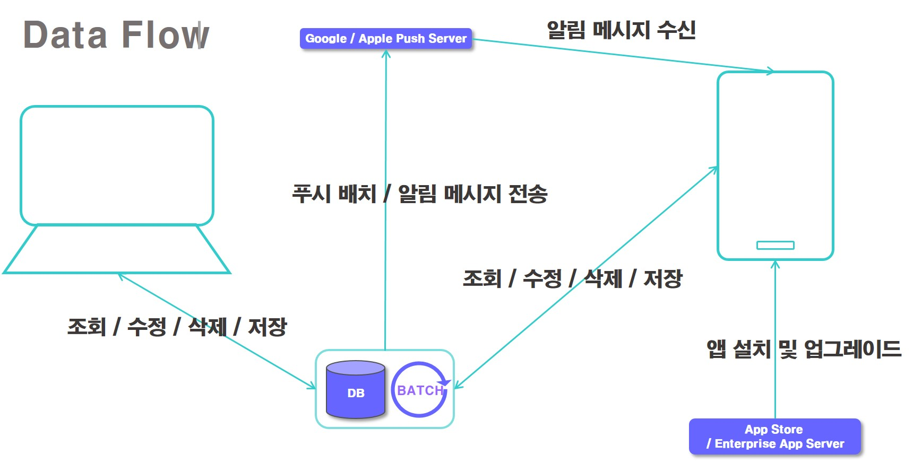

# 개발정리mobile 목차

# 기본 정보
## Vue.js의 간략한 개요
> MVVM 패턴을 사용한 `프로그레시브 프레임워크`

### Vue의 인스턴스

### Vue의 라이프사이클

### Vue의 컴포넌트

 

## project `Venus`(hunel Mobile Version)
### 데이터 프로세스

 

### 요구 스택 

|구분|세부 내용|
|----|---------|
|O/S|`Windows`, `Unix / Linux`|
|JDK Version|`jdk1.7` 이상|
|DBMS|`OracleDB 11g` 이상|
|Web Server|제약 없으나 hunel 구축 사례를 참고할 것|
|Web Application Server|제약 없으나 hunel 구축 사례를 참고할 것|
|Language|`Java`|
|Server-Side Template|`jsp`|
|Front-end Framework|`jQuery`, `Vue.js`, `Bootstrap4.x` 이상|
|UI Component|Vuetify.js|
|CSS Preprocessor|`SASS`|

 

# 기본 코드(포맷) 소개

# 상세 정보 모음