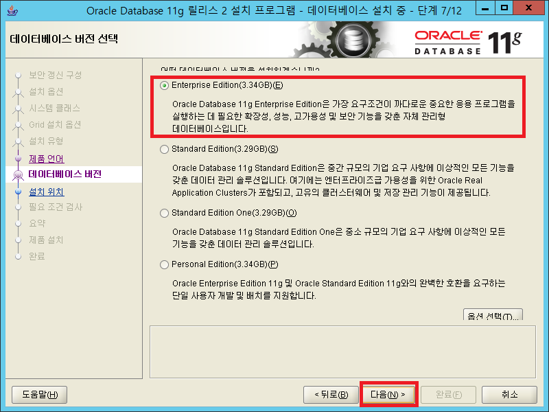
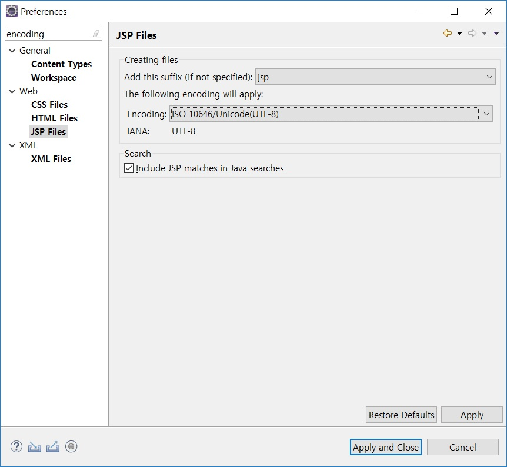
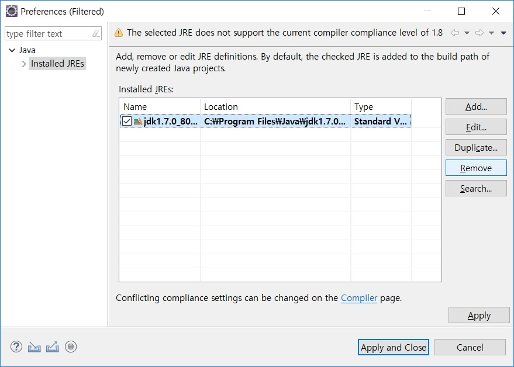

# Oracle 11g Release 2 설치
## Oracle 11g Release 2 다운로드
> [다운로드 위치(오라클 공식 사이트)](https://www.oracle.com/technetwork/database/enterprise-edition/downloads/index.html)

<hr>

- 라이센스 사용약관 동의

  

<hr>

- 데이터베이스 설치 파일 다운로드

  

<hr>

- 다운로드 완료 후

  

<hr>

- 압축 해제 후

  

<br>

## Oracle 11g Release 2 `Desktop Class` 로 설치
> 이 문서는 `데스크탑 클래스` 설치 순서를 기록한 것임

- setup 실행

  

- 보안갱신 구성
  - `My Oracle Support를 통해 보안 갱신 수신` 체크 해제 후 다음 선택

    

  <hr>

  - `Popup 창 전자 메일 주소를 제공하지 않습니다.` 의 "예" 를 선택

    

<hr>

- 설치 옵션
  - `데이터베이스 생성 및 구성` 체크 후 다음 선택

    

<hr>

- 시스템 클래스
  - 데이터베이스 전체를 설치할 것이므로 `데스크톱 클래스` 체크

    

  <hr>

  - *데이터베이스를 최소화하여 설치할 것이라면 `Server Class 설치` 참고*

<hr>

- 기본 설치 + 필요 조건 검사

  

  - `Oracle Base`는 사용자 임의의 데이터베이스가 위치할 폴더
    - 베이스 위치만 지정하면 `소프트웨어 위치`, `데이터베이스 파일 위치` 자동 설정
  - `관리 비밀번호`는 system 계정의 비밀번호임

    

    - 오라클에서 지정한 비밀번호 생성규칙에 어긋나면 나타나는 팝업

- 요약
  - 설치 조건으로 작성된 내용
    
    

<hr>

- 제품 설치

  

  <hr>

  

  <hr>

  

  <hr>

  - `비밀번호 관리`를 선택하면 잠글 계정과 잠그지 않을 계정 확인 가능

    

<hr>

- 설치 완료

  

<br>

## Oracle 11g Release 2 `Server Class` 로 설치
> 이 문서는 `서버 클래스` 설치 순서를 기록한 것임

<hr>

- setup 실행

  

<hr>

- 보안갱신 구성
  - `My Oracle Support를 통해 보안 갱신 수신` 체크 해제 후 다음 선택

    

  <hr>

  - `Popup 창 전자 메일 주소를 제공하지 않습니다.` 의 "예" 를 선택

    

<hr>

- 설치 옵션
  - `데이터베이스 생성 및 구성` 체크 후 다음 선택

    

<hr>

- 시스템 클래스
  - 데이터베이스 최소화하여 설치할 것이므로 `서버 클래스` 체크

    

<hr>

- Grid 설치 옵션
  - `단일 인스턴스 데이터베이스 설치` 체크 후 다음 선택

    

<hr>

- 설치 유형
  - `고급 설치` 체크 후 다음 선택

    

<hr>

- 제품 언어
  - `영어`가 맨 위로, `한국어`가 영어 아래로 오게 선택

    

<hr>

- 데이터베이스 버전
  - `Enterprise Edition` 체크 후 다음 선택

    

<hr>

- 설치 위치
  - 데이터베이스를 설치할 베이스 경로를 확인하고 다음 선택

    

<hr>

- 구성 유형
  - `일반용/트랜잭션 처리` 체크 후 다음 선택

    

<hr>

- 데이터베이스 식별자
  - `전역 데이터베이스 이름`과 `Oracle SID`를 **orcl** 입력 후 다음 선택

    

<hr>

- 구성 옵션
  - `메모리` 탭 부분에서 사용자 임의로 메모리 사용 지정

    

  <hr>

  - `문자 집합` 탭 부분에서 `유니코드(AL32UTF8) 사용` 체크 후 다음 선택

    

<hr>

- 관리 옵션
  - 다음 선택

    

<hr>

- 데이터베이스 저장 영역
  - `데이터베이스 파일 위치 지정` 위치 확인 후 다음 선택

    

<hr>

- 백업 및 복구
  - 사용자 임의로 `자동 백업을 사용할 것인지 아닌지`를 체크 후 다음 선택

    

<hr>

- 스키마 비밀번호
  - 계정의 암호를 `다르게` 변경하거나 혹은 `동일하게` 사용자 임의로 체크 후 다음 선택

    

<hr>

- 요약
  - 최종 설치할 정보 확인 후 완료 선택

    

<hr>

- 제품 설치

  

  <hr>

  

  <hr>

  

  <hr>

    - `비밀번호 관리`를 선택하면 잠글 계정과 잠그지 않을 계정 확인 가능

      

<hr>

- 설치 완료

  

<br>

## Oracle Database Batch 작성
- 오라클 서비스 정상 작동 확인

  

  - 오라클은 컴퓨터 시작과 동시에 자동으로 켜짐
    - 이는 RAM 및 컴퓨터 자원을 소모하게 됨
    - 사용자 임의로 On/Off가 가능해야 함

<hr>

- 오라클 서비스 수동으로 변경하기
  - `시작 - 서비스 검색 - Oracle 항목으로 이동`
    - `시작 유형`이 **자동** 인 항목들에 우클릭
    - `속성` 선택 후 자동을 **수동**으로 변경

<hr>

- 배치 파일 작성하기
  - notepad(메모장) 또는 코드 에디터 실행
  - 아래의 내용을 각각 기입하고 원하는 파일명으로 저장, 확장자는 `.bat` 로 저장

<br>

### *오라클 시작용 배치파일 코드*
- 구성
  - cmd 실행 시 `관리자 권한` 획득
  - `OracleVssWriterORCL` 시작
  - `OracleDBConsoleorcl` 시작
  - `OracleMTSRecoveryService` 시작
  - `OracleOraDb11g_home1TNSListener` 시작
  - `OracleServiceORCL` 시작

<hr>

- Oracle Service Start 배치파일 코드(start.bat)
  ```bat
    @echo off
    :: BatchGotAdmin
    :-------------------------------------
    REM  --> Check for permissions
    >nul 2>&1 "%SYSTEMROOT%\system32\cacls.exe" "%SYSTEMROOT%\system32\config\system"

    REM --> If error flag set, we do not have admin.
    if '%errorlevel%' NEQ '0' (
        echo Requesting administrative privileges...
        goto UACPrompt
    ) else ( goto gotAdmin )

    :UACPrompt
        echo Set UAC = CreateObject^("Shell.Application"^) > "%temp%\getadmin.vbs"
        echo UAC.ShellExecute "%~s0", "", "", "runas", 1 >> "%temp%\getadmin.vbs"

        "%temp%\getadmin.vbs"
        exit /B

    :gotAdmin
        if exist "%temp%\getadmin.vbs" ( del "%temp%\getadmin.vbs" )
        pushd "%CD%"
        CD /D "%~dp0"
    :--------------------------------------  

    net start OracleVssWriterORCL
    net start OracleDBConsoleorcl
    net start OracleMTSRecoveryService
    net start OracleOraDb11g_home1TNSListener
    net start OracleServiceORCL

    PAUSE
  ```

<br>

### *오라클 종료용 배치파일*
- 구성
  - cmd 실행 시 `관리자 권한` 획득
  - `OracleVssWriterORCL` 종료
  - `OracleDBConsoleorcl` 종료
  - `OracleMTSRecoveryService` 종료
  - `OracleOraDb11g_home1TNSListener` 종료
  - `OracleServiceORCL` 종료

<hr>

- Oracle Service Stop 배치파일 코드(stop.bat)
  ```bat
    @echo off
    :: BatchGotAdmin
    :-------------------------------------
    REM  --> Check for permissions
    >nul 2>&1 "%SYSTEMROOT%\system32\cacls.exe" "%SYSTEMROOT%\system32\config\system"

    REM --> If error flag set, we do not have admin.
    if '%errorlevel%' NEQ '0' (
        echo Requesting administrative privileges...
        goto UACPrompt
    ) else ( goto gotAdmin )

    :UACPrompt
        echo Set UAC = CreateObject^("Shell.Application"^) > "%temp%\getadmin.vbs"
        echo UAC.ShellExecute "%~s0", "", "", "runas", 1 >> "%temp%\getadmin.vbs"

        "%temp%\getadmin.vbs"
        exit /B

    :gotAdmin
        if exist "%temp%\getadmin.vbs" ( del "%temp%\getadmin.vbs" )
        pushd "%CD%"
        CD /D "%~dp0"
    :--------------------------------------  

    net stop OracleVssWriterORCL
    net stop OracleDBConsoleorcl
    net stop OracleMTSRecoveryService
    net stop OracleOraDb11g_home1TNSListener
    net stop OracleServiceORCL

    PAUSE
  ```

<br>

# Toad for Oracle 설치
- `Toad 11.6 for 64bit` 압축 해제

- `Toad DBA Suite for Oracle 11.6 64-bit Commercial` 관리자 권한으로 실행
  

- `I accept these terms` 체크 후 `Next` 클릭
  

- 기본적으로 체크 된 부분 그대로 `Install` 클릭
  

  

  

- 라이센스를 묻는 창은 아무것도 하지 않고 `Next` 클릭
  

- `No thanks` 클릭 후 다음 화면으로 넘어가면 `Finish`를 클릭하여 완료
  

- `Toad for Oracle 11.6` 실행
  

- `Toad 11.6 for 64bit` 하위의 keyzen.exe를 `관리자 권한으로 실행`
  

  

- Toad for Oracle License 창에 `Key`와 `Site Message`를 입력하기
  

# Eclipse 실행과 기본 설정
## Eclipse 실행 전
- `eclipse-jee-2018-09-win32-x86_64` 압축 해제
  - *로컬디스크(D:)* 로 이동
- `jdk` 압축 해제
  - *jdk-7u80-windows-x64* 설치
  - *jdk-8u161-windows-x64* 설치
- `codeStyle` 압축 해제
  - hunel 표준 코드 스타일
- **(선택)** 개발자용 폰트 설치
  - `NanumGothicCoding_Setup-2.0` 설치
    

  - `D2Coding-Ver1.3.2-20180524` 설치
    

- `HUNEL_EHRS_WEB_STAND` 압축 해제
    

## Eclipse 실행 후
### `workspace` 설정
- hunel 공통 경로 : `C:/EHR_PROJECT`
  

    <hr>

  - 압축 해제한 `HUNEL_EHRS_WEB_STAND`를 해당 workspace로 이동
    

<hr>

- `window-preferences` 클릭
  

<br>

### `Encoding` 설정(UTF-8)
- encoding 검색
  

  <hr>

  - `Workspace` 인코딩 변경
  

  <hr>

  - `CSS Files` 인코딩 변경
  

  <hr>

  - `HTML Files` 인코딩 변경
  

  <hr>

  - `JSP Files` 인코딩 변경
  

<br>

### `Formatter` 설정
- formatter 검색
  

  <hr>

  - `Java Formatter` 변경
    

  <hr>

  - `JavaScript` 변경
    

<br>

### **(선택)** `Font` 설정
- font 검색
    

  <hr>

  - `Colors and Fonts` 변경
    
    - 변경할 폰트를 확인 후 D2 폰트 또는 나눔고딕 폰트 선택

<br>

### hunel 프로젝트 Import
- explorer 창에서 우클릭 후 Import 항목 선택
    

  <hr>

  - workspace 검색 후 `Existing Projects into Workspace` 선택
    

  <hr>

  - Directory 클릭 후 workspace로 지정한 폴더 선택
    

  <hr>

  - Finish를 선택하여 완료

<br>

### hunel 프로젝트 Build Path 설정(1)
- `JRE System Library` 설정
  - explorer 창의 프로젝트 우클릭 후 Build Path - Configure Build Path 선택
    

    <hr>

    - Libraries 탭 선택, JRE System Library를 선택 후 Edit 클릭
      

    <hr>

    - `Installed JREs...` 클릭
      

    <hr>

    - 기존에 있던 JRE 라이브러리 `Remove` 클릭
      

    <hr>

    - `Add` 클릭
      

    <hr>

    - `Standard VM` 선택 후 `Next`
      

    <hr>

    - C:/Program Files/Java/jdk1.7.0_80 폴더 선택 후 `Finish`
      

    <hr>

    - 적용 완료
      

<hr>

- `Server Library` 설정은 Server 설정과 같이 진행한다.

<br>

## Server 설정
### Server 추가
- Apache-Tomcat의 버전은 `6 또는 7`을 사용한다.
  - 6 버전의 경우 `apache-tomcat-6.0.53` 압축 해제
  - 7 버전의 경우 `apache-tomcat-7.0.86-windows-x64` 압축 해제

<hr>

- 압축 해제된 폴더는 hunel 공통 경로(`C:/EHR_PROJECT`) 하위에 넣는다.
  
  
<hr>

- Eclipse IDE의 Server 탭에서 `No servers are ...`을 클릭한다..
  
  
<hr>

- 최상단의 `Apache` 트리에서 자신에게 맞는 Tomcat 버전을 선택 후 `Finish` 클릭
  

  <hr>

  

<hr>

- 추가된 Tomcat Server를 더블클릭
  

  <hr>

  - 두번째 `Server Locations`의 `Use Tomcat installation` 체크, 저장
    

<br>

### hunel 프로젝트 Build Path 설정(2)
- `Server Library` 설정
  - explorer 창의 프로젝트 우클릭 후 Build Path - Configure Build Path 선택
    

  <hr>

  - Libraries 탭 선택, Server Library 선택 후 Edit 클릭 
    
  
  <hr>

  - 추가한 Tomcat 선택 후 Finish
    
  
  <hr>

  - 추가된 Server Library 확인
    

<br>

### hunel Project Facets 수정
> *Build Path 수정*과 함께 진행하나 Server 설정을 분리해 놓았기에 후술함.

<br>

- explorer 창의 프로젝트 우클릭 후 Build Path - Configure Build Path 선택
  - 좌측 메뉴의 `Project Facets` 선택
    
    
  <hr>

  - `Java`의 `Version` 변경(1.6 → 1.7)
    
  
  <hr>

  - 우측의 `Runtimes` 탭 클릭 후 Apache Tomcat v7.0 체크
    

<br>

## Source 수정
### Tomcat Server
- Servers 하위의 server.xml

    
  
  <hr>

  ```xml
  <Service name="HUNELWEBSTAND">
    <Connector URIEncoding="utf-8" compressableMimeType="text/html,text/plain,text/xml,text/html,application/json,text/css,application/javascript,application/x-javascript" compression="on" compressionMinSize="256" connectionTimeout="20000" port="8100" protocol="HTTP/1.1" redirectPort="8443"/>
    <Connector URIEncoding="utf-8" maxParameterCount="-1" maxPostSize="-1" port="8297" protocol="AJP/1.3" redirectPort="8443"/>
    <Engine defaultHost="localhost" name="HUNELWEBSTAND">
      <Realm className="org.apache.catalina.realm.UserDatabaseRealm" resourceName="UserDatabase"/>
      <Host appBase="webapps" autoDeploy="true" name="localhost" unpackWARs="true" xmlNamespaceAware="false" xmlValidation="false">
        <Valve className="org.apache.catalina.valves.AccessLogValve" directory="logs" pattern="common" prefix="hunel_access_log." resolveHosts="false" suffix=".txt"/>
          <Context docBase="C:/EHR_PROJECT/HUNEL_EHRS_WEB_STAND/WebRoot" path="" privileged="true" reloadable="true">
          <Resource auth="Container" connectionProperties="SetBigStringTryClob=true" driverClassName="oracle.jdbc.driver.OracleDriver" factory="org.apache.tomcat.dbcp.dbcp.BasicDataSourceFactory" maxActive="20" maxIdle="10" name="HUNELWEBSTAND" username="HUNELSTANDARD" password="HUNEL!STANDARD" type="javax.sql.DataSource" url="jdbc:oracle:thin:@localhost:1521:orcl" validationQuery="SELECT 1 FROM DUAL"/>
          <Resource auth="Container" connectionProperties="SetBigStringTryClob=true" driverClassName="oracle.jdbc.driver.OracleDriver" factory="org.apache.tomcat.dbcp.dbcp.BasicDataSourceFactory" maxActive="20" maxIdle="10" name="HUNELWEBSTAND_RET" username="HUNELHTMLEHR_RET" password="HUNEL!STANDARD" type="javax.sql.DataSource" url="jdbc:oracle:thin:@localhost:1521:orcl" validationQuery="SELECT 1 FROM DUAL"/>
        </Context>
      </Host>
    </Engine>
  </Service>

  서비스명은 임의대로 지정할 수 있으나 프로젝트명과 통일시키는 것을 권장한다.
  중요한 것은 Context 태그의 경로와 Container로 설정하는 DB 접속 정보이다.

  여러 서비스를 동시에 구동하고 싶다면 서비스명을 달리 주면 되며, Context와 Container를 확인하여 입력한다.
  ```

  <hr>

  - `Full Source Code` : [server.xml](https://github.com/hcgnine/Guide/blob/master/%EA%B0%9C%EB%B0%9C%ED%99%98%EA%B2%BD%EA%B5%AC%EC%B6%95/%EC%84%A4%EC%A0%95_%EC%9D%B4%ED%81%B4%EB%A6%BD%EC%8A%A4/server.xml)

<br>


### RD report 경로 설정 및 라이센스 적용
- [Tomcat Server Location Configure Error 해결방법](https://stackoverflow.com/questions/1012378/eclipse-server-locations-section-disabled-and-need-to-change-to-use-tomcat-ins)

<hr>

- `Crownix_ERS_Server(설치파일)` 압축 해제
  - 엠투소프트 프로덕트이므로 라이센스(기간제)가 필요함
  - 주기적으로 `HUNEL PORTAL`에 게시, 필요시 본인이 신청하여 다운받을 수 있음
    - [신청 예시](표준_메일_전송용_템플릿/)

<hr>

- Tomcat 폴더 -> webapps 하위에 `DataServer, ReportingServer` 폴더 이동
  - 갱신/새로 발급된 `Crownix licence` 덮어쓰기
    - 위치 : `톰캣경로\webapps\DataServer\license\license`
    - 위치 : `톰캣경로\webapps\ReportingServer\license\license`

<hr>

- [Reporting Server](http://localhost:8100/ReportingServer/manager/index.html)
  - 위 하이퍼링크에서 포트번호만 변경하면 본인의 Reporting Server로 접속 가능
  - `username` : admin
  - `password` : hunel(또는 admin)

<hr>
<br>

[뒤로](https://github.com/hcgnine/Guide)

<br>
<hr>

### IBsheet 라이센스 적용
- IBsheet license 요청 후 응답 파일 : 라이센스 **키**를 .js 파일에 덮어쓰기
  - sheet : 그리드
  - org : 화상조직도

<hr>
<br>

[뒤로](https://github.com/hcgnine/Guide)

<br>
<hr>

### hunel 프로젝트
- `web.xml`
  - 프로젝트명/WebRoot/WEB-INF/**web.xml**
    ```xml
      <dispatcher>REQUEST</dispatcher>
      <dispatcher>FORWARD</dispatcher>

      해당 구문을 주석처리한다.

      <!--     <dispatcher>REQUEST</dispatcher> -->
      <!--     <dispatcher>FORWARD</dispatcher> -->

      dispatcher는 각 프로젝트 사이트에서 확인 후 변경하면 된다.
    ```

    ```xml
      톰캣 6의 경우
      <dispatcher>REQUEST</dispatcher>,
      <dispatcher>FORWARD</dispatcher> 태그 주석처리 시 에러 발생
      (제우스 개발서버 소스 가져왔을 경우 주석처리되어있을 수 있음)
    ```
  
  <hr>

  - `Full Source Code` : [web.xml]([설정_이클립스/web.xml](https://github.com/hcgnine/Guide/blob/master/%EA%B0%9C%EB%B0%9C%ED%99%98%EA%B2%BD%EA%B5%AC%EC%B6%95/%EC%84%A4%EC%A0%95_%EC%9D%B4%ED%81%B4%EB%A6%BD%EC%8A%A4/web.xml)

<hr>

- `system.properties`
  - 프로젝트명/WebRoot/WEB-INF/**system.properties**
    ```properties
      # 기록물 출력을 위한 RD 서버 Path 설정
      
      # HCG 개발자 서버
      RD_WEBROOT=http://1.234.41.25:8102
      # 로컬 테스트 환경
      RD_WEBROOT=http://localhost:8100
    ```

    ```properties
      # 프로젝트 진행 시 Referer 체크 여부를 선택한다.

      ########## referer Check하지 않을 도메인 ########## 
      REFERER_IGNORE_URL.1=http://localhost:8102
      REFERER_IGNORE_URL.2=http://localhost:8102/
      REFERER_IGNORE_URL.3=http://localhost:8102/menuAction.do
      REFERER_IGNORE_URL.4=http://localhost:8102/interview
      REFERER_IGNORE_URL.5=http://1.234.41.25:8102
      REFERER_IGNORE_URL.6=http://1.234.41.25:8102/
      REFERER_IGNORE_URL.7=http://1.234.41.25:8102/menuAction.do
      REFERER_IGNORE_URL.8=http://1.234.41.25:8102/interview
    ``` 

<hr>
<br>

[뒤로](https://github.com/hcgnine/Guide)

<br>
<hr>