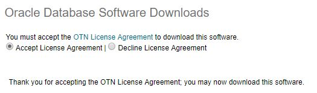
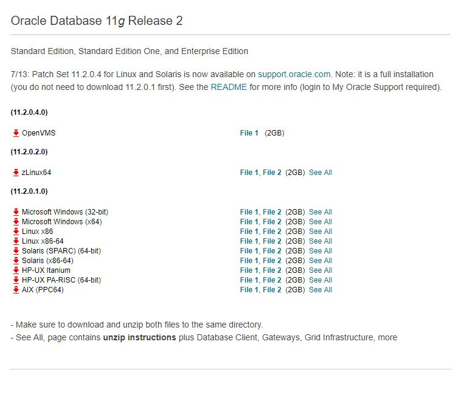
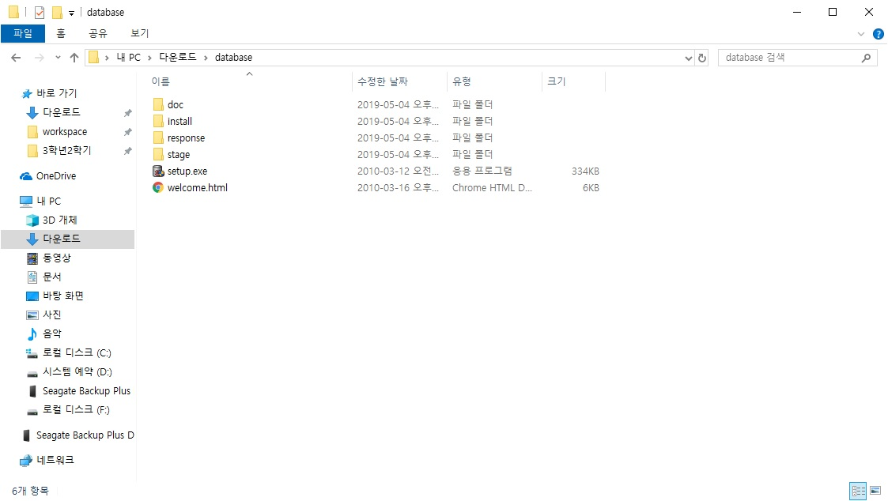
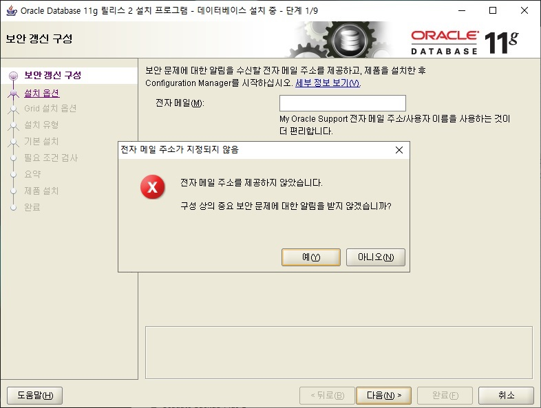
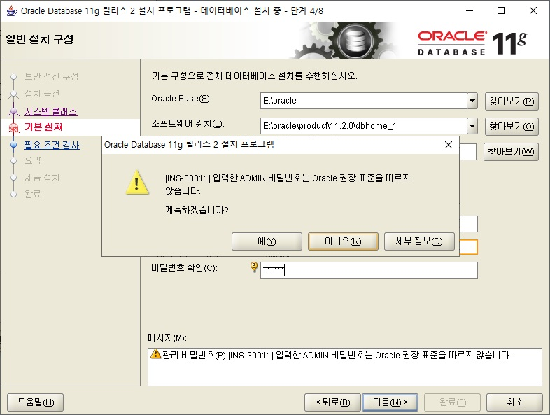
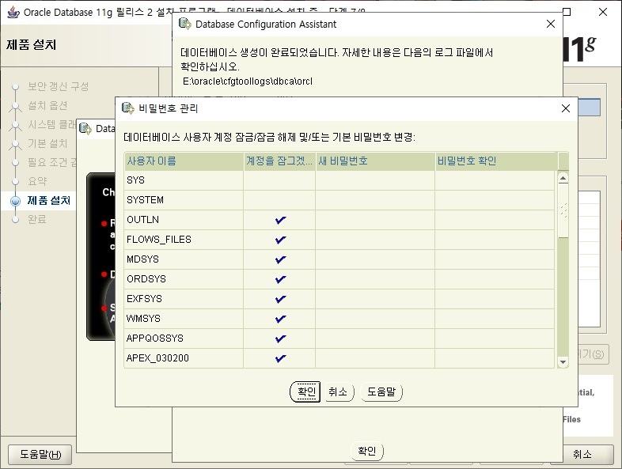
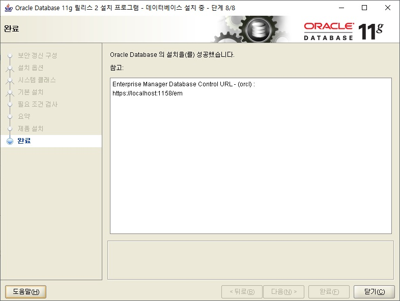

<!-- TOC -->

- [Oracle 11g Release 2 설치](#oracle-11g-release-2-설치)
    - [Oracle 11g Release 2 다운로드](#oracle-11g-release-2-다운로드)
        - [라이센스 사용약관 동의](#라이센스-사용약관-동의)
        - [데이터베이스 설치 파일 다운로드](#데이터베이스-설치-파일-다운로드)
        - [다운로드 완료 후](#다운로드-완료-후)
        - [압축 해제 후](#압축-해제-후)
    - [Oracle 11g Release 2 설치](#oracle-11g-release-2-설치-1)
        - [setup 실행](#setup-실행)
        - [보안갱신 구성](#보안갱신-구성)
        - [설치 옵션](#설치-옵션)
        - [시스템 클래스](#시스템-클래스)
        - [요약](#요약)
        - [제품 설치](#제품-설치)
        - [설치 완료](#설치-완료)
    - [Oracle Database Batch 작성](#oracle-database-batch-작성)
        - [오라클 서비스 정상 작동 확인](#오라클-서비스-정상-작동-확인)
        - [오라클 서비스 수동으로 변경하기](#오라클-서비스-수동으로-변경하기)
        - [배치 파일 ~~작성하기~~첨부](#배치-파일-작성하기첨부)

<!-- /TOC -->

# Oracle 11g Release 2 설치

## Oracle 11g Release 2 다운로드
> [다운로드 위치(오라클 공식 사이트)](https://www.oracle.com/technetwork/database/enterprise-edition/downloads/index.html)

### 라이센스 사용약관 동의

  

### 데이터베이스 설치 파일 다운로드

  

### 다운로드 완료 후

  

### 압축 해제 후

  

## Oracle 11g Release 2 설치
> 이 문서는 `데스크톱 클래스` 설치 순서를 기록해놓은 것임
>> `서버 클래스` 설치 순서는 **[여기](I_SERVER_CLASS.md)** 참고

### setup 실행

  

### 보안갱신 구성
- `My Oracle Support를 통해 보안 갱신 수신` 체크 해제 후 다음 선택

  

- `Popup 창 전자 메일 주소를 제공하지 않습니다.` 의 "예" 를 선택

  

### 설치 옵션
- `데이터베이스 생성 및 구성` 체크 후 다음 선택

  

### 시스템 클래스
- 데이터베이스 전체를 설치할 것이므로 `데스크톱 클래스` 체크

  

  - *데이터베이스를 최소화하여 설치할 것이라면 `서버 클래스` 체크*
    - 서버 클래스 설치를 참고차고 싶다면 **[여기로](I_SERVER_CLASS.md)**

- 기본 설치 + 필요 조건 검사

    

  - `Oracle Base`는 사용자 임의의 데이터베이스가 위치할 폴더
    - 베이스 위치만 지정하면 `소프트웨어 위치`, `데이터베이스 파일 위치` 자동 설정
  - `관리 비밀번호`는 system 계정의 비밀번호임

    

    - 오라클에서 지정한 비밀번호 생성규칙에 어긋나면 나타나는 팝업

### 요약
- 설치 조건으로 작성된 내용
 
  

### 제품 설치

  

  

  

  - `비밀번호 관리`를 선택하면 잠글 계정과 잠그지 않을 계정 확인 가능

    

### 설치 완료

  

## Oracle Database Batch 작성
### 오라클 서비스 정상 작동 확인

  

  - 오라클은 컴퓨터 시작과 동시에 자동으로 켜짐
    - 이는 RAM 및 컴퓨터 자원을 소모하게 됨
    - 사용자 임의로 On/Off가 가능해야 함

### 오라클 서비스 수동으로 변경하기
- `시작 - 서비스 검색 - Oracle 항목으로 이동`
  - `시작 유형`이 **자동** 인 항목들에 우클릭
  - `속성` 선택 후 자동을 **수동**으로 변경

### 배치 파일 ~~작성하기~~첨부
- [오라클 서비스 시작 및 종료 배치파일](설치_오라클_배치파일/)

 

[뒤로](https://github.com/hcgnine/Guide)

 

