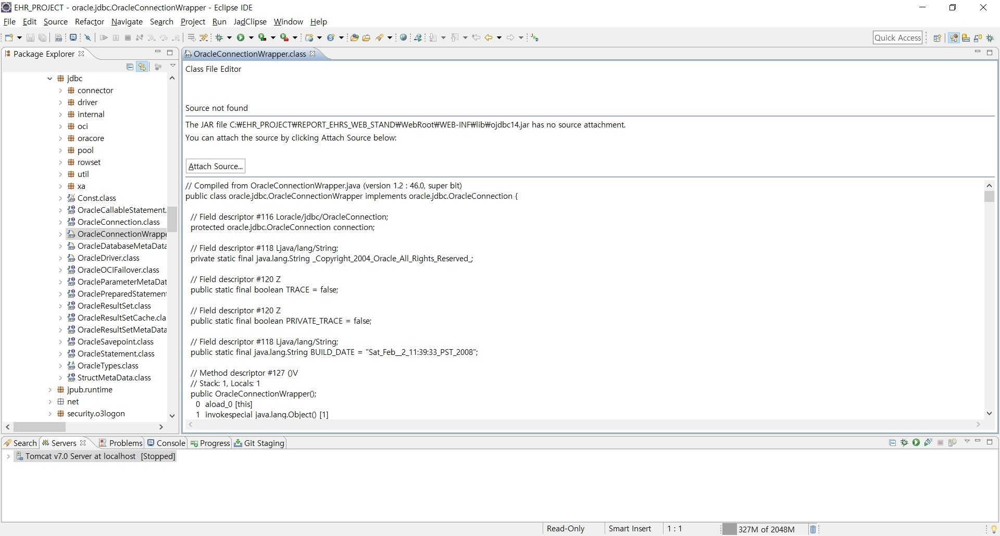
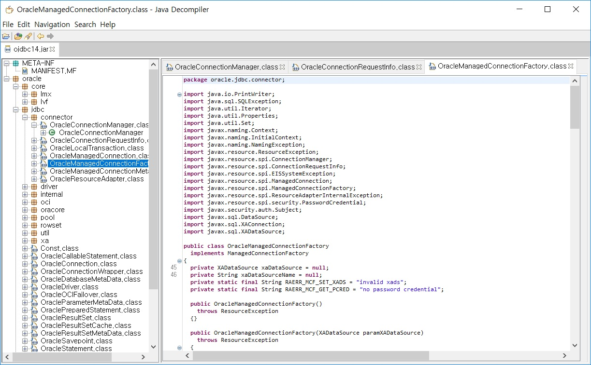

# Java Decompiler
> 역컴파일러(Decompiler)는 컴파일러와 반대의 역할을 하는 프로그램이다.
>> 상대적으로 저수준의 추상에 있는 프로그램의 코드를 고수준의 추상으로 변형한다.
>>> 역컴파일링은 잃어버린 소스 코드를 되찾거나, 컴퓨터 보안 그리고 오류 검출 정정 등의 과정에서 유용하게 사용된다.

- 일반적으로 자신이 작성한 코드가 아닌, 접근하지 못하게 막아놓은 타인의 코드를 확인하기 위해 사용
- `Eclipse IDE`에서 `F3` 또는 `Ctrl+Space(/Click)`시 해당 코드로 접근이 가능하나 접근을 막아놓은 경우 아래와 같이 뜬다.
    
    

## Java 디컴파일러 JD-GUI

- 별도의 설치 없이 실행만으로 간단히 디컴파일이 가능한 컴파일러 프로그램

### 실행 방법
- [JD-GUI 페이지](http://java-decompiler.github.io/)에서 OS에 맞는 압축 파일 다운로드
  - 다운로드 된 압축 파일을 해제하면 `jd-gui.exe`가 존재
  - 해당 파일을 클릭하여 실행
- 원하는 jar 파일을 드래그&드랍으로 가져올 수 있음
  - 또는 최상단의 `File-Open Files...`으로 원하는 라이브러리 선택 가능
- `Save All Source`로 디컴파일된 소스 저장 가능

### 주요 특징
- JD-GUI는 Java와 Groovy로 개발되었다.
- JD-GUI는 대부분의 최신 컴파일러에서 동작한다.
  - jdk1.1.8 이하도 동작

### 제약사항
- [홈페이지](http://java-decompiler.github.io/)에서 확인 가능
