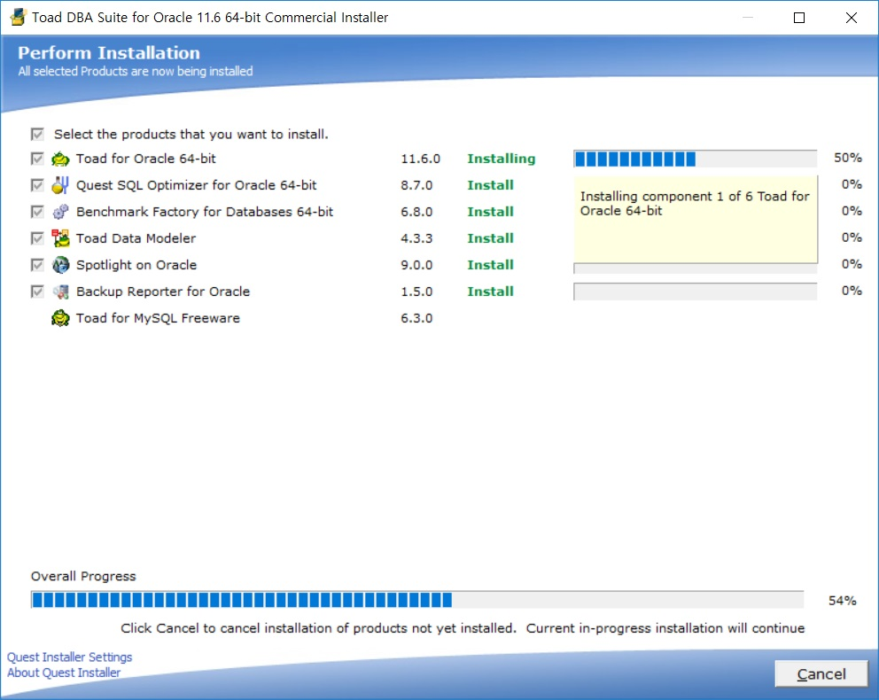
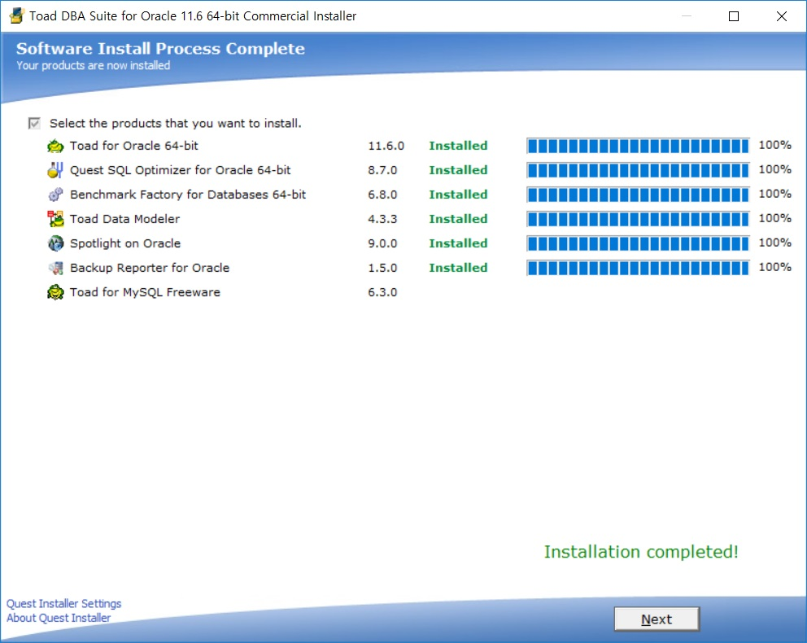
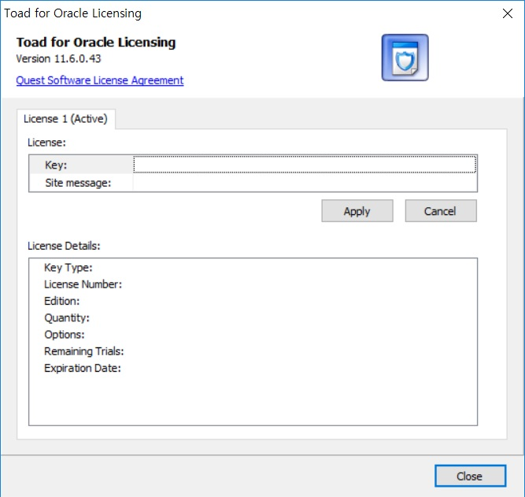
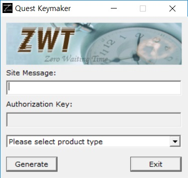
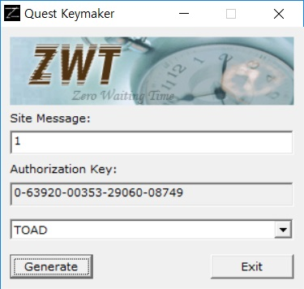
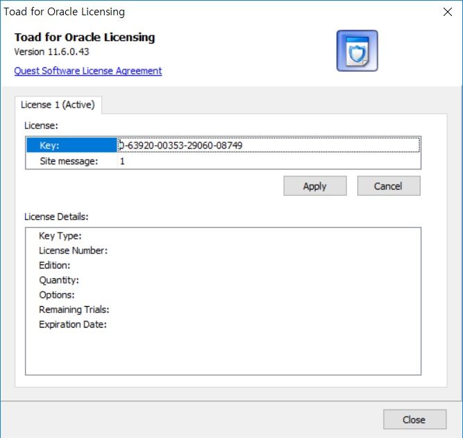

# Toad for Oracle 설치

## 1. `Toad 11.6 for 64bit` 압축 해제

 

## 2. `Toad DBA Suite for Oracle 11.6 64-bit Commercial` 관리자 권한으로 실행

 

## 3. `I accept these terms` 체크 후 `Next` 클릭

 

## 4. 기본적으로 체크 된 부분 그대로 `Install` 클릭

 

## 5. 라이센스를 묻는 창은 아무것도 하지 않고 `Next` 클릭

 

## 6. `No thanks` 클릭 후 다음 화면으로 넘어가면 `Finish`를 클릭하여 완료

 

## 7. `Toad for Oracle 11.6` 실행

 

## 8. `Toad 11.6 for 64bit` 하위의 keyzen.exe를 `관리자 권한으로 실행`

 

## 9. Toad for Oracle License 창에 `Key`와 `Site Message`를 입력하기

 

[뒤로](https://github.com/hcgnine/Guide)

 

