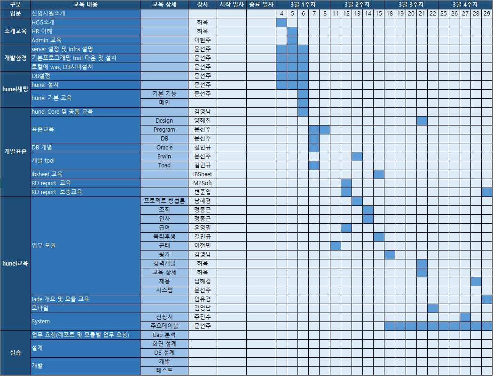

# 교육

## 1. 2019 신입사원 교육일정

 

## 2. 업무교육
- [1주차](01_업무교육/week01/README.md)
- [2주차](01_업무교육/week02/README.md)
- [3주차](01_업무교육/week03/README.md)
- [4주차](01_업무교육/week04/README.md)

 

## 3. 개발교육
- [1주차](02_개발교육/week01/README.md)
- [2주차](02_개발교육/week02/README.md)
- [3주차](02_개발교육/week03/README.md)
- [4주차](02_개발교육/week04/README.md)

 

## 4. 배포자료
### 개발표준
- [HUNEL_웹개발표준](03_배포자료/HCG_PPA/산출물템플릿_20190308/2.설계/hunel_웹표준_개발표준_v.1.4.doc)

 

### 산출물 예시
- [0.관리](03_배포자료/HCG_PPA/산출물템플릿_20190308/0.관리/)
- [1.GAP분석](03_배포자료/HCG_PPA/산출물템플릿_20190308/1.GAP분석/)
- [2.설계](03_배포자료/HCG_PPA/산출물템플릿_20190308/2.설계/)
- [3.개발](03_배포자료/HCG_PPA/산출물템플릿_20190308/3.개발/)
- [4.테스트](03_배포자료/HCG_PPA/산출물템플릿_20190308/4.테스트/)
- [5.전이](03_배포자료/HCG_PPA/산출물템플릿_20190308/5.전이/)

 

[뒤로](https://github.com/hcgnine/Guide)

 

