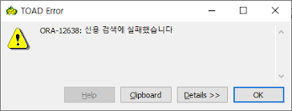
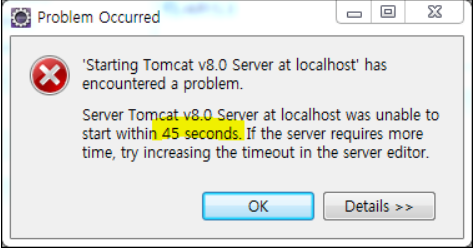

# 에러내역

## 데이터베이스
### 0. DataGrip 설정 관련
```
Unsafe query: 'Delete' statement without 'where' clears all data in the table
```
- https://www.mkyong.com/mysql/cant-delete-records-in-mysql-workbench/
- setting > Database > General > [] Show a warning before executing potentially unsafe queries >> UnCheck

```sh
SET SQL_SAFE_UPDATES=0;
```

### 1. ORA-12638 Error
- 사진
    <div align=center>

    

    </div>

- 원인
  - Oracle 실행 시 Admin 권한 부족으로 발생하는 문제

- 해결방법
  - `{oracle 설치 위치}/product/11.2.0/dbhome_1/NETWORK/ADMIN` 로 이동
    - `sqlnet.ora` 를 **관리자 권한**으로 실행
        ```
        # 주석처리하기
        # SQLNET.AUTHENTICATION_SERVICES= (NTS)
        ```
    - 재실행

## 톰캣
### 1. 톰캣 타임아웃
- 사진
    <div align=center>

    

    </div>

- 내용
    ```
    Server Tomcat v8.0 Server at localhost was unable to start within 45 seconds. If the server requires more time, try increasing the timeout in the server editor.
    ```

- 원인
  - 톰캣의 Default로 설정된 시간제한에 걸린 것. 즉, 톰캣이 시작될 때 45초 시간 제한에 걸려서 작동이 중단된 것인데 RD report 서버가 가동되는데 시간이 상당 지체되므로 일어나는 현상임.

- 해결방법
  - server.xml의 **`<Connector />`** 부분의 `connectionTimeout` 을 수정하면 된다.
    ```xml
    <Connector ... connectionTimeout="20000" .../>
    ```